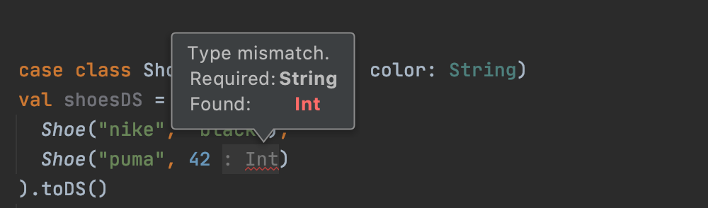

Datasets are available to Spark Scala/Java users and offer more type safety than DataFrames.

Python and R infer types during runtime, so these APIs cannot support the Datasets.

This post demonstrates how to create Datasets and describes the advantages of this data structure.

## toDS

Create a `City` case class, instantiate some objects, and then build a Dataset:

```
case class City(englishName: String, continent: String)

val cities = Seq(
  City("bejing", "asia"),
  City("new york", "north america"),
  City("paris", "europe")
).toDS()

cities.show()
```

```
+-----------+-------------+
|englishName|    continent|
+-----------+-------------+
|     bejing|         asia|
|   new york|north america|
|      paris|       europe|
+-----------+-------------+
```

The `cities` Dataset is of type `org.apache.spark.sql.Dataset[City]`.

## createDataset

The `cities` Dataset can also be created with the `createDataset` method:

```
case class City(englishName: String, continent: String)

val cities2 = spark.createDataset(
  Seq(
    City("bejing", "asia"),
    City("new york", "north america"),
    City("paris", "europe")
  )
)
```

`cities2` is also of type `org.apache.spark.sql.Dataset[City]`.

## Converting from DataFrame to Dataset

Let's create a DataFrame of trees and then convert it to a Dataset. Start by creating the DataFrame.

```
val treesDF = Seq(
  ("Oak", "deciduous"),
  ("Hemlock", "evergreen"),
  ("Apple", "angiosperms")
).toDF("tree_name", "tree_type")

treesDF.show()
```

```
+---------+-----------+
|tree_name|  tree_type|
+---------+-----------+
|      Oak|  deciduous|
|  Hemlock|  evergreen|
|    Apple|angiosperms|
+---------+-----------+
```

`treesDF` is a `org.apache.spark.sql.DataFrame`.

Define a case class and use `as` to convert the DataFrame to a Dataset.

```
case class Tree(tree_name: String, tree_type: String)

val treesDS = treesDF.as[Tree]
```

`treesDS` is a `org.apache.spark.sql.Dataset[Tree]`.

## DataFrame is an alias for Dataset\[Row\]

DataFrame is defined as a Dataset\[Row\] in the Spark codebase with this line: `type DataFrame = Dataset[Row]`.

`org.apache.spark.sql.Row` is a generic object that can be instantiated with any arguments.

```
import org.apache.spark.sql.Row

val oneRow = Row("hi", 34)
val anotherRow = Row(34.2, "cool", 4)
```

case classes cannot be instantiated with any arguments. This code will error out:

```
case class Furniture(furniture_type: String, color: String)
Furniture("bed", 33)
```

Here's the error message:

```
error: type mismatch;
 found   : Int(33)
 required: String
Furniture("bed", 33)
                 ^
```

Scala throws a compile-time error when you try to instantiate an object with the wrong type.

Your text editor will complain about this code, so you don't need to wait until runtime to discover the error.


## Runtime vs compile-time errors

Here's some invalid code to create a DataFrame that'll error-out at runtime:

```
val shoesDF = Seq(
  ("nike", "black"),
  ("puma", 42)
).toDF("brand", "color")
```

Here's the runtime error: `java.lang.ClassNotFoundException: scala.Any`.

Note that the runtime error is not descriptive, so the bug is hard to trace. The runtime error isn't caught by your text editor either.

Let's write some similarly invalid code to create a Dataset.

```
case class Shoe(brand: String, color: String)

val shoesDS = Seq(
  Shoe("nike", "black"),
  Shoe("puma", 42)
).toDS()
```

The Dataset API gives a much better error message:

```
error: type mismatch;
 found   : Int(42)
 required: String
      Shoe("puma", 42)
                   ^
```

This is a compile-time error, so it'll be caught by your text editor.



## Advantages of Datasets

Datasets catch some bugs at compile-time that aren't caught by DataFrames till runtime.

Runtime bugs can be a real nuisance for big data jobs.

You don't want to run a job for 4 hours, only to have it error out with a silly runtime bug. It's better to catch bugs in your text editor, before they become production job errors.

## Disadvantages of Datasets

Spark automatically converts Datasets to DataFrames when performing operations like adding columns.

Adding columns is a common operation. You can go through the effort of defining a case class to build a Dataset, but all that type safety is lost with a simple `withColumn` operation.

Here's an example:

```
case class Sport(name: String, uses_ball: Boolean)

val sportsDS = Seq(
  Sport("basketball", true),
  Sport("polo", true),
  Sport("hockey", false)
).toDS()
```

`sportsDS` is of type `org.apache.spark.sql.Dataset[Sport]`.

Append a `short_name` column to the Dataset and view the results.

```
import org.apache.spark.sql.functions._
val res = sportsDS.withColumn("short_name", substring($"name", 1, 3))
res.show()
```

```
+----------+---------+----------+
|      name|uses_ball|short_name|
+----------+---------+----------+
|basketball|     true|       bas|
|      polo|     true|       pol|
|    hockey|    false|       hoc|
+----------+---------+----------+
```

`res` is of type `org.apache.spark.sql.DataFrame`.

We'd need to define another case class and convert `res` back to a Dataset if we'd like to get the type safety benefits back.

Not all operations convert Datasets to DataFrames. For example, filtering does not convert Datasets to DataFrames:

```
val nonBallSports = sportsDS.where($"uses_ball" === false)
```

`nonBallSports` is still of type `org.apache.spark.sql.Dataset[Sport]`.

## Typed Datasets

The [frameless](https://github.com/typelevel/frameless) library offers typed Datasets that are even more type safe than Spark Datasets, but [typed Datasets face even more limitations](https://mungingdata.com/apache-spark/frameless-typed-datasets/).

Lots of Spark workflows operate on wide tables with transformations that append tens or hundreds of columns. Creating a new case class whenever a new column is added isn't practical for most Spark workflows.

## Why PySpark doesn't have Datasets

We've demonstrated that Scala will throw compile-time errors when case classes are instantiated with invalid arguments.

Python is not compile-time type safe, so it throws runtime exceptions when classes are instantiated with invalid arguments. The Dataset API cannot be added to PySpark because of this Python language limitation.

## Spark Datasets aren't so type safe

### Some nonsensical operations are caught at runtime

Create a Dataset with an integer column and try to add four months to the integer.

```
case class Cat(name: String, favorite_number: Int)

val catsDS = Seq(
  Cat("fluffy", 45)
).toDS()

catsDS.withColumn("meaningless", add_months($"favorite_number", 4)).show()
```

Here's the error message: org.apache.spark.sql.AnalysisException: cannot resolve 'add\_months(`favorite_number`, 4)' due to data type mismatch: argument 1 requires date type, however, '`favorite_number`' is of int type.;;

AnalysisExceptions are thrown at runtime, so this isn't a compile-time error that you'd expect from a type safe API.

### Other nonsensical operations return null

Let's run the `date_trunc` function on a `StringType` column and observe the result.

```
catsDS.withColumn("meaningless", date_trunc("name", lit("cat"))).show()
```

```
+------+---------------+-----------+
|  name|favorite_number|meaningless|
+------+---------------+-----------+
|fluffy|             45|       null|
+------+---------------+-----------+
```

Some Spark functions just return `null` when the operation is meaningless. `lit("cat")` isn't a valid format, so this operation will always return `null`.

### Some operations return meaningless results

Let's create a Dataset with a date column and then reverse the date:

```
import java.sql.Date

case class Birth(hospitalName: String, birthDate: Date)

val birthsDS = Seq(
  Birth("westchester", Date.valueOf("2014-01-15"))
).toDS()

birthsDS.withColumn("meaningless", reverse($"birthDate")).show()
```

```
+------------+----------+-----------+
|hospitalName| birthDate|meaningless|
+------------+----------+-----------+
| westchester|2014-01-15| 51-10-4102|
+------------+----------+-----------+
```

At the very least, we'd expect this code to error out at runtime with a `org.apache.spark.sql.AnalysisException`.

A type-safe implementation would throw a compile time error when the `reverse` function is passed a `DateType` value.

## Conclusion

Spark Datasets offer more type safety than DataFrames, but they're hard to stick with. Spark will automatically convert your Datasets to DataFrames when you perform common operations, like adding a column.

Even when you're using Datasets, you don't get much type safety. The `org.apache.spark.sql.Column` objects don't have type information, so they're akin to Scala `Any` values.

Some `org.apache.spark.sql.functions` throw `AnalysisException` when they're supplied with meaningless input, but others just return junk responses. Diligently [test your Spark code](https://github.com/MrPowers/spark-fast-tests) to catch bugs before making production deploys.
