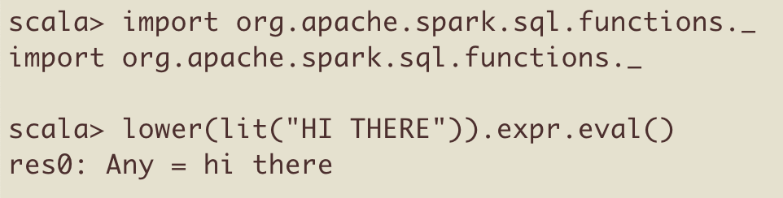
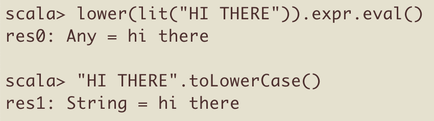

# Executing Spark code with expr and eval

You can execute Spark column functions with a genius combination of `expr` and `eval()`.

This technique lets you execute Spark functions without having to create a DataFrame.

This makes it easier to run code in the console and to run tests faster.

## Simple example

Open up the [Spark console](https://mungingdata.com/apache-spark/using-the-console/) and let's evaluate some code!

Use the `lower` method defined in `org.apache.spark.sql.functions` to downcase the string "HI THERE".

```
import org.apache.spark.sql.functions._

lower(lit("HI THERE")).expr.eval() // hi there
```

Here's how this looks in a console:



Note that this code returns an Any value. It does not return a string.

## Array example

Let's use `array_contains` to see if `Array("this", "is", "cool")` contains the string "cool":

```
val myArr = Array("this", "is", "cool")
array_contains(lit(myArr), "cool").expr.eval() // true
```

Let's check to make sure `myArr` doesn't contain the word "blah":

```
array_contains(lit(myArr), "blah").expr.eval() // false
```

What a nice way to play around with Spark functions!!

## Executing Column methods

Column methods are defined in [org.apache.spark.sql.Column](http://spark.apache.org/docs/latest/api/scala/index.html#org.apache.spark.sql.Column).

Let's execute the `contains()` method defined in the Column class with expr and eval.

```
lit("i like tacos").contains("tacos").expr.eval() // true
```

Let's verify that "i like tacos" does not contain the word "beans".

```
lit("i like tacos").contains("beans").expr.eval() // false
```

## lower in a DataFrame

Creating a DataFrames requires more typing than expr / eval.

Let's execute the `lower` function in a DataFrame:

```
val df = Seq("HI THERE").toDF("col1")

df.withColumn("lower_col1", lower($"col1")).show()

+--------+----------+
|    col1|lower_col1|
+--------+----------+
|HI THERE|  hi there|
+--------+----------+
```

expr / eval is easier when you'd like to quickly execute a function.

## Scala functions vs. expr / eval

Scala functions return typed values whereas expr / eval returns Any type values.

`lower(lit("HI THERE")).expr.eval()` returns an `Any` value.

`"HI THERE".toLowerCase()` returns a `String` value.



We don't normally want to return Any type values. Let's create some helper methods.

## Abstracting

Let's define an `evalString()` method that'll take a Column argument and return a String.

```
import org.apache.spark.sql.Column

def evalString(col: Column) = {
  col.expr.eval().toString
}
```

This lets us do less typing:

```
evalString(lower(lit("HI THERE"))) // hi there
```

A regular function isn't nearly hacky enough! Let's use an implicit class to monkey patch the `Column` class, so we can call `evalString` directly on column objects.

## Hacking

Here's a code snippet from the [spark-daria](https://github.com/MrPowers/spark-daria) repo that extends the `Column` class with an `evalString()` method.

```
object ColumnExt {
  implicit class ColumnMethods(col: Column) {
    def evalString(): String = {
      col.expr.eval().toString
    }
  }
}
```

Let's `cd` into the spark-daria project directory and run `sbt console` to fire up a console with all the spark-daria code loaded.

```
import com.github.mrpowers.spark.daria.sql.ColumnExt._

lower(lit("HI THERE")).evalString() // hi there
```

It's normally bad practice to extend Spark core classes. Only extend core classes when you feel like the extension adds a method that's missing from the API.

## Testing

We typically need to create DataFrames to test column methods. With `evalString`, we can test column methods with standard Scala comparison operators.

Here's a `myLowerClean` Column function that removes all whitespace and downcases a string:

```
def myLowerClean(col: Column): Column = {
  lower(regexp_replace(col, "\\s+", ""))
}
```

Here's how we can test `myLowerClean` with `evalString()`.

```
it("runs tests with evalString") {
  assert(myLowerClean(lit("  BOO     ")).evalString() === "boo")
  assert(myLowerClean(lit(" HOO   ")).evalString() === "hoo")
}
```

This test is slower and more verbose when the [spark-fast-tests](https://github.com/MrPowers/spark-fast-tests/) `assertColumnEquality` method is used.

```
it("assertColumnEquality approach") {
  val df = spark.createDF(
    List(
      ("  BOO     ", "boo"),
      (" HOO   ", "hoo"),
      (null, null)
    ), List(
      ("cry", StringType, true),
      ("expected", StringType, true)
    )
  ).withColumn(
    "clean_cry",
    myLowerClean(col("cry"))
  )

  assertColumnEquality(df, "clean_cry", "expected")
}
```

You should read [Testing Spark Code](https://leanpub.com/testing-spark/) if you'd like to learn more about how the expr / eval design pattern can be used in Spark test suites.

The [spark-fast-tests](https://github.com/MrPowers/spark-fast-tests/) README contains more detailed benchmarking results.

expr / eval can be a powerful testing technique, but users need to know the limitations.

## Picky parens

You may have noticed that `.expr` doesn't have parens and `eval()` does have parens.

```
lower(lit("HI THERE")).expr.eval()
```

The code will error out if `expr` is given parens (e.g. `lower(lit("HI THERE")).expr().eval()`).

The code will also error out if `eval()` doesn't have parens (e.g. `lower(lit("HI THERE")).expr.eval`).

You need to be super careful about your paren placement for this design pattern!

## Spark's object model

You should always dig into Spark's object model to understand return values at every step of a long method chain to better understand how Spark works.

Let's break down the objects in the code snippet we keep using: `lower(lit("HI THERE")).expr.eval()`.

- `lit("HI THERE")` returns a [Column](http://spark.apache.org/docs/latest/api/scala/index.html#org.apache.spark.sql.Column) object. `lit()` is defined in the [functions](http://spark.apache.org/docs/latest/api/scala/index.html#org.apache.spark.sql.functions$) object.
- `lower()` is also defined in the functions object and also returns a Column
- The Column documentation page has this note: "The internal Catalyst expression can be accessed via expr, but this method is for debugging purposes only and can change in any future Spark releases." This design pattern isn't as robust as I thought ;)
- We're deep in Spark now. Think `eval()` is [defined somewhere in this file](https://github.com/apache/spark/blob/5264164a67df498b73facae207eda12ee133be7d/sql/catalyst/src/main/scala/org/apache/spark/sql/catalyst/expressions/Expression.scala). Not sure.

Always keep digging into Spark's object model when you encounter a magical code snippet to learn more about how Spark works.

## Conclusion

The expr / eval design pattern lets you easily evaluate code via the console and provides a powerful testing pattern because it's so fast.

[Testing Spark Applications](https://leanpub.com/testing-spark/) is the best resource to learn more about how this design pattern can be used in production.
