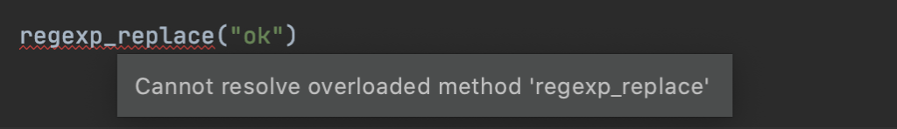
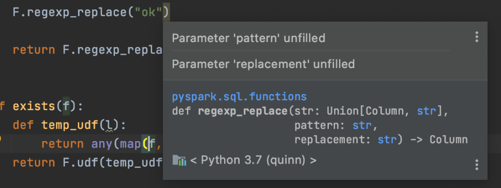
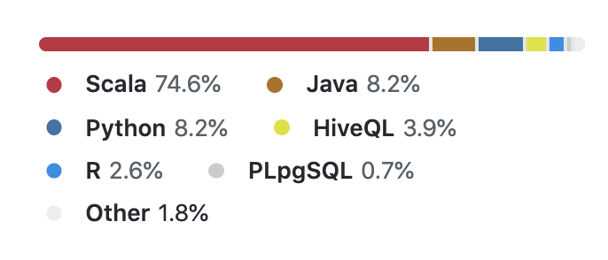

# Scala Spark vs Python PySpark: Which is better?

Apache Spark code can be written with the Scala, Java, Python, or R APIs.

Scala and Python are the most popular APIs. This blog post performs a detailed comparison of writing Spark with Scala and Python and helps users choose the language API that's best for their team.

Both language APIs are great options for most workflows. Spark lets you write elegant code to run jobs on massive datasets - it's an amazing technology.

Choosing the right language API is an important decision. It's hard to switch once you develop core libraries with one language.

Making the right choice is difficult because of common misconceptions like "Scala is 10x faster than Python", which are completely misleading when comparing Scala Spark and PySpark.

TL;DR:

- PySpark used to be buggy and poorly supported, but that's not true anymore. Python is a first class citizen in Spark. PySpark is a great option for most workflows.
- More people are familiar with Python, so PySpark is naturally their first choice when using Spark.
- Many programmers are terrified of Scala because of its reputation as a super-complex language. They don't know that Spark code can be written with basic Scala language features that you can learn in a day. You don't need to "learn Scala" or "learn functional programming" to write Spark code with Scala. You can stick to basic language features like `if`, `class`, and `object`, write code that looks exactly like Python, and enjoy the benefits of the Scala ecosystem.
- Scala is a compile-time, type-safe language, so it offers certain features that cannot be offered in PySpark, like Datasets. Compile time checks give an awesome developer experience when working with an IDE like IntelliJ.
- A lot of the Scala advantages don't matter in the Databricks notebook environment. Notebooks don't support features offered by IDEs or production grade code packagers, so if you're going to strictly work with notebooks, don't expect to benefit from Scala's advantages.
- Python has great libraries, but most are not performant / unusable when run on a Spark cluster, so Python's "great library ecosystem" argument doesn't apply to PySpark (unless you're talking about libraries that you know are performant when run on clusters).

Let's dig into the details and look at code to make the comparison more concrete.

## Chaining DataFrame transformations

This section demonstrates how the `transform` method can elegantly invoke Scala functions (because functions can take two parameter lists) and isn't quite as easy with Python.

Custom transformations are a great way to package Spark code. They're easily reusable and can be composed for different analyses. They're also easily testable as standalone units.

Suppose you have the following DataFrame.

```
+--------+
| country|
+--------+
|  brasil|
|colombia|
|    null|
+--------+
```

Here's a Scala function that'll append some text to the `country` column:

```scala
def funify(colName: String, str: String)(df: DataFrame): DataFrame = {
  df.withColumn("funified", concat(col(colName), lit(" "), lit(str)))
}
```

Here's how to invoke the Scala function with the `Dataset#transform` method:

```scala
df
  .transform(funify("country", "is awesome"))
  .show()
```

```
+--------+-------------------+
| country|           funified|
+--------+-------------------+
|  brasil|  brasil is awesome|
|colombia|colombia is awesome|
|    null|               null|
+--------+-------------------+
```

Notice how the `funify` function is defined with two parameter lists and invoked with one set of arguments. The Scala programming language allows for this elegant syntax.

Here's an equivalent PySpark function that'll append to the `country` column:

```scala
from pyspark.sql.functions import col, lit, concat

def funify(col_name, str):
    def _(df):
        return df.withColumn("funified", concat(col(col_name), lit(" "), lit(str)))
    return _
```

Here's how to invoke the Python function with `DataFrame#transform`:

```scala
df.transform(funify("country", "is super fun!")).show(truncate=False)
```

```
+--------+----------------------+
|country |funified              |
+--------+----------------------+
|colombia|colombia is super fun!|
|brasil  |brasil is super fun!  |
|null    |null                  |
+--------+----------------------+
```

There are [a lot of different ways to define custom PySpark transformations](https://mungingdata.com/pyspark/chaining-dataframe-transformations/), but nested functions seem to be the most popular.

Nested functions aren't the best. They create an extra level of indentation and require two return statements, which are easy to forget. The comparative difficulty of chaining PySpark custom transformations is a downside.

## Datasets vs DataFrames

Datasets can only be implemented in languages that are compile-time type-safe. Java and Scala are compile-time type-safe, so they support Datasets, but Python and R are not compile-time type-safe, so they only support DataFrames.

Datasets so useful in practice.

- It's easy to perform operations [that'll convert a Dataset to a DataFrame](https://mungingdata.com/apache-spark/dataset-tods-createdataset-advantages/) (e.g. adding a column).
- Datasets [are less performant](https://stackoverflow.com/questions/40596638/spark-2-0-dataset-vs-dataframe/40602882#40602882) although [the performance gap is supposedly narrowing](https://izeigerman.medium.com/making-the-spark-dataframe-composition-type-safe-r-7b6fed524ec2)
- [Expressively typed Datasets](https://github.com/typelevel/frameless/) sound promising, but [aren't practical yet](https://mungingdata.com/apache-spark/frameless-typed-datasets/)

Datasets shouldn't be considered to be a huge advantage because most Scala programmers use DataFrames anyways.

## Feature parity

PySpark generally supports all the features in Scala Spark, with a few exceptions.

The `CalendarIntervalType` has been in the Scala API since Spark 1.5, but still isn't in the PySpark API as of Spark 3.0.1. This is a "serious loss of function" and [will hopefully get added](https://github.com/apache/spark/pull/29935).

In general, both the Python and Scala APIs support the same functionality. Spark knows that a lot of users avoid Scala/Java like the plague and they need to provide excellent Python support.

## Performance comparison

Scala and PySpark should perform relatively equally for DataFrame operations.

[This thread](https://stackoverflow.com/questions/32464122/spark-performance-for-scala-vs-python) has a dated performance comparison.

["Regular" Scala code can run 10-20x faster than "regular" Python code](https://news.ycombinator.com/item?id=26030970), but that PySpark isn't executed liked like regular Python code, so this performance comparison isn't relevant.

PySpark is converted to Spark SQL and then executed on a JVM cluster. It's not a traditional Python execution environment. Benchmarks for other Python execution environments are irrelevant for PySpark.

Watch out! Some other blog posts imply that PySpark is 10x slower which just isn't true.

## Code editing

The IntelliJ community edition provides a powerful Scala integrated development environment with out of the box. If provides you with code navigation, type hints, function completion, and compile-time runtime error reporting.

There's also a [Metals](https://scalameta.org/metals/) project that allows for IDE-like text editor features in Vim or VSCode. Use IntelliJ if you'd like a full-serviced solution that works out of the box. Metals is good for those who enjoy text editor tinkering and custom setups.

Scala provides excellent text editors for working with Spark.

Some folks develop Scala code without the help of either Metals or IntelliJ, which puts you at a disadvantage. Scala IDEs give you a lot of help for free. Scala devs that reject free help from their text editor will suffer unnecessarily.

PyCharm doesn't work out of the box with PySpark, [you need to configure it](https://stackoverflow.com/questions/34685905/how-to-link-pycharm-with-pyspark). [pyspark-stubs](https://github.com/zero323/pyspark-stubs) provide some nice error messages and autocompletion, but nothing compared to what's offered by Scala/IntelliJ.

Scala has the edge for the code editor battle.

## Compile time exceptions

Here's what IntelliJ will show when you try to invoke a Spark method without enough arguments.



The PyCharm error only shows up when pyspark-stubs is included and is more subtle.


At least you can hover over the method and get a descriptive hint.



## Code navigation

IntelliJ/Scala let you easily navigate from your code directly to the relevant parts of the underlying Spark code. Suppose your cursor is on the `regexp_extract` function. You can pretty Command + b to go directly to `org.apache.spark.sql.functions.regexp_extract` and then continue pressing Command + b to see exactly how the function is working under the hood.

PySpark code navigation is severely lacking in comparison. You can navigate to functions within your codebase, but you'll be directed to the stub file if you try to jump to the underlying PySpark implementations of core functions.

PySpark code navigation can't be as good due to Python language limitations.

## Packaging JARs vs Wheels

Scala projects can be packaged as JAR files and uploaded to Spark execution environments like Databricks or EMR where the functions are invoked in production. JAR files can be assembled without dependencies (thin JAR files) or with dependencies (fat JAR files). Scala makes it easy to customize your fat JAR files to exclude the test dependencies, exclude Spark (because that's already included by your runtime), and contain other project dependencies. See [this blog](https://mungingdata.com/apache-spark/building-jar-sbt/) for more on building JAR files.

You can even overwrite the packages for the dependencies in fat JAR files to avoid namespace conflicts by leveraging a process called shading.

Suppose `com.your.org.projectXYZ` depends on `com.your.org.projectABC` and you'd like to attach `projectXYZ` to a cluster as a fat JAR file. You'd like `projectXYZ` to use version 1 of `projectABC`, but would also like to attach version 2 of `projectABC` separately. When `projectXYZ` calls `com.your.org.projectABC.someFunction`, it should use version 1. All other invocations of `com.your.org.projectABC.someFunction` should use version 2.

You can shade `projectABC` in the `projectXYZ` fat JAR file, so the path is something like `projectAbcShaded.projectABC`, to prevent namespace conflicts for when `projectABC` version 2 is attached to the cluster. See [here](https://mungingdata.com/apache-spark/shading-dependencies-with-sbt/) for more details on shading.

Shading is a great technique to avoid dependency conflicts and dependency hell.

Python doesn't support building fat wheel files or shading dependencies. This [blog post](https://databricks.com/blog/2020/12/22/how-to-manage-python-dependencies-in-pyspark.html) explains some of the new ways to manage dependencies with Python and [this repo](https://github.com/massmutual/sample-pyspark-application) shows how PySpark developers have managed dependencies historically. The PySpark solutions aren't as clean as fat JAR files, but are robust and improving nonetheless.

## Scala dependency hell

Scala minor versions aren't binary compatible, so maintaining Scala projects is a lot of work. Scala 2.11 projects need to depend on projects that were also compiled with Scala 2.11.

It was even a lot of work for the Spark creators, Scala programming experts, [to upgrade the Spark codebase from Scala 2.11 to 2.12](https://issues.apache.org/jira/browse/SPARK-14220).

Scala codebase maintainers need to track the continuously evolving Scala requirements of Spark:

- Spark 2.3 apps needed to be compiled with Scala 2.11.
- Spark 2.4 apps could be cross compiled with both Scala 2.11 and Scala 2.12.
- Spark 3 apps only support Scala 2.12.

Suppose you add a dependency to your project in Spark 2.3, like [spark-google-spreadsheets](https://github.com/potix2/spark-google-spreadsheets). The maintainer of this project stopped maintaining it and [there are no Scala 2.12 JAR files in Maven](https://mvnrepository.com/artifact/com.github.potix2/spark-google-spreadsheets). The spark-google-spreadsheets dependency would prevent you from cross compiling with Spark 2.4 and prevent you from upgrading to Spark 3 entirely.

You'd either need to upgrade spark-google-spreadsheets to Scala 2.12 and publish a package yourself or drop the dependency from your project to upgrade.

PySpark developers don't have the same dependency hell issues. A wheel file that's compiled with Python 3.6 will work on a Python 3.7 cluster. A wheel file that's compiled with Spark 2 will likely work on a Spark 3 cluster.

Scala should thoroughly vet dependencies and the associated transitive dependencies whenever evaluating a new library for their projects. Minimizing dependencies is the best way to sidestep dependency hell.

## Spark native functions

The `org.apache.spark.sql.functions` are examples of Spark native functions. They're implemented in a manner that allows them to be optimized by Spark before they're executed.

The `pyspark.sql.functions` are mere wrappers that call the Scala functions under the hood.

Spark native functions need to be written in Scala.

Check out the itachi repo for [an example of a repo that contains a bunch of Spark native functions](https://github.com/yaooqinn/itachi).

You need to write Scala code if you'd like to write your own Spark native functions. The Spark maintainers [are hesitant to expose the regexp\_extract\_all functions to the Scala API](https://github.com/apache/spark/pull/31346), so I implemented it in [the bebe project](https://github.com/MrPowers/bebe).

You'll need to use Scala if you'd like to do this type of hacking. 75% of the Spark codebase is Scala code:



Most folks aren't interested in low level Spark programming. This advantage only counts for folks interested in digging in the weeds.

## Libraries

Python has a great data science library ecosystem, some of which cannot be run on Spark clusters, others that are easy to horizontally scale.

- scikit-learn is an example of a lib that's not easily runnable on Spark
- [jellyfish](https://jellyfish.readthedocs.io/en/latest/) can be easily wrapped in UDFs and run on Spark in a performant manner, see the [ceja](https://github.com/MrPowers/ceja) project

Just make sure that the Python libraries you love are actually runnable on PySpark when you're assessing the Python library ecosystem.

There is also a well-supported [Koalas](https://github.com/databricks/koalas) project for folks that would like to write Spark code with Pandas syntax.

If you absolutely need a particular library, you can assess the support for both the Scala and PySpark APIs to aid your decision. For example, if you need Tensorflow at scale, you can compare [TensorFlowOnSpark](https://github.com/yahoo/TensorFlowOnSpark) and [tensorflow\_scala](https://github.com/eaplatanios/tensorflow_scala) to aid your decision.

A lot of the popular Spark projects that were formerly Scala-only now offer Python APIs (e.g. [spark-nlp](https://github.com/JohnSnowLabs/spark-nlp) and [python-deequ](https://github.com/awslabs/python-deequ)).

Neither library ecosystem is clearly favored. It depends on your specific needs.

## UDFs

UDFs should be avoided whenever possible, with either language API, because they're a black box for the compiler and can't be optimized.

UDFs are also a frequent cause of NullPointerExceptions. Make sure you always test the null input case when writing a UDF.

You should always try to solve your problem with the functions exposed in `org.apache.spark.sql.functions` or `pyspark.sql.functions` before falling back to UDFs.

Both Python and Scala allow for UDFs when the Spark native functions aren't sufficient.

[Pandas UDFs (aka vectorized UDFs)](https://databricks.com/blog/2017/10/30/introducing-vectorized-udfs-for-pyspark.html) are marketed as a cool feature, but they're really an anti-pattern that should be avoided, so don't consider them a PySpark plus.

## toPandas

PySpark DataFrames can be converted to Pandas DataFrames with `toPandas`. This collects all the data on the driver node and negates all the parallelism benefits of regular PySpark DataFrames.

Spark DataFrames are spread across a cluster and computations run in parallel - that's why Spark is so fast - it's a cluster computing framework.

You throw all the benefits of cluster computing out the window when converting a Spark DataFrame to a Pandas DataFrame. All the data is transferred to the driver node. Subsequent operations run on the Pandas DataFrame will only use the computational power of the driver node.

The driver node usually isn't big enough for all the data, so calling `toPandas` often results in an out of memory exception.

`toPandas` might be useful at times, but it probably causes more harm than good. Newbies try to convert their Spark DataFrames to Pandas so they can work with a familiar API and don't realize that it'll crash their job or make it run a lot slower. Use [koalas](https://github.com/databricks/koalas) if you'd like to write Spark code with Pandas syntax.

`toPandas` is [the fastest way to convert a DataFrame column to a list](https://mungingdata.com/pyspark/column-to-list-collect-tolocaliterator/), but that's another example of an antipattern that commonly results in an OutOfMemory exception.

`toPandas` shouldn't be considered a PySpark advantage. Write out a Parquet file and read it in to a Pandas DataFrame using a different computation box if that's your desired workflow. You don't need a heavyweight Spark JVM cluster to work with Pandas.

## Whitespace sensitivity

Python's whitespace sensitivity causes ugly PySpark code when backslash continuation is used.

Here's an example from the [python-deequ](https://github.com/awslabs/python-deequ) README:

```python
checkResult = VerificationSuite(spark) \
    .onData(df) \
    .addCheck(
        check.hasSize(lambda x: x >= 3) \
        .hasMin("b", lambda x: x == 0) \
        .isComplete("c")  \
        .isUnique("a")  \
        .isContainedIn("a", ["foo", "bar", "baz"]) \
        .isNonNegative("b")) \
    .run()
```

Backslash continuation is frowned upon in the Python community, but you'll still see it in the wild.

The equivalent Scala code looks nicer without all the backslashes:

```scala
val verificationResult = VerificationSuite()
  .onData(data)
  .addCheck(
    Check(CheckLevel.Error, "unit testing my data")
      .hasSize(_ == 5)
      .isComplete("id")
      .isUnique("id")
      .isComplete("productName")
      .isContainedIn("priority", Array("high", "low"))
      .isNonNegative("numViews")
    .run()
```

You can avoid the Python backslashes by wrapping the code block in parens:

```python
spark = (SparkSession
    .builder
    .config("spark.jars.packages", pydeequ.deequ_maven_coord)
    .config("spark.jars.excludes", pydeequ.f2j_maven_coord)
    .getOrCreate())
```

Spark encourages a long method change style of programming so Python whitespace sensitivity is annoying.

## Type safe programming

Scala is a compile-time, type-safe language and offers type safety benefits that are useful in the big data space.

Suppose your project has a small bug and contains a method that takes three parameters, but is only invoked with two arguments. Scala will throw a compile-time error and not allow you to build the JAR file to make a production deploy.

Small bugs can be really annoying in big data apps. Your job might run for 5 hours before your small bug crops up and ruins the entire job run.

Python doesn't have any similar compile-time type checks. Python will happily build a wheel file for you, even if there is a three parameter method that's run with two arguments.

There are different ways to write Scala [that provide more or less type safety](https://www.lihaoyi.com/post/StrategicScalaStylePracticalTypeSafety.html). Spark is on the less type safe side of the type safety spectrum.

- Column objects are basically untyped
- Datasets aren't that practical to use
- Type casting is a core design practice to make Spark work

Type safety has the potential to be a huge advantage of the Scala API, but it's not quite there at the moment. I'm working on a project called [bebe](https://github.com/MrPowers/bebe) that'll hopefully provide the community with a performant, type safe Scala programming interface.

## Notebook programming

Some of the costs / benefits we've discussed thus far don't carry over to the notebook environment.

For example, Scala allows for compile time checks and IDEs will highlight invalid code. Databricks notebooks don't support this feature. This particular Scala advantage over PySpark doesn't matter if you're only writing code in Databricks notebooks.

Databricks notebooks are good for exploratory data analyses, but shouldn't be overused for production jobs.

The code for production jobs should live in version controlled GitHub repos, which are packaged as wheels / JARs and attached to clusters. Databricks notebooks should provide a thin wrapper around the package that invokes the relevant functions for the job.

## Delta Engine

Databricks is developing a proprietary Spark runtime called Delta Engine that's written in C++.

Delta Engine will provide Scala & Python APIs. One of the main Scala advantages at the moment is that it's the language of Spark. This advantage will be negated if Delta Engine becomes the most popular Spark runtime.

The Delta Engine source code is private. That'll make navigating to internals and seeing how things work under the hood impossible, in any language. That'll also make it impossible for other players to release Delta Engine based runtimes.

The existence of Delta Engine makes the future of Spark unclear.

Delta Lake, another Databricks product, started private and eventually succumbed to pressure and became free & open source. It's possible Delta Engine will become open source and the future of hardcore Spark hacking will be C++.

## Publishing open source projects

Publishing open source Scala projects to Maven is a pain.

- You need to open a JIRA ticket to create your Maven namespace (not kidding)
- Wait for a couple of days for them to respond to the JIRA ticket
- You need to create a GPG key and upload the public key to a keyserver
- Actually publishing requires a separate SBT plugin (SBT plugin maintenance / version hell is a thing too!)

Every time you run the publish command, you need to remember the password for your GPG key.

Publishing open source Python projects to PyPi is much easier. You run the publishing command, enter your username / password, and the wheel is uploaded, pretty much instantaneously. The Poetry dependency management tool provides the `poetry publish` tool out of the box, so you don't need to deal with the Python equivalent of a SBT plugin.

Python open source publishing is a joy compared to Scala.

## Conclusion

Spark is an awesome framework and the Scala and Python APIs are both great for most workflows.

PySpark is more popular because Python is the most popular language in the data community.

PySpark is a well supported, first class Spark API, and is a great choice for most organizations.

Scala is a powerful programming language that offers developer friendly features that aren't available in Python. You can use basic Scala programming features with the IntelliJ IDE and get useful features like type hints and compile time checks for free.

Scala offers a lot of advance programming features, but you don't need to use any of them when writing Spark code. Complex Spark data processing frameworks can be built with basic Scala language features like `object`, `if`, and functions.

Scala is also great for lower level Spark programming and easy navigation directly to the underlying source code.

Scala gets a lot of hate and many developers are terrified to even try working with the language. Their aversion of the language is partially justified. Scala allows certain developers to get out of line and write code that's really hard to read. Sidenote: Spark codebase is a great example of well written Scala that's easy to follow.

The best language for your organization will depend on your particular team. Platforms like Databricks make it easy to write jobs in both languages, but that's not a realistic choice for most companies. Once core libraries are developed in one language, then all subsequent jobs are forced to use the chosen language to avoid rework.

Choosing the right language API is important. Think and experiment extensively before making the final decision!
