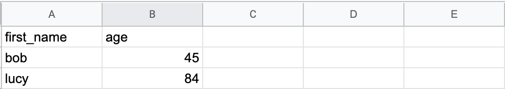
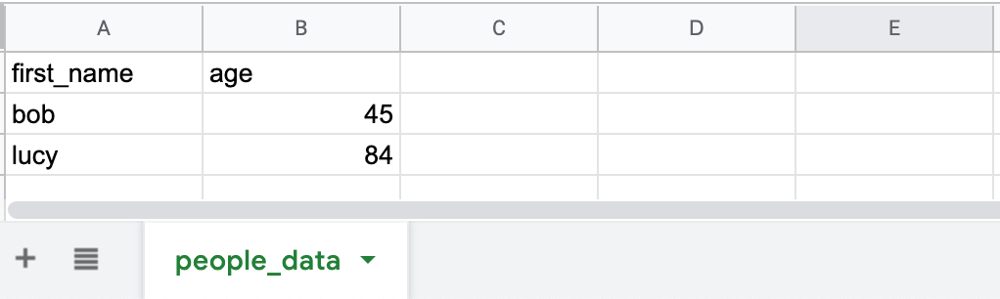

This blog post explains how to read a Google Sheet into a Spark DataFrame with the [spark-google-spreadsheets](https://github.com/potix2/spark-google-spreadsheets) library.

Google Sheets is not a good place to store a lot of data, but is fine for small datasets. Google Sheets are easy for non-technical users to understand and modify.

## Create a Google Spreadsheet

Create a Google Spreadsheet with a few columns and rows of data.



You'll of course need a Google account to access Sheets.

## Setup credentials

Setting up the credentials is the hardest part.

Luckily [this guide](https://github.com/juampynr/google-spreadsheet-reader) provides a detailed description of the process.

You'll need to create a service account key and then share your sheet with the email address in the service account ID field.

As part of the process, you'll create a credentials file that you can store on your machine, perhaps in the `~/gcloud_credentials/` directory. Make sure to never check in credentials to source control.

## Import the library and read the sheet

Add this line to your `build.sbt` file to import the library:

```
libraryDependencies += "com.github.potix2" %% "spark-google-spreadsheets" % "0.6.3"
```

Now you'll need to inspect the URL of your Google Sheet to decipher its unique identifier. Suppose the URL is `https://docs.google.com/spreadsheets/d/1d6aasdfqwergfds0P1bvmhTRasMbobegRE6Zap-Tkl3k/edit#gid=0`.

The unique sheet identifier is `1d6aasdfqwergfds0P1bvmhTRasMbobegRE6Zap-Tkl3k` for this sheet.

Further suppose that the tab name is `people_data`.



Here's how to read the sheet into a DataFrame:

```
val df = spark.sqlContext.read
  .format("com.github.potix2.spark.google.spreadsheets")
  .load("1d6aasdfqwergfds0P1bvmhTRasMbobegRE6Zap-Tkl3k/people_data")
```

Run `df.show()` to view the contents of the DataFrame:

```
+----------+---+
|first_name|age|
+----------+---+
|       bob| 45|
|      lucy| 84|
+----------+---+
```

Run `df.printSchema()` to print the schema of the DataFrame:

```
root
 |-- first_name: string (nullable = true)
 |-- age: string (nullable = true)
```

The `age` column was not inferred to be an `IntegerType` column. Doesn't appear that this library supports schema inference.

`df.rdd.partitions.length` returns one, which means that the entire sheet was read into a single memory partition. Spark normally reads big datasets in parallel into multiple partitions. The Google Sheet data is only read into a single partition because this library isn't meant to read big datasets. It's meant to read tiny datasets.

## Scala 2.12 / Spark 3

There's [an open issue](https://github.com/potix2/spark-google-spreadsheets/issues/24) for cross compiling this library with Scala 2.12.

If the issue doesn't get worked on and you'd like a JAR file that'll work with Scala 2.12 and Spark 3, [email me](https://github.com/MrPowers/) and I'll consider forking the repo and making a release.

## Next steps

spark-google-spreadsheets makes it easy to read data from Google Sheets into Spark DataFrames.

Google Sheets can be great for small single source of truth data files that are frequently updated by non-technical users.

Users can make arbitrary changes to Google Sheets, so make sure to validate input before processing it in your Spark application. The [spark-daria](https://github.com/MrPowers/spark-daria) validators will help.

You can also write data from Spark to Google Sheets, but that's probably a less common workflow for most organizations.
