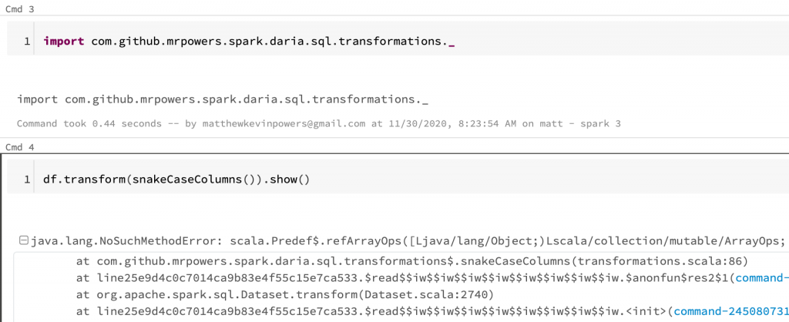
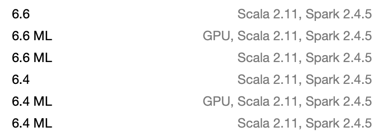
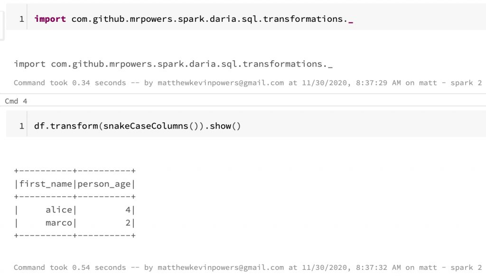
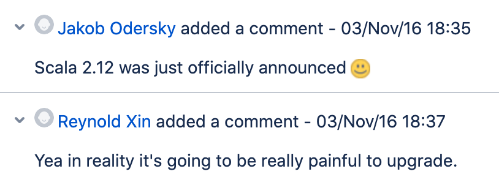
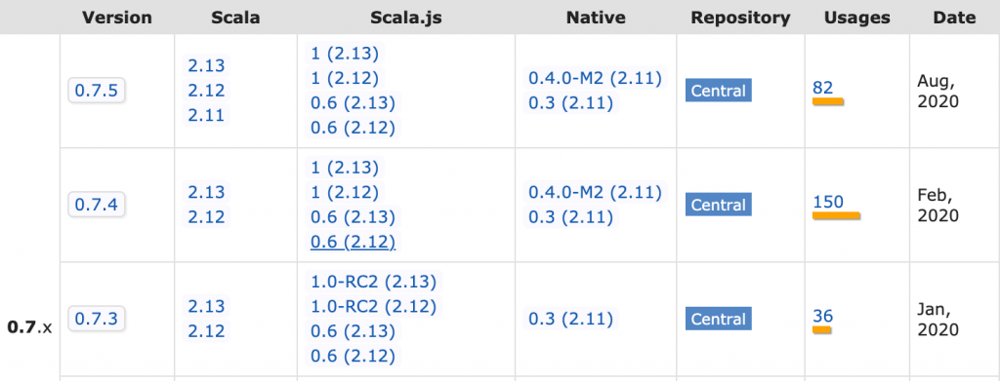
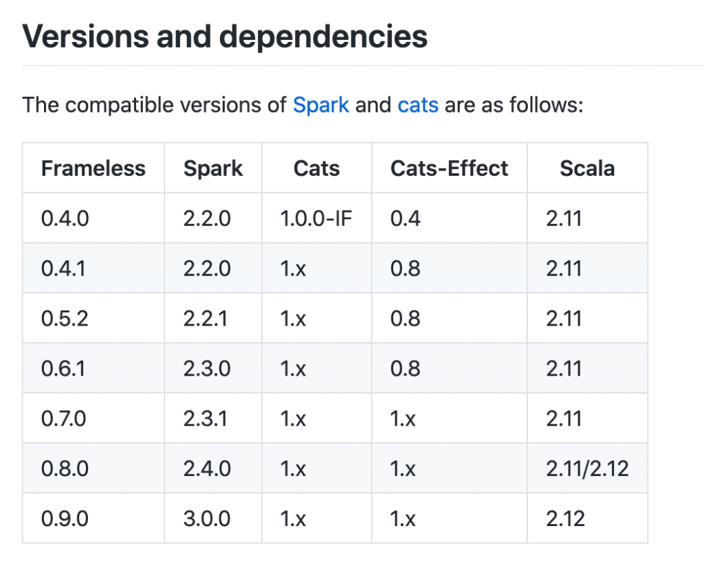
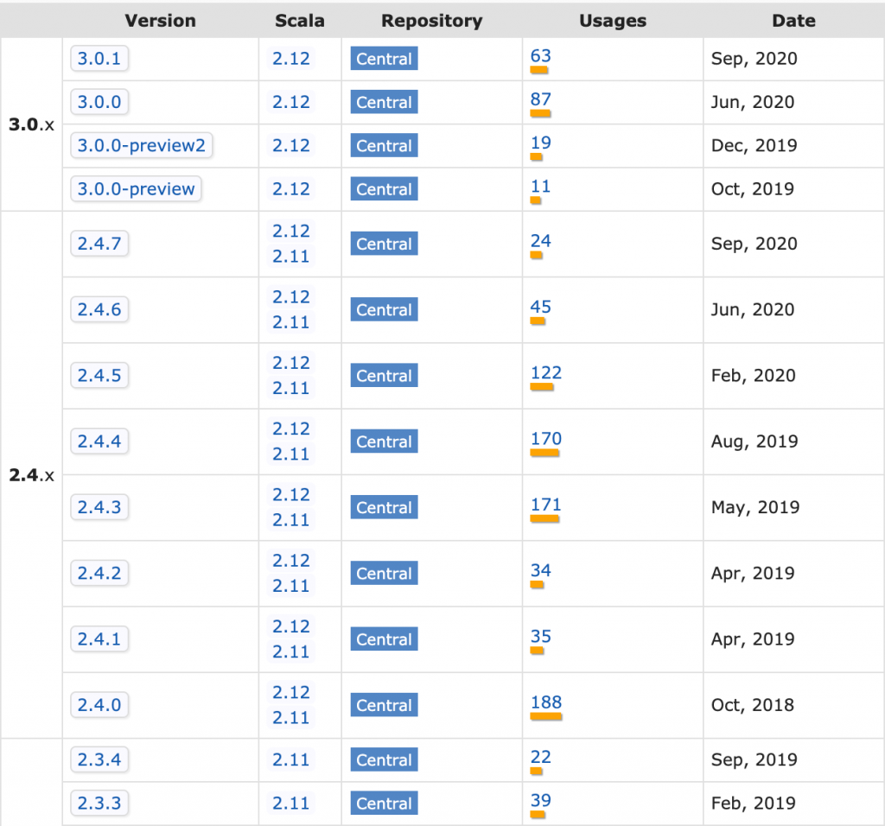

# Migrating Scala Projects to Spark 3

This post explains how to migrate your Scala projects to Spark 3.

It covers the high level steps and doesn't get [into all the details](https://spark.apache.org/docs/3.0.0-preview/sql-migration-guide.html).

Migrating PySpark projects is easier. Python wheel files generated in a PySpark 2 app also work with PySpark 3.

Scala projects that use Scala 2.11 will not work with Spark 3 projects and you need to cross compile the project to avoid strange error messages.

There a few upgrade approaches:

- Cross compile with Spark 2.4.5 and Scala 2.11/2.12 and gradually shift jobs to Spark 3 (with the JAR files compiled with Scala 2.12)
- Upgrade your project to Spark 3 / Scala 2.12 and immediately switch everything over to Spark 3, skipping the cross compilation step
- Create a build matrix and build several jar files for different combinations of Scala and Spark (e.g. Scala 2.11/Spark 2.4.5, Scala 2.12/Spark 2.4.5, Scala 2.12/Spark 3.0.1)

## Specifying dependencies

Different JAR files are stored in Maven for the different Scala versions.

Scala project JAR files should be stored in Maven using this convention:

```
com/
  github/
    mrpowers/
      spark-daria_2.11/
        0.38.2/
          spark-daria_2.11-0.38.2.jar
      spark-daria_2.12/
        0.38.2/
          spark-daria_2.12-0.38.2.jar
```

See [the Maven website](https://repo1.maven.org/maven2/com/github/mrpowers/spark-daria_2.11/) for the 2.11 JARs and [here](https://repo1.maven.org/maven2/com/github/mrpowers/spark-daria_2.12/) for the 2.12 JARs.

Scala dependencies should be added to your `build.sbt` file with the `%%` operator that automatically fetches the Scala version that corresponds with your project version.

You should add dependencies to your project like this:

```scala
libraryDependencies += "com.github.mrpowers" %% "spark-daria" % "0.38.2"
```

The `%%` operator will grab the Scala 2.11 JAR file when the project version is set to Scala 2.11 and will use the Scala 2.12 JAR file when the project version is set to Scala 2.12.

Make sure all of your Scala dependencies use the `%%` operator.

Java dependencies don't need to use the `%%` operator because they don't need to be cross compiled for different versions of Scala. You can add a Java dependency like this an it'll cross compile fine with different Scala versions:

```scala
libraryDependencies += "joda-time" % "joda-time" % "2.10.8"
```

## Cross compile with Scala 2.12

Scala 2.12 support was added as of Spark 2.4.

For Spark 2.0 - Spark 2.3, you could only use Scala 2.11.

Once you upgrade your project to Spark 2.4.x, add the following line to your `build.sbt` file:

```scala
crossScalaVersions := Seq("2.11.12", "2.12.12")
```

Run the `sbt +assembly` command to build two JAR files, one for Scala 2.11 and another for Scala 2.12. Here's where the JAR files are outputted in the file system:

```
spark-daria/
  target/
    scala-2.11/
      spark-daria-assembly-0.38.2.jar
    scala-2.12/
      spark-daria-assembly-0.38.2.jar
```

[This post](https://mungingdata.com/apache-spark/building-jar-sbt/) discusses building JAR files in more detail.

## Errors for Scala 2.11 JAR files on Spark 3 clusters

Suppose you have the following DataFrame:

```
+----------+----------+
|First Name|Person Age|
+----------+----------+
|     alice|         4|
|     marco|         2|
+----------+----------+
```

Let's run a spark-daria transformations to snake case all of the DataFrame columns:

```scala
import com.github.mrpowers.spark.daria.sql.transformations._
df.transform(snakeCaseColumns()).show()
```

This code errors out with this strange message: java.lang.NoSuchMethodError: scala.Predef$.refArrayOps(\[Ljava/lang/Object;)Lscala/collection/mutable/ArrayOps.

Your code will error out if you attach a JAR file that was compiled with Scala 2.11 to a Spark 3 cluster.

Here's the error you'll see in Databricks:



The Scala 2.11 JAR file can be added to the Spark 3 cluster and imported without any errors. You won't get errors until you actually start running the code.

## Scala 2.12 projects on Spark 2 cluster

All the Databricks Spark 2 clusters use Scala 2.11:



Scala 2.12 JAR files surprisingly work on Spark 2 clusters without any issues:



I'm not certain Scala 2.12 JAR files will work on Spark 2/Scala 2.11 clusters properly in all situations.

It's always best to match the JAR file Scala version with the cluster Scala version.

## How to make migrating easier

Upgrading Spark from Scala 2.11 to Scala 2.12 was a massive undertaking [as you can see here](https://issues.apache.org/jira/browse/SPARK-14220).



You can make your projects easier to upgrade by limiting dependencies. Every dependency you have in a project is a potential point of failure when you're upgrading.

When you add a dependency, make sure it's actively maintained and cross compiled with the latest versions of Scala. If a library you rely on does not publish a Scala 2.12 JAR file, then you'll need to fork it and build the JAR file yourself.

[spark-google-spreadsheets](https://mungingdata.com/apache-spark/read-google-sheets-dataframe/) is a good example of a project that's [not being built with Scala 2.12 yet](https://github.com/potix2/spark-google-spreadsheets/issues/24). Don't add this dependency to your Spark 2 project unless you're prepared to release the Scala 2.12 JAR file yourself when you're trying to upgrade to Spark 3.

When you're considering adding a library to your project, make sure to evaluate all the transitive dependencies. Here are some dependencies from [spark-testing-base](https://github.com/holdenk/spark-testing-base) for example:

```scala
lazy val commonDependencies = Seq(
  "org.scalatest" %% "scalatest" % "3.0.5",
  "io.github.nicolasstucki" %% "multisets" % "0.4",
  "org.scalacheck" %% "scalacheck" % "1.14.0",
  "junit" % "junit" % "4.12",
  "org.eclipse.jetty" % "jetty-util" % "9.3.11.v20160721",
  "com.novocode" % "junit-interface" % "0.11" % "test->default")
```

If you depend on spark-testing-base, you'll be depending on multisets, [which is now archived](https://github.com/nicolasstucki/multisets). multisets [has JAR files for Scala 2.10, 2.11, and 2.12](https://mvnrepository.com/artifact/io.github.nicolasstucki/multisets), but no JAR file for Scala 2.13. This'll be a problem when Spark eventually upgrades to Scala 2.13.

Look for developers that build Scala libraries that are dependency free, have stable APIs, and are always updated to be cross compiled with the latest version of Scala.

[Li Haoyi's libraries](https://github.com/lihaoyi) like [os-lib](https://github.com/lihaoyi/os-lib), [utest](https://github.com/lihaoyi/utest), and [fansi](https://github.com/lihaoyi/fansi) are great examples of stable, dependency-free libraries.

You can go to Maven and see how the latest version of utest has JAR files for Scala 2.11, 2.12, and 2.13.



Scalatest is an example of a less reliable dependency, for example the [Scalatest 3.1 release made backwards incompatible changes](https://github.com/scalatest/scalatest/issues/1274). Library users normally don't expect breaking changes for minor version bumps. Users typically expect [semantic versioning](https://semver.org/) rules to be followed.

spark-testing-base depends on Scalatest 3.0.5 and upgrading the Scalatest version will be hard. Using the latest version of Scalatest with spark-testing-base isn't possible. spark-testing-base doesn't have an easy path forward. They're already building JAR files for different versions of Scala / Spark. Are they supposed to create a four dimensional build matrix for all combinations of Scala / Spark / Scalatest / project versions?

Part of the reason I authored the dependency-free [spark-fast-tests](https://github.com/MrPowers/spark-fast-tests) library was to avoid depending on Scalatest. Avoid libraries with dependencies whenever possible.

Sidenote: Scalatest is an important part of the Scala community and I'm grateful for all they've contributed.

## Scala ecosystem isn't very stable

Scala minor version bumps can introduce breaking changes to your code. Scala 2.11 code may not work with Scala 2.12.

Lots of Scala libraries use the SBT build tool, which also changes a lot.

Scala runs on the JVM, which is also changing.

Maintaining a Scala project can be quite burdensome. I highly recommend limiting dependencies and leveraging dependency-free libraries when working with Scala.

## Best upgrade path

Upgrade your Spark application to Spark 2.4.5 and cross compile it with Scala 2.11 or 2.12. The Scala 2.12 JAR files will work for Spark 3 and the Scala 2.11 JAR files will work with Spark 2.

Transition some of your production workflows to Spark 3 and make sure everything is working properly.

After some jobs are running on Spark 3 without problems, then get ready to make the full switch. Upgrade the Scala version to 2.12 and the Spark version to 3.0.1 in your project and remove the cross compile code.

See the [frameless example](https://github.com/typelevel/frameless) of cross compiling and then cutting Spark 2/Scala 2.11:



Spark 3 only works with Scala 2.12, so you can't cross compile once your project is using Spark 3. See the [Spark Maven page](https://mvnrepository.com/artifact/org.apache.spark/spark-sql) with the available versions:



Before beginning the upgrade process, you might want to do a full audit of all your project dependencies (including the transitive dependencies). Limiting your project dependencies will make it easier to maintain your project going forward.
