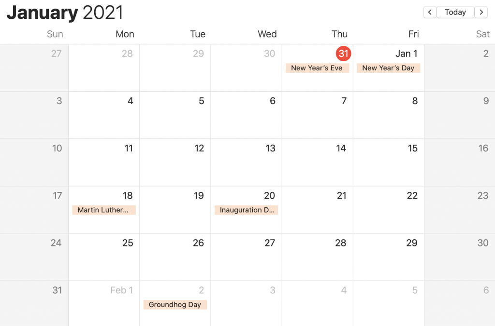

# Calculating Week Start and Week End Dates with Spark

You can use native Spark functions to compute the beginning and end dates for a week, but the code isn't intuitive.

This blog post demonstrates how to wrap the complex code in simple functions, so your code is readable.

The Spark datetime functions aren't the best, but they're better than using UDFs with ugly Java code.

## TL;DR

Use the `beginningOfWeek` and `endOfWeek` functions defined in [spark-daria](https://github.com/MrPowers/spark-daria) to easily calculate these values.

```scala
import com.github.mrpowers.spark.daria.sql.functions._

df
  .withColumn("beginning_of_week", beginningOfWeek(col("some_date")))
  .withColumn("end_of_week", endOfWeek(col("some_date")))
```

Here's example output:

```
+----------+-----------------+-----------+
| some_date|beginning_of_week|end_of_week|
+----------+-----------------+-----------+
|2021-01-09|       2021-01-03| 2021-01-09|
|2021-01-10|       2021-01-10| 2021-01-16|
|2021-01-11|       2021-01-10| 2021-01-16|
|2021-01-12|       2021-01-10| 2021-01-16|
|2021-01-13|       2021-01-10| 2021-01-16|
|2021-01-14|       2021-01-10| 2021-01-16|
|2021-01-15|       2021-01-10| 2021-01-16|
|2021-01-16|       2021-01-10| 2021-01-16|
|2021-01-17|       2021-01-17| 2021-01-23|
|2021-01-18|       2021-01-17| 2021-01-23|
|      null|             null|       null|
+----------+-----------------+-----------+
```

Spark considers Sunday to be the first day of the week and Saturday to be the last day of the week. You'll need to pass in an optional `lastDayOfWeek` argument if you'd like to use a custom week definition.

Keep reading for more details.

## dayofweek

Let's start by analyzing Spark's internal representation of days, so you can understand the required inputs for the date functions.

Spark has a `dayofweek` function that returns an integer from 1 to 7. 1 is for Sunday, 2 is for Monday, …, and 7 is for Saturday.

Suppose you have the following DataFrame with all the dates from a week in January 2021.

```
+----------+
| some_date|
+----------+
|2021-01-10|
|2021-01-11|
|2021-01-12|
|2021-01-13|
|2021-01-14|
|2021-01-15|
|2021-01-16|
|      null|
+----------+
```

Run `df.withColumn("dayofweek", dayofweek(col("some_date"))).show()` and observe the output.

```
+----------+---------+
| some_date|dayofweek|
+----------+---------+
|2021-01-10|        1| // a Sunday
|2021-01-11|        2|
|2021-01-12|        3|
|2021-01-13|        4|
|2021-01-14|        5|
|2021-01-15|        6|
|2021-01-16|        7| // a Saturday
|      null|     null|
+----------+---------+
```

Notice that Spark considers Sunday to be the first day of the week and Saturday to be the last day of the week.

The `dayofweek` function will come in handy when calculating the end of the week.

## `next_day`

Let's look at another DataFrame with a couple of dates.

```
+----------+
| some_date|
+----------+
|2021-01-11|
|2021-01-23|
+----------+
```

Use the `next_day` function to calculate the next Friday:

```scala
sourceDF
  .withColumn("next_friday", next_day(col("some_date"), "Friday"))
  .show()
```

Here are the results:

```
+----------+-----------+
| some_date|next_friday|
+----------+-----------+
|2021-01-11| 2021-01-15|
|2021-01-23| 2021-01-29|
+----------+-----------+
```

Take a look at the calendar to see how the `next_day` function is working:



## endOfWeek

Let's create an `endOfWeek` function that returns the last day of the week. Saturday should be the default week end date, but the function should take an optional parameter to allow for user customization.

```scala
def dayOfWeekStr(col: Column): Column = {
  when(col.isNull, null)
    .when(col === lit(1), lit("Sun"))
    .when(col === lit(2), lit("Mon"))
    .when(col === lit(3), lit("Tue"))
    .when(col === lit(4), lit("Wed"))
    .when(col === lit(5), lit("Thu"))
    .when(col === lit(6), lit("Fri"))
    .when(col === lit(7), lit("Sat"))
}

def endOfWeek(col: Column, lastDayOfWeek: String = "Sat"): Column = {
  when(dayOfWeekStr(dayofweek(col)) === lit(lastDayOfWeek), col)
    .otherwise(next_day(col, lastDayOfWeek))
}
```

Suppose you have the following dates:

```
+----------+
| some_date|
+----------+
|2020-12-27|
|2020-12-28|
|2021-01-03|
|2020-12-12|
|      null|
+----------+
```

Run `df.withColumn("week_end", endOfWeek(col("some_date"))).show()` to calculate the last day of the week:

```
+----------+----------+
| some_date|  week_end|
+----------+----------+
|2020-12-27|2021-01-02|
|2020-12-28|2021-01-02|
|2021-01-03|2021-01-09|
|2020-12-12|2020-12-12|
|      null|      null|
+----------+----------+
```

The last day of the week is Saturday by default.

## beginningOfWeek

Now that we have an `endOfWeek` function, it's easy to calculate the beginning of the week:

```scala
def beginningOfWeek(col: Column, lastDayOfWeek: String = "Sat"): Column = {
  val endOfWeek = endOfWeek(col, lastDayOfWeek)
  date_sub(endOfWeek, 6)
}
```

You take the end of the week and subtract six days to calculate the beginning of the week.

Let's use the same dataset as above and calculate the beginning of the week, assuming the week end on Wednesday (so the weeks start on Thursday).

```scala
df
  .withColumn("beginning_of_week", beginningOfWeek(col("some_date"), "Wed"))
  .show()
```

Here's the output:

```
+----------+-----------------+
| some_date|beginning_of_week|
+----------+-----------------+
|2020-12-27|       2020-12-24|
|2020-12-28|       2020-12-24|
|2021-01-03|       2020-12-31|
|2020-12-12|       2020-12-10|
|      null|             null|
+----------+-----------------+
```

## weekofyear

Spark's `weekofyear` function returns the week number as an integer that ranges from 1 to 53.

Let's use this DataFrame as input data for the function:

```
+----------+
| some_date|
+----------+
|2021-01-01|
|2021-01-02|
|2021-01-09|
|2021-01-10|
|2021-01-11|
|2021-01-12|
|2021-01-13|
|2021-01-14|
|2021-01-15|
|2021-01-16|
|2021-01-17|
|2021-01-18|
|      null|
+----------+
```

Run the `weekofyear` function with `weekofyear(col("some_date"))` and observe the output:

```
+----------+----------+
| some_date|weekofyear|
+----------+----------+
|2021-01-01|        53|
|2021-01-02|        53|
|2021-01-09|         1|
|2021-01-10|         1|
|2021-01-11|         2|
|2021-01-12|         2|
|2021-01-13|         2|
|2021-01-14|         2|
|2021-01-15|         2|
|2021-01-16|         2|
|2021-01-17|         2|
|2021-01-18|         3|
|      null|      null|
+----------+----------+
```

Here's the unexpected function output:

- The first week of 2021 is grouped with the last week of 2020 (desirable for some calculations)
- Week starts with Monday and ends with Sunday (other Spark functions assume week starts with Sunday and ends with Saturday)

The `weekofyear` function is good for high level weekly aggregations, but shouldn't be used if you need fine grained week control.

## Next week day

The weekdays are Monday, Tuesday, Wednesday, Thursday, and Friday.

Spark has a `date_add` function that can be used to calculate the next day, but we'll need a little more logic for calculations the next weekday. It the day is Friday, the next weekday is the following Monday, not the next day (which would be a Saturday).

Here's the code for calculating the next weekday:

```scala
def nextWeekDay(col: Column): Column = {
  val d = dayofweek(col)
  val friday = lit(6)
  val saturday = lit(7)
  when(col.isNull, null)
    .when(d === friday || d === saturday, next_day(col,"Mon"))
    .otherwise(date_add(col, 1))
}
```

Notice how `lit(6)` and `lit(7)` are assigned to variables that make the code readable.

Also notice how the if/else logic is modeled with when/otherwise in Spark.

Let's use this dataset to observe the behavior of the `nextWeekday` function:

```
+----------+
| some_date|
+----------+
|2021-01-10|
|2021-01-11|
|2021-01-12|
|2021-01-13|
|2021-01-14|
|2021-01-15|
|2021-01-16|
|      null|
+----------+
```

Run the function with `nextWeekday(col("some_date"))` and observe the output:

```
+----------+------------+
| some_date|next_weekday|
+----------+------------+
|2021-01-10|  2021-01-11| // for Sunday, next weekday is Monday
|2021-01-11|  2021-01-12|
|2021-01-12|  2021-01-13|
|2021-01-13|  2021-01-14| // for Wednesday, next weekday is Thursday
|2021-01-14|  2021-01-15|
|2021-01-15|  2021-01-18| // for Friday, next weekday is Monday
|2021-01-16|  2021-01-18|
|      null|        null|
+----------+------------+
```

As you can see in [this answer](https://stackoverflow.com/questions/49414408/get-next-week-date-in-spark-dataframe-using-scala), the code is more complex if the `java.time` libraries are used. Avoid the Java Time libraries and UDFs whenever possible.

## Conclusion

The Spark native functions make it relatively easy to compute the end and beginning of the week.

You should wrap generic datetime functions in helper methods so your code is more readable.

Datetime related manipulation is particularily hard to read because of all the underlying assumptions (e.g. the integer 1 represents Sunday, the default week ends on Saturday).

Hide all this messiness by simply using the [spark-daria](https://github.com/MrPowers/spark-daria) helper functions.
