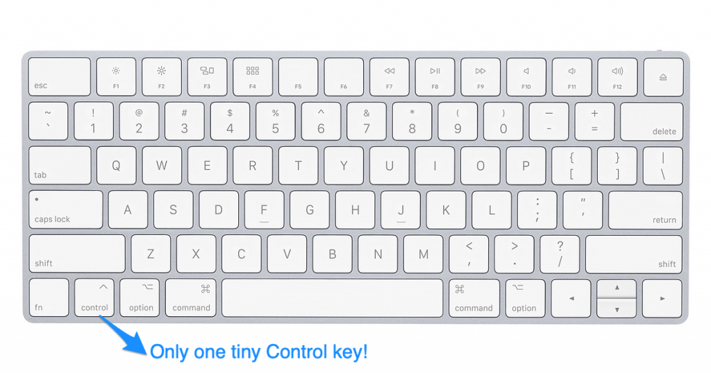
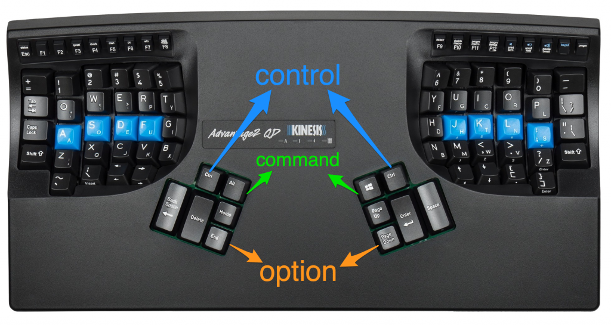

Have you ever tried Emacs, found the keybindings to be highly unergonomic, and wondered why so many great programmers are passionate about such a weird editor?

You're not alone - [Emacs pinky is a thing](http://ergoemacs.org/emacs/emacs_pinky.html) and [several famous Emacs users suffer with debilitating repetitive strain injury](http://ergoemacs.org/emacs/emacs_hand_pain_celebrity.html).

This blog post outlines a different approach to learning Emacs that won't leave you confused or with RSI.

There is a reason tons of [famous programmers use Emacs](https://www.pixelstech.net/article/1375065327-Those-famous-Emacs-users).

I'll let you in on the secret…

If you've had a bad experience with Emacs is probably because you didn't use the right keyboard.

Yep, that's right, people have been blaming Emacs for decades when the real problem is the keyboard they're using to write Emacs!

TL;DR Emacs isn't great on normal keyboards but is amazing on keyboards like the Kinesis Advantage that provide easy access to modifier keys for both hands.

## Most keyboards suck for Emacs

Most keyboards suck for programming because the special characters and modifer keys aren't easily accessible.

Emacs keybindings should be used with keyboards easily let you press the modifier keys with both hands.

You haven't given Emacs a fair shot if you haven't tried it out with a suitable keyboard.

## Ergonomic typing basics

You should use two hands whenever typing commands that require two keys. When typing capital W, you should hold down the shift key with your right hand and type the "w" key with your left hand. You should not hold the shift key with your left pinky and press the "w" key with your left index finger.

Lots of Emacs commands require the Control key. There is only one Control key in the lower left corner of most keyboards. This encourages programmers to press Control + c (C-c) by holding Control with their left pinky and "c" with their right index finger.

Repeatedly pressing two keys with one hand is not ergonomic and will cause RSI.

Emacs pinky is caused by the location of the control key on your keyboard. It's not a flaw of the text editor!

## Suitable keyboards for Emacs

A good programming keyboard makes it easy to press the Control and Meta keys with both your left and right hands. Apple users also need access to the Command button with both hands.

Your keyboard should allow you to type the modifier keys with your index fingers or thumbs. Your pinkies are weak fingers and are most susceptible to RSI. Pinkies should be used minimally when typing.

## Kinesis Advantage

The Kinesis Advantage keyboard provides easy access to the Control, Meta, and Apple keys for both your right and left thumbs.

With a little bit of Kinesis configuration, you can setup your keys like this:

Emacs shortcuts are ergonomic and intuitive with a Kinesis Advantage keyboard.

The difference is night and day - I love Emacs on a Kinesis Advantage keyboard and don't use Emacs when I am using regular Mac keyboards.

## Sublime Text and Emacs

The [Emacs Pro Essentials](https://github.com/sublime-emacs/sublemacspro) plugin makes it easy to add familiar Emacs key bindings to the modern [Sublime Text editor](https://www.sublimetext.com/).

This blog post discusses [moving to Sublime Text after 20 years of Emacs](https://medium.com/@justinchuang/from-emacs-to-sublime-text-3-47358d89a5ff). Some key quotes from the article:

- "Sublime Text 3 is a better and moderner programming editor than GNU Emacs in the 21st century."
- "Unlike 1980, programming is a much more complicated task in today’s world. We have too many things to learn. People should spend time on more important stuff rather than tinkering their editor anymore."

You can start learning Emacs keybindings with Sublime Text and then switch to "pure Emacs" later if you'd like to learn Emacs Lisp and [have full control to configure your text development environment](https://alhassy.github.io/init/).

The Sublime Text shortcuts work seamlessly with the Emacs shortcuts. You can easily highlight text "the Emacs way" (C-space C-space) and then cut / copy "the Apple way" (Command-x / Command-v).

Sublime offers great file navigation with Command-t and great find/replace with Command-f.

## Unexpected benefits of Emacs

Emacs keybindings work well in a ton of unexpected places including Google Chrome input boxes, TextEdit, and the Terminal command line.

Brian Fox created Bash and was an Emacs maintainer so it's no suprise that Emacs keybindings work seamlessly in Bash terminals.

Standard shortcuts don't work in Terminal and you'll find it amazing to have a good set of shortcuts for editing command line text.

## Conclusion

Emacs keybindings didn't make sense to me until I got a Kinesis Advantage keyboard.

You should learn how to use the Kinesis Advantage keyboard first and then learn Emacs. Learning both at the same time would be too much.

I've been a happy Vim user for many years and now I'm a happy Emacs user too.

I use Vim when typing on my Mac keyboard (when traveling with my laptop) and Emacs when I have access to my Kinesis Advantage keyboard and standing desk.

P.S. The blog post contains affiliate links.
