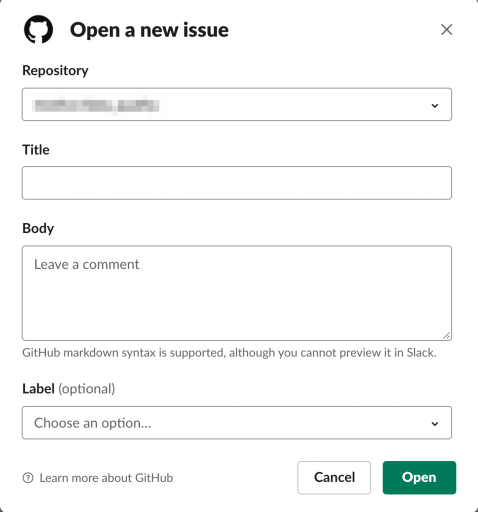
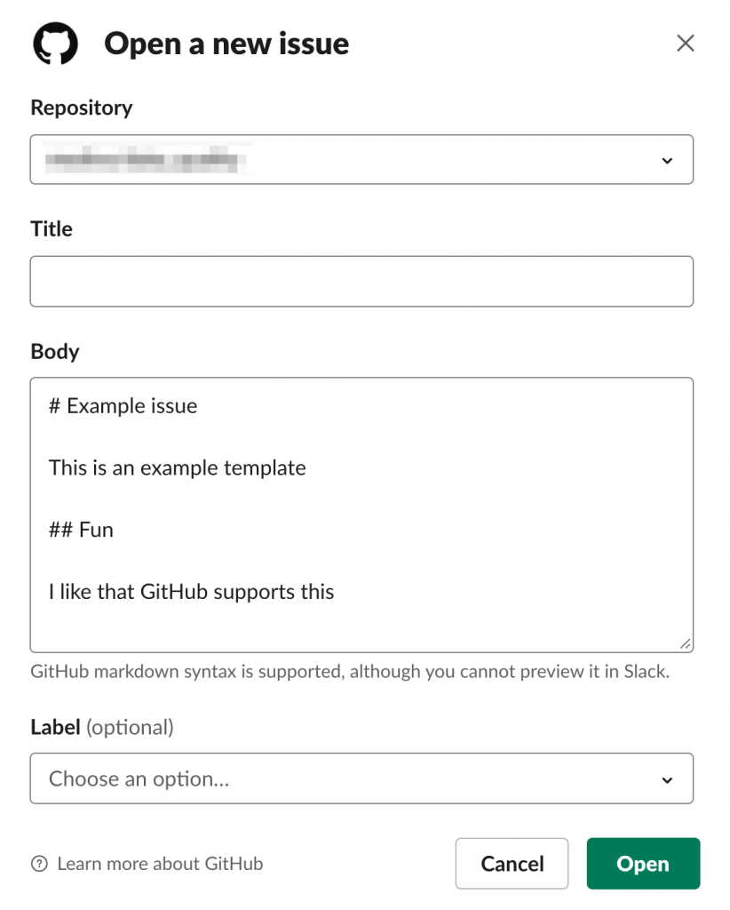

GitHub is great for an IT ticketing system - it's easy to create issues, set assignees, and prioritize the ticket with labels.

The GitHub Slack integration makes it easy to create tickets directly from the Slack command line.

This blog post explains how to create a lightweight ticketing system with GitHub, so you can avoid adding another technology to your organization.

## Creating GitHub tickets

Let's say your GitHub repo is named `bug_tracker`. You can easily create a ticket by logging onto GitHub, openining the `bug_tracker` repo, clicking Issues, and then clicking New Issue.

This workflow works fine for programmers familiar with GitHub, but it's not the best for nontechnical team members.

You might want to make the ticketing system easily accessible to product, legal, and other departments.

Luckily the Slack GitHub integration makes it easy to create GitHub issues directly from the Slack command line.

## Creating tickets from Slack

The [GitHub Slack integration](https://slack.github.com/) makes it easy to create issues in Slack.

You link your GitHub and Slack accounts with the `/github signin` command (you can run this command from any channel).

The ["Take action" section of the README](https://github.com/integrations/slack#take-action) describes the command to create an issue: `/github open [owner/repo]`

For example, to create an issue in the [spark-daria](https://github.com/MrPowers/spark-daria/), you'd run `/github open mrpowers/spark-daria`.

This command opens the following dialogue box where you can populate the issue title, body, and labels.



Just fill out the form and click Open to create the issue!

## Creating tickets with templates

You can also make templates that make it easier to populate different types of tickets.

Suppose you have a `mrpowers/bugs` repo. You can add issue templates to the `.github/ISSUE_TEMPLATE` directory. Let's create a `.github/ISSUE_TEMPLATE/bad_link.md` file with these contents:

```
# Example issue

This is an example template

## Fun

I like that GitHub supports this
```

We can now run `/github open mrpowers/bugs bad_link` to open the issue form with the body pre-populated from the template.



## Custom Slack Slash commands

You can use [Slack slash commands](https://api.slack.com/interactivity/slash-commands) to build a custom ticketing system.

You could make a `/bug_report` Slash command and let the user type commands like `/bug_report the link to the about page is broken`. The `/bug_report` command could be configured to send a POST request to AWS Lambda. Lambda would create a GitHub issue, add approvers, ping folks in Slack, etc.

It's usually best to avoid building a custom system. Internal tools take a while to build and are annoying to maintain. You probably won't want to update Lambda functions once versions get deprecated or update your code when Slack changes their API.

## Conclusion

GitHub is a great tool for a lightweight ticketing system.

The GitHub features and terminology are familiar for developers.

The GitHub Slack integration is maintained and you can rely on third party developers to keep the code updated as Slack changes their API.

This is a great opportunity for organizations to limit the number of technologies and operational overhead.
