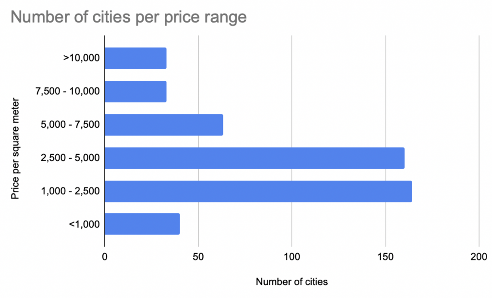
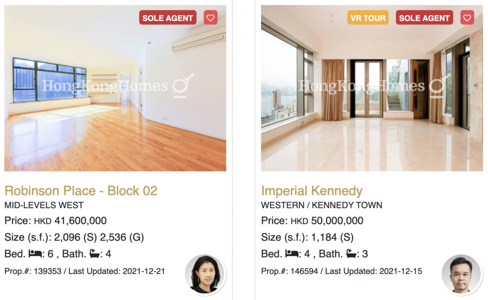
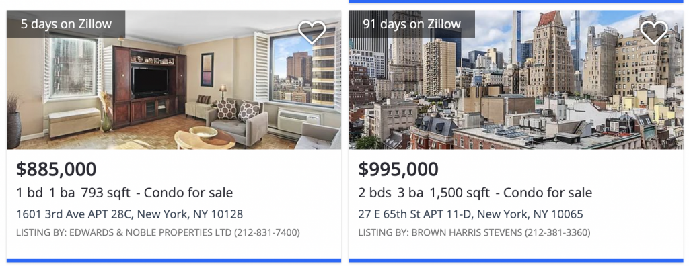
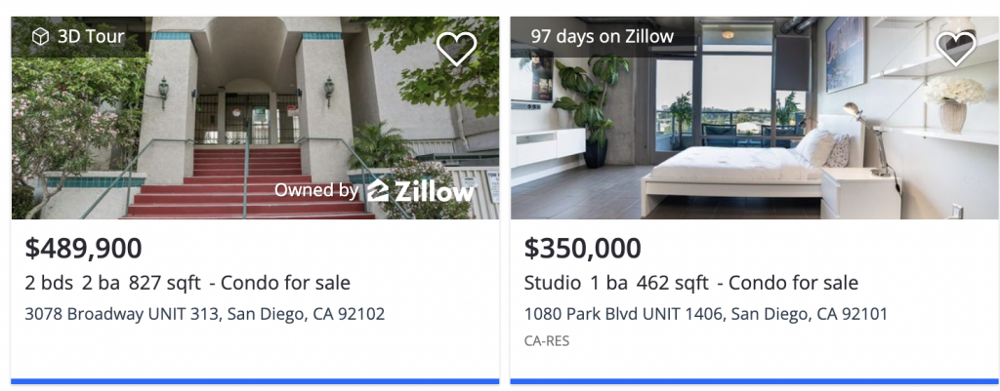
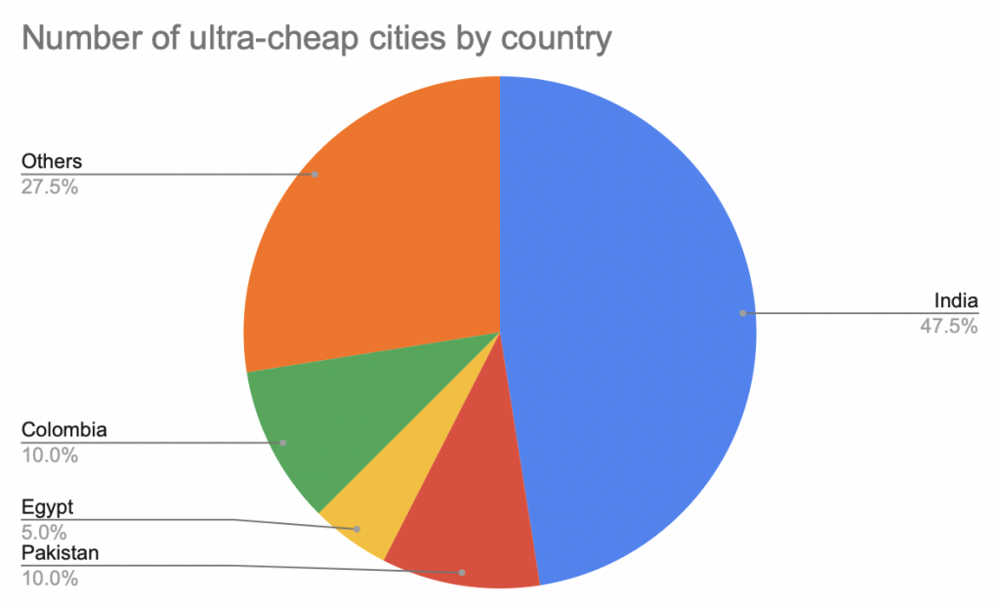

This post explains how to identify ultra-cheap international real estate markets and when you can capitalize on deeply discounted prices.

Let's borrow Andrew Henderson's definition of an ultra-cheap real estate market:

- Less than $1,000 per square meter ($93 per square foot)
- Near the city center

This article gives a high level overview of pricing per square meter in markets across the world and demonstrates how pricing varies greatly across cities.

Some ultra-cheap markets have bad fundamentals and will stay cheap. Other ultra-cheap markets are set to grow and offer attractive returns for investors. This blog post will help you discover the markets that are destined to be winners.

## Price per square meter for different cities

Numbeo shows [the price per square meter](https://www.numbeo.com/cost-of-living/city_price_rankings?itemId=100) for real estate in 493 cities around the world. Here are a few of the prices as of December 2021 (with their Numbeo price ranking):

- Hong Kong: 33,596 (1)
- New York: 15,576 (11)
- San Diego: 8,754 (43)
- Montreal: 5,693 (101)
- Kansas City: 2,819 (267)
- Detroit: 1,320 (412)
- Medellin: 974 (456)
- Caracas: 946 (462)

The price discrepancies between cities is vast - you can either buy one apartment in Hong Kong or 35 equal sized apartments in Medellin for the same price!

The following graph illustrates the number of cities in different price ranges:

Only 40 (8%) of the 493 cities in the list have a price per square meter less than $1,000. Andrew Henderson's "ultra-cheap rule of thumb" seems to nicely capture the bottom sliver of the market.

A relatively small number of cities cost more than $10,000 per square meter. 66% of cities have apartments that cost between $1,000 and $5,000 per square meter.

Let's take a look at some actual listings in different markets to sanity check the Numbeo estimates.

### Hong Kong

Robinson Place - Block 2 costs $5,335,000 and is 195 square meters, so it costs $27,000 per square meter. Imperial Kennedy costs $6,412,000 and is smaller, so its cost per square meter is even higher. The Numbeo estimate of 33,596 per square meter in Hong Kong seems accurate.

### New York City

1601 3rd Ave is 73 square meters and costs $885,000, so the price per square meter is $12,000. That's similar to $15,576 as predicted by Numbeo.

### San Diego

3078 Broadway is 77 square meters and costs $489,900, so the price per square meter is $6,500. It's priced similar to the Numbeo prediction of $8,754.

### Medellin

This Medellin apartment costs $295,000 and is 300 square meters (983 per square meter), almost identical to $982 per square meter as computed by Numbeo.

## Ultra-cheap breakdown

Take a look at the number of ultra-cheap cities by country bearing in mind that most countries don't have any ultra-cheap cities:

India, Pakistan, Colombia, and Egypt are the only countries with multiple ultra-cheap cities.

There are other countries that only have one ultra-cheap city like Iraq, Venezuela, Nigeria, and South Africa. They've been grouped into the Others bucket of the pie chart.

Let's look at the GDP per capita for the countries with multiple ultra-cheap cities:

- India: $1,900
- Pakistan: $1,200
- Egypt: $3,500
- Colombia: $5,300

While India has a lot of ultra-cheap cities, it's notable that the India brand name cities like Delhi ($3,005 per square meter), Mumbai ($7,185), and Bangalore ($1,800) are not ultra-cheap. Lesser know Indian cities like Vadodara ($584) are the ones that fall in the ultra-cheap bucket. Here's [a video of Vadodara](https://www.youtube.com/watch?v=vtGZDulm4MM&ab_channel=TopVideos), so you can get an idea of the market.

Multan, Pakistan is the cheapest city on the list ($288). Here's [a video of Multan](https://www.youtube.com/watch?v=WOJ42xGkhMU&ab_channel=WildLensbyAbrar). This low pricing is probably mainly driven by the low GDP per capita in Pakistan.

## What causes markets to be ultra-cheap?

Crime, economic crises, political instability, and low economic output are correlated with cheap cities.

Caracas ($946), Cali ($852), and Johannesburg ($847) are on the [top 50 cities with highest murder rates](https://en.wikipedia.org/wiki/List_of_cities_by_murder_rate) list, so it's not surprising they're ultra-cheap. However, Saint Louis ($1,967), Baltimore ($2,635), and San Juan ($2,788) are also on the top 50 murder list, but they're not nearly as cheap, so violence isn't the only factor.

Venezuela is in the midst of a major economic crisis, so that's another contributing factor why Caracas is ultra-cheap. However, Lebanon is also in an economic crisis and Beirut ($3,761) isn't that cheap, so economic crises can't explain cheap housing single handedly either.

Colombia is a curious case because the economy is growing, crime is falling, and demographics are favorable. The property market is also booming.

Remember that the Numbeo figures are priced in US dollars, not in Colombian pesos. The Colombian peso has deprecated significantly against the US dollar from July 2014 to December 2021. The exchange rate has gone from 1,861 COP / USD to 4000 COP / USD. A Colombian property that rose 60% from July 2014 to December 2021 in Colombian peso terms actually fell in value when converted to US dollars due to exchange rate fluctuations.

Not all currencies have been depreciating against the dollar. The Swiss Franc and the Singapore dollar haven't depreciated for example. The price per square meter isn't dragged down for Switzerland or Singapore when the figures are converted to US dollars.

In summary, ultra-cheap real estate markets usually have bargain basement prices for a good reason. Finding the attractive investment opportunity requires identifying the markets that will get better or are unjustifiably battered down by false economic narratives.

## Nomad Capitalist video on ultra-cheap markets

Andrew Henderson has a great video from 2019 on ultra-cheap international real estate:

https://youtu.be/YyzsSQcDCvo

Henderson recommends buying property in capital cities or business centers. He focuses on the core city center / tourist section of these cities. Capital cities tend to have the most population and economic growth in emerging markets.

Some cities Henderson mentions in his 2019 video (with December 2021 Numbeo prices for comparison):

- Phnom Penh, Cambodia ($2,412)
- Tblisi, Georgia ($1,263)
- Chisinau, Moldova ($1,116)
- Bishkek, Kyrgyzstan (no data)
- Tashkent, Uzbekistan ($1,195)
- Cairo, Egypt ($850)
- Alexandria, Egypt ($923)
- Islamabad, Pakistan ($607)
- Tunis, Tunisia ($927)

Some of his picks are already starting to climb out of the ultra-cheap club.

Henderson likens investing in these markets to call options. Some of these markets will languish, but others will take off. The downside risk is limited because the prices are already as cheap as they get.

You'll need to actually visit these countries or have a trusted local advisor to find the good deals of course. There aren't high quality websites with neatly organized listings in emerging markets. You won't find the good deals online.

## Best case scenario when investing in ultra-cheap markets

You'd be fabulously wealthy if you bought real estate in Singapore back in 1980.

Singapore's GDP per capita grew from $5,000 a year in 1980 to $60,000 a year in 2020. Their miraculous economic growth was accompanied with real estate price appreciation. Singapore is now one of the most expensive real estate markets in the world with a price per square meter of $19,000.

If you bought a few apartments in Singapore in 1980, you'd have cash flow generating assets and would be sitting on massive capital gains.

Singapore's success is obvious now, but it wasn't clear back in 1980.

## Economic growth stories aren't obvious

Watch this video from the founding father of Singapore, Lee Kuan Yew (LKY), which contains some older clips of LKY, including the famous interview where he reflects on his failure to unify Malaysia:

https://youtu.be/anAYPAmg0IM

LKY is crying in the older clip and he sounds like a man that failed his life mission. Few people would watch the 1965 speech and think "LKY will lead Singapore to be one of the greatest economic success stories of the 20th century".

Don't expect an ultra-cheap market to have an "obvious path paved with gold". That's not how it works. These markets are ultra-cheap for good reasons and you need to pick the ones that have good prospects.

Most ultra-cheap markets won't turn it around like Singapore. They'll continue to languish.

## Ultra-cheap markets can stay cheap

Kabul ($664) is an ultra-cheap market has been for many decades. Afghanistan had a brutal war in the 1980s and has continued to struggle with violent conflict ever since.

As of 2020, the GDP per capita in Afghanistan is only $509 USD.

Kabul seems likely to remain ultra-cheap.

## The next ultra-cheap growth story

Colombian is well poised to climb out of ultra-cheap territory.

Colombia has a lot of positive fundamentals:

- low debt
- strong economic growth
- good demographics
- growing tourism
- close to US & Canada
- open to foreign investment

Andrew Henderson posits that Colombia is cheap because it's still shrouded by the "it's a drug capital" false narrative.

I've been living in Colombia for the past several years and believe in the Colombian growth story. The Colombia Peso has weakened considerably from 2011 till 2021 and a slight strenghening of the Colombia Peso is all it will take to take the Colombian markets our of ultra-cheap territory. I'm buying properties in Colombia at current valuations.

## Conclusion

Ultra-cheap real estate markets will be inexpensive for good reasons. Don't expect safe, beautiful, sunny, and rich cities like Santa Barbera, California ($19,000 per square meter) to be ultra-cheap.

Some ultra-cheap real estate markets are beaten down for reasons that will persist in the future.

Invest in the markets that are battered down by false narratives and have good economic growth stories.

You'll need solid local contacts to invest well of course. An understanding of the culture, language, and local laws is also helpful.

International real estate investing is only appropriate for a small fraction of investors that have a global mindset, are adventurous, and have a high risk tolerance. If you buy into an ultra-cheap market and it becomes the next Singapore, then you'll obviously make a lot of money.
