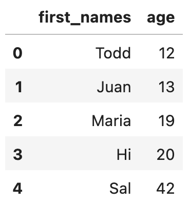
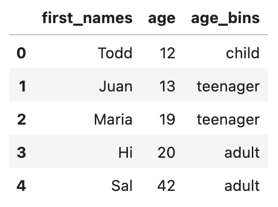

# Add Category Column to pandas DataFrame with cut

This post explains how to add a category column to a pandas DataFrame with `cut()`.

`cut` makes it easy to categorize numerical values in buckets.

Let's look at a a DataFrame of people and categorize them into "child", "teenager", and "adult" buckets based on their age.

## Simple example

Suppose you have the following DataFrame.



Here's the code to create the DataFrame.

```
import pandas as pd
import numpy as np

df = pd.DataFrame(
    {"first_names": ["Todd", "Juan", "Maria", "Hi", "Sal"], "age": [12, 13, 19, 20, 42]}
)
```

Add an `age_bins` column to the DataFrame that categorizes the people into these buckets: child, teenager, or adult.

```
df["age_bins"] = pd.cut(
    x=df["age"],
    bins=[1, 12, 19, np.inf],
    labels=["child", "teenager", "adult"],
)
```

Here's what the resulting DataFrame contains.



The rightmost value is inclusive in the `bins` argument, so the buckets are 1-12, 13-19, and 20-infinity.

## dtypes

Let's inspect the `dtypes` of the resulting DataFrame.

```
df.dtypes
```

```
first_names      object
age               int64
age_bins       category
dtype: object
```

You can see that `age_bins` is a category column.

## When to use cut

You can use `cut` when building features for model training.

You may want to train a machine learning model based on bucket labels, not actual numerical values. `cut` makes it really easy for you to transform a numerical value into categories.

## Conclusion

`cut` is a convenient way to convert a numerical column into different value buckets.

You'll find it especially useful when feature engineering.
