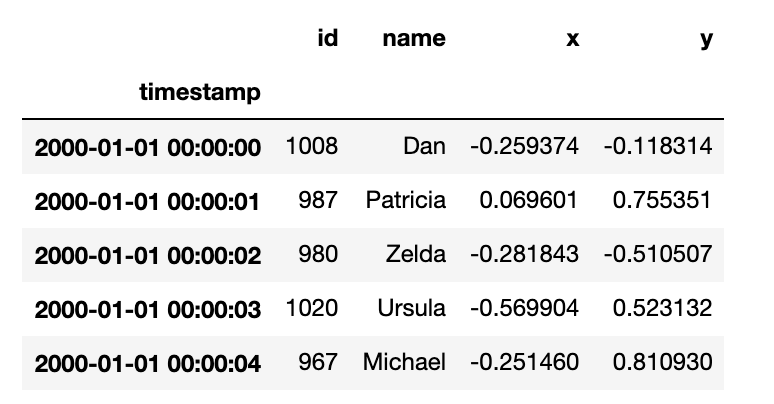

pandas is a great DataFrame library for datasets that fit comfortably in memory, but throws out of memory exceptions for datasets that are too large.

This post shows how pandas works well for a small dataset, but can't run a query on a big datasets. It then shows how Dask can run the query on the large dataset, which has a familiar pandas-like API.

Dask DataFrames scale workflows by splitting up the dataset into partitions and performing computations on each partition in parallel. Each partition in a Dask DataFrame is a pandas DataFrame. Dask's reliance on pandas is what makes it feel so familiar for pandas users.

Let's look at a query that works with pandas on a small dataset and errors out on a large dataset.

## Data query

Here's a subset of the data that will be used in the queries for this blog post.



All the queries will use datasets that have this schema. The only difference will be the size of the datasets that are used.

We'll be querying the number of unique values in the `id` column.

Follow the instructions in the [coiled-datasets](https://github.com/coiled/coiled-datasets) repo if you'd like to create the synthetic datasets and run these queries on your machine.

## Querying data with pandas

Let's run a query to compute the number of unique values in the `id` column with pandas on the small dataset. The `1-month` directory contains 4 Parquet files with 228 MB of data, so they can easily get loaded into a pandas DataFrame.

```
import os
import glob

import pandas as pd

home = os.path.expanduser("~")

path = f"{home}/data/timeseries/1-month/parquet"
all_files = glob.glob(path + "/*.parquet")

df = pd.concat((pd.read_parquet(f) for f in all_files))

# let's time this query
df[["id"]].nunique()
```

It only takes 0.4 seconds to find the number of unique elements in the `id` column when querying this small dataset with pandas.

Now let's run the same query on a large dataset with 1,094 files and 58.2 GB of data.

```
path = f"{home}/data/timeseries/20-years/parquet"
all_files = glob.glob(path + "/*.parquet")

df = pd.concat((pd.read_parquet(f) for f in all_files))

# the next line causes a memory error
df[["id"]].nunique()
```

This query causes the computer to run out of memory, so Python will kill the process.

This query was run on a computer with 8 GB of RAM. That's not even close to big enough to handle a query on a 58.2 GB dataset with pandas.

Let's see how we can run this query the large `20-years` dataset using Dask.

## Big data query with Dask

Let's run the same query on the large dataset with Dask. The syntax for loading multiple files into a Dask DataFrame is more elegant.

```
import dask
import dask.dataframe as dd

from dask.distributed import Client
client = Client()

ddf = dd.read_parquet(
    f"{home}/data/timeseries/20-years/parquet",
    engine="pyarrow",
)

# time the following query
ddf["id"].nunique().compute()
```

Dask runs this query in 9 seconds.

You don't need to explicitly glob files when loading multiple Parquet files into a Dask DataFrame. Dask is built to load multiple files in parallel. It handles the file listing operation for you, under the hood.

This example shows how Dask can handle "out of core" datasets, which is data that's bigger than RAM. The RAM on my machine is 8 GB and Dask can run queries on a dataset that's 58.2 GB.

Dask allows you to "scale up" you computations and run computations on each core of your computer in parallel. It also lets you "scale out" your computations and distribute workloads to multiple computers in a cluster. This example uses Dask to run computations on a single machine, so it's an example of scaling up.

Let's look at when you can expect to run into pandas memory issues and when you should consider switching to Dask.

## How much data can pandas handle?

In the [10 things I hate about pandas article](https://wesmckinney.com/blog/apache-arrow-pandas-internals/), the author of pandas outlines a RAM / dataset size rule of thumb:

> pandas rule of thumb: have 5 to 10 times as much RAM as the size of your dataset

The article is from 2017 and pandas has gotten more efficient, so the ratio is probably better now. In any case, pandas can't handle datasets that are bigger than the RAM on your machine.

There are lots of real world datasets that are much larger than what pandas can handle, so Dask is helpful in a lot of real life scenarios.

## Conclusion

pandas can be used for datasets that fit comfortably in memory but will error out for larger datasets.

When your data is too large for pandas, you can use Dask instead.

Dask uses pandas under the hood and it's easy to convert Dask DataFrames to pandas DataFrames and vice versa. pandas library interoperability is also good with Dask.

The Dask DataFrame API intentionally mimics the pandas API, so it'll feel familiar.

When your datasets are really huge, you can scale out Dask analyses to the cluster. Dask can easily process terabytes of data.

Stick with pandas when your data is sufficiently small and use Dask when your data is large.
