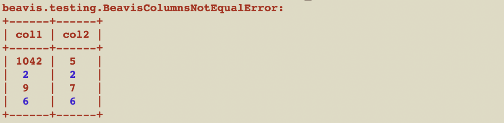
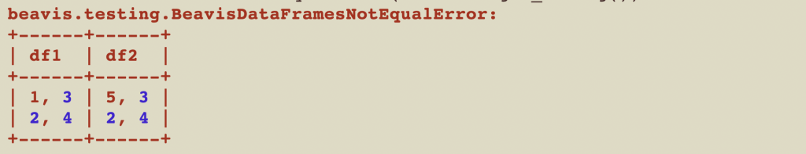
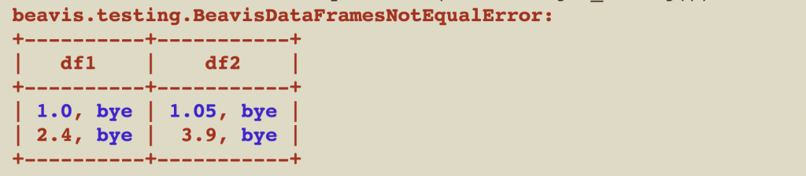

This post explains how to test Pandas code with the built-in test helper methods and with the [beavis](https://github.com/MrPowers/beavis) functions that give more readable error messages.

Unit testing helps you write Pandas code that more modular and easier to refactor. It's especially important to test your core Pandas helper methods.

This post shows the two most popular types of DataFrame tests:

1. Column equality assertions
2. Checking entire DataFrame equality

## Column equality

Let's create a function that adds a `starts_with_s` column to a DataFrame that returns `True` if a string starts with the letter "s".

```
def startswith_s(df, input_col, output_col):
    df[output_col] = df[input_col].str.startswith("s")
```

Now let's write a unit test that runs the `startswith_s` function and make sure it returns the correct result. We'll start with the built-in `pd.testing.assert_series_equal` method.

```
df = pd.DataFrame({"col1": ["sap", "hi"], "col2": [3, 4]})
startswith_s(df, "col1", "col1_startswith_s")
expected = pd.Series([True, False], name="col1_startswith_s")
pd.testing.assert_series_equal(df["col1_startswith_s"], expected)
```

`assert_series_equal` isn't easy to use cause it requires you to manually create a Pandas Series. Let's write the same test with [beavis](https://github.com/MrPowers/beavis).

```
df = pd.DataFrame({"col1": ["sap", "hi"], "col2": [3, 4], "expected": [True, False]})
startswith_s(df, "col1", "col1_startswith_s")
beavis.assert_pd_column_equality(df, "col1_startswith_s", "expected")
```

This is cleaner because we can create a single DataFrame and don't need to build a separate Pandas Series. We can make it even cleaner with another helper method for constructing Pandas DataFrames.

The built in Pandas constructor forces you to create DataFrames with columns of data. Let's use another beavis helper method to create DataFrames with rows of data and write the same test.

```
df = beavis.create_pdf([("sap", 3, True), ("hi", 4, False)], ["col1", "col2", "expected"])
startswith_s(df, "col1", "col1_startswith_s")
beavis.assert_pd_column_equality(df, "col1_startswith_s", "expected")
```

`create_pdf` makes the test more readable because it groups the input data and expected output in the same tuple, which is easier to visually parse.

## Beavis error messages

The beavis error messages are also more descriptive compared to the built-in Pandas errors.

Here's the built-in error message when comparing series that are not equal.

```
df = pd.DataFrame({"col1": [1042, 2, 9, 6], "col2": [5, 2, 7, 6]})
pd.testing.assert_series_equal(df["col1"], df["col2"])
```

```
>   ???
E   AssertionError: Series are different
E
E   Series values are different (50.0 %)
E   [index]: [0, 1, 2, 3]
E   [left]:  [1042, 2, 9, 6]
E   [right]: [5, 2, 7, 6]
```

It's hard to tell which columns are mismatched because they're not aligned.

Here's the beavis error message that aligns rows and highlights the mismatches in red.

```
import beavis

beavis.assert_pd_column_equality(df, "col1", "col2")
```



This descriptive error message makes it easier to debug errors and maintain flow.

## DataFrame equality

You may want to compare the equality of two entire DataFrames as well, not just individual columns.

Here's how to compare DataFrame equality with the built-in `pandas.testing.assert_frame_equal` function.

```
df1 = pd.DataFrame({'col1': [1, 2], 'col2': [3, 4]})
df2 = pd.DataFrame({'col1': [5, 2], 'col2': [3, 4]})
pd.testing.assert_frame_equal(df1, df2)
```

```
E   AssertionError: DataFrame.iloc[:, 0] (column name="col1") are different
E
E   DataFrame.iloc[:, 0] (column name="col1") values are different (50.0 %)
E   [index]: [0, 1]
E   [left]:  [1, 2]
E   [right]: [5, 2]
```

`assert_frame_equal` doesn't provide an error message that's easy to read.

beavis provides a nicer error message.

```
beavis.assert_pd_equality(df1, df2)
```



## Custom equality

You may want to compare DataFrame equality with a custom equality function for certain columns. Here's how to compare two DataFrames with a custom equality function for the float columns.

```
def approx_equality(a, b):
    return math.isclose(a, b, rel_tol=0.1)

df1 = beavis.create_pdf([(1.0, "bye"), (2.4, "bye")], ["col1", "col2"])
df2 = beavis.create_pdf([(1.05, "bye"), (3.9, "bye")], ["col1", "col2"])
beavis.assert_pd_equality(df1, df2, equality_funs = {"col1": approx_equality})
```

The `approx_equality` function returns `True` if the floating point numbers are within 0.1 of each other. Approximate equality is important for floating point comparisons.

These DataFrames aren't considered equal in this example because the floating point numbers are sufficiently far apart. Here's the error message:



## Approximate equality

You can also use the `assert_approx_pd_equality` method to automatically perform approximate equality comparisons for all floating point columns in the DataFrames.

Here's an example:

```
df1 = pd.DataFrame({"col1": ["hi", "aa"], "col2": [3.05, 3.99]})
df2 = pd.DataFrame({"col1": ["hi", "aa"], "col2": [3, 4]})
beavis.assert_approx_pd_equality(df1, df2, 0.1, check_dtype=False)
```

`col1` is a string column so the default equality operator is used. `col2` is a floating point column, so approximate equality is used with the specified precision (which is `0.1` in this example).

## Why testing is important

Testing help you verify the accuracy of your code locally before running it in production. Your test suite documents the functionality of your codebase and serves as a safety blanket when you're refactoring.

If your test suite doesn't break when you refactor, you can rest assured that the refactoring hasn't introduced a breaking change.

Refactoring also encourages you to write code that's designed better. Code that's poorly written is harder to test. You'll be forced to rework awkward parts of your code, so the tests are easier to write.

Many data engineers / data scientists still haven't embraced testing as part of their normal workflow. In the long run, the time invested in writing tests pays for itself in the form of less production errors / less time dealing with bugs.

## Great expectations

The [great\_expectations](https://github.com/great-expectations/great_expectations) library provides an elegant API for performing complex data assertions, similar to the unit tests we've been writing. Great Expectations is more flexible and can accommodate a wider variety of use cases.

beavis is designed to be used on small datasets to verify the correctness of your code via unit tests.

Great Expectations can be used on large datasets to verify the accuracy of the underlying data. Great Expectations is a great library to use in an ETL pipeline to avoid ingesting a large amount of bad data for example.

Both libraries have a place in your PyData stack.

## Conclusion

Pandas doesn't have a big testing culture like other tech stacks. Most Pandas developers never write tests.

Localhost code experimentation and exploratory data analyses don't need tests. Testing is best avoided when experimenting.

You should seriously consider writing tests when you're ready to start writing production-grade code. Good software engineering practices also make for more robust data pipelines.

The PyData ecosystem has a variety of tools that make it easy to build an automated pipeline that's high quality and handles edge cases with ease. You should be thankful for all the amazing open source contributions that make this tech stack so accessible and easy to use!
