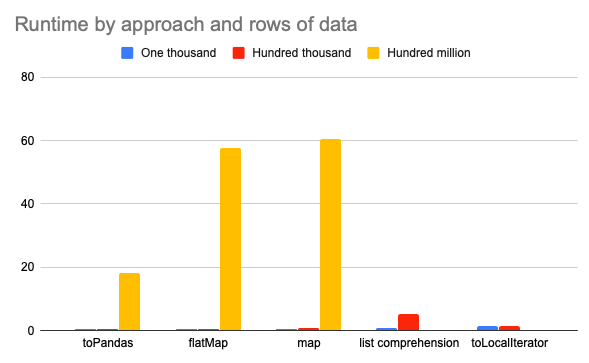

# Converting a PySpark DataFrame Column to a Python List

There are several ways to convert a PySpark DataFrame column to a Python list, but some approaches are much slower / likely to error out with OutOfMemory exceptions than others!

This blog post outlines the different approaches and explains the fastest method for large lists. It'll also explain best practices and the limitations of collecting data in lists.

If you're collecting a small amount of data, the approach doesn't matter that much, but if you're collecting a lot of data or facing out of memory exceptions, it's important for you to read this post in detail.

## Benchmarking summary

Suppose you have the following DataFrame:

```
+---+-----+
|mvv|count|
+---+-----+
|  1|    5|
|  2|    9|
|  3|    3|
|  4|    1|
+---+-----+
```

Here's how to convert the `mvv` column to a Python list with `toPandas`.

```python
list(df.select('mvv').toPandas()['mvv']) # => [1, 2, 3, 4]
```

This table summarizes the runtime for each approach in seconds for datasets with one thousand, one hundred thousand, and one hundred million rows.

|  | One thousand | Hundred thousand | Hundred million |
| --- | --- | --- | --- |
| toPandas | 0.32 | 0.35 | 18.12 |
| flatMap | 0.55 | 0.5 | 57.5 |
| map | 0.39 | 0.77 | 60.6 |
| list comprehension | 0.85 | 5.18 |  |
| toLocalIterator | 1.44 | 1.34 |  |

Here's a graphical representation of the benchmarking results:



The list comprehension approach failed and the toLocalIterator took more than 800 seconds to complete on the dataset with a hundred million rows, so those results are excluded.

## Code for each approach

Here's the `toPandas` code:

```python
list(df.select('mvv').toPandas()['mvv']) # => [1, 2, 3, 4]
```

`toPandas` [was significantly improved in Spark 2.3](https://arrow.apache.org/blog/2017/07/26/spark-arrow/). Make sure you're using a modern version of Spark to take advantage of these huge performance gains.

Here's the `flatMap` code:

```python
df.select('mvv').rdd.flatMap(lambda x: x).collect()
```

Here's the `map` code:

```python
df.select('mvv').rdd.map(lambda row : row[0]).collect()
```

Here's the `collect()` list comprehension code:

```python
[row[0] for row in df.select('mvv').collect()]
```

Here's the `toLocalIterator` list comprehension code:

```python
[r[0] for r in df.select('mvv').toLocalIterator()]
```

## Benchmarking details

The benchmarking analysis was run on cluster with a driver node and 5 worker nodes. The ec2 instances used were i3.xlarge (30.5 GB of RAM and 4 cores each) using Spark 2.4.5. Each dataset was broken into 20 files that were stored in S3.

## Best practices when creating lists from DataFrames

You want to collect as little data to the driver node as possible. Collecting data transfers all the data from the worker nodes to the driver node which is slow and only works for small datasets.

Spark is powerful because it lets you process data in parallel. If the driver node is the only node that's processing and the other nodes are sitting idle, then you aren't harnessing the power of the Spark engine.

It's best to avoid collecting data to lists and figure out to solve problems in a parallel manner.

Collecting data to a Python list and then iterating over the list will transfer all the work to the driver node while the worker nodes sit idle. This design pattern is a common bottleneck in PySpark analyses.

If you must collect data to the driver node to construct a list, try to make the size of the data that's being collected smaller first:

- run a `select()` to only collect the columns you need
- run aggregations
- deduplicate with `distinct()`

Don't collect extra data to the driver node and iterate over the list to clean the data. Organize the data in the DataFrame, so you can collect the list with minimal work.

## What happens if you collect too much data

The driver node can only handle so much data. If you run `list(df.select('mvv').toPandas()['mvv'])` on a dataset that's too large you'll get this error message:

```
UserWarning: toPandas attempted Arrow optimization because 'spark.sql.execution.arrow.enabled' is set to true, but has reached the error below and can not continue. Note that 'spark.sql.execution.arrow.fallback.enabled' does not have an effect on failures in the middle of computation.

Caused by: org.apache.spark.SparkException: Job aborted due to stage failure: Total size of serialized results of 9 tasks (4.2 GB) is bigger than spark.driver.maxResultSize (4.0 GB)
```

If you run `[row[0] for row in df.select('mvv').collect()]` on a dataset that's too large, you'll get this error message (on Databricks):

```
ConnectException error: This is often caused by an OOM error that causes the connection to the Python REPL to be closed. Check your query's memory usage.
```

The dreaded java.lang.OutOfMemoryError.

There is only so much data that can be collected to a Python list. Spark will error out if you try to collect too much data.

## How to collect multiple lists

Suppose you'd like to collect two columns from a DataFrame to two separate lists.

It's best to run the collect operation once and then split up the data into two lists. We want to avoid collecting data to the driver node whenever possible. Collecting once is better than collecting twice.

Here's an example of collecting one and then splitting out into two lists:

```python
df = spark.createDataFrame([(1, 5), (2, 9), (3, 3), (4, 1)], ["mvv", "count"])
collected = df.select('mvv', 'count').toPandas()
mvv = list(collected['mvv'])
count = list(collected['count'])
```

## Next steps

Newbies often fire up Spark, read in a DataFrame, convert it to Pandas, and perform a "regular Python analysis" wondering why Spark is so slow! They might even resize the cluster and wonder why doubling the computing power doesn't help.

Collecting data to a Python list is one example of this "do everything on the driver node antipattern".

Sometimes it's nice to build a Python list but do it sparingly and always brainstorm better approaches. Keep data spread across the worker nodes, so you can run computations in parallel and use Spark to its true potential.
