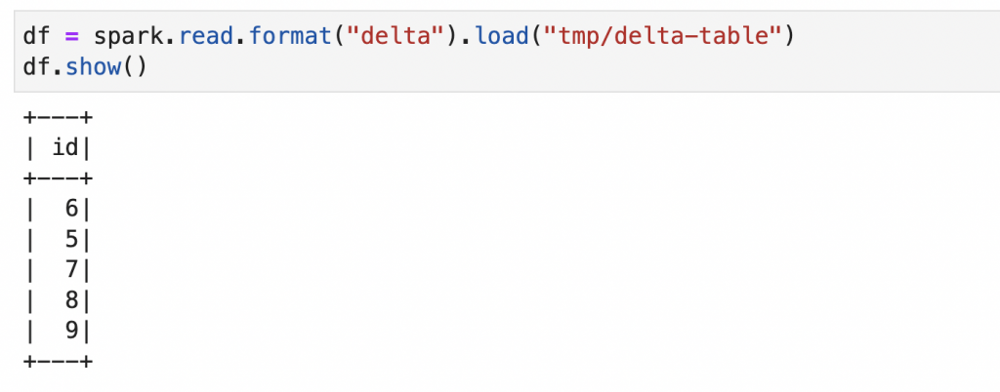

This blog post explains how to install PySpark, Delta Lake, and Jupyter Notebooks on a Mac. This setup will let you easily run Delta Lake computations on your local machine in a Jupyter notebook for experimentation or to unit test your business logic.

In order to run PySpark, you need to install Java. This guide will teach you how to install Java with a package manager that lets you easily switch between Java versions.

You also need to pay close attention when setting your PySpark and Delta Lake versions, as they must be compatible. This post will show you how to pin PySpark and Delta Lake versions when creating your environment, to ensure they are compatible.

Creating a local PySpark / Delta Lake / Jupyter setup can be a bit tricky, but you'll find it easy by following the steps in this guide.

## Install Java

You need to install Java to run Spark code. Feel free to skip this section if you've already installed Java.

Installing Java can be difficult because there are different vendors and versions. [SDKMAN](https://sdkman.io/), short for the Software Development Kit Manager, makes it easy to install, and switch between, different Java versions.

See [this blog post](https://mungingdata.com/java/sdkman-multiple-versions-java-sbt-scala/) for a detailed description on how to work with SDKMAN.

After installing SDKMAN, you can run `sdk list java` to list all the Java versions that are available for installation. Spark works well with the `zulu` Java vendor. You can run a command like `sdk install java 8.0.322-zulu` to install Java 8, a Java version that works well with different version of Spark. You may need to run a slightly different command as Java versions are updated frequently.

Run `java -version` and you should see output like this if the installation was successful:

```
openjdk version "1.8.0_322"
OpenJDK Runtime Environment (Zulu 8.60.0.21-CA-macosx) (build 1.8.0_322-b06)
OpenJDK 64-Bit Server VM (Zulu 8.60.0.21-CA-macosx) (build 25.322-b06, mixed mode)
```

## Install conda

The next step is to [install Miniconda](https://docs.conda.io/projects/conda/en/latest/user-guide/install/index.html), so you can build a software environment with Delta Lake, Jupyter, and PySpark.

After Miniconda is installed, you should be able to run the `conda info` command.

Now you're ready to start creating a software environment with all the required dependencies.

## Install PySpark & Delta Lake via conda

We're going to create a conda software environment from a YAML file that'll allow us to specify the exact versions of PySpark and Delta Lake that are known to be compatible.

You can see [the compatible versions here](https://docs.delta.io/latest/releases.html). For example, you can use Delta Lake 1.2 with PySpark 3.2, but cannot use Delta Lake 0.3.0 with PySpark 3.2.

Here's an example YAML file with the required dependencies.

```
name: mr-delta
channels:
  - conda-forge
  - defaults
dependencies:
  - python=3.9
  - ipykernel
  - nb_conda
  - jupyterlab
  - jupyterlab_code_formatter
  - isort
  - black
  - pyspark=3.2.0
  - pip
  - pip:
    - delta-spark==1.2.1
```

Notice how the Python, PySpark, and `delta-spark` dependencies are pinned to specific versions that are known to be compatible. You want to explicitly set dependencies that are compatible rather than relying on conda to properly resolve the dependency versions.

`delta-spark` is installed via pip because it's not uploaded to `conda-forge`.

This conda environment file is also available in the [delta-examples](https://github.com/MrPowers/delta-examples) code repo. You can clone the repo, `cd` into the project directory, and run `conda create env -f envs/mr-delta.yml` to create the conda environment.

When you run `conda env list`, you should see the "mr-delta" environment listed.

Run `conda activate mr-delta` to activate the environment. Once the environment is activated, you're ready to open a Jupyter notebook.

## Open Jupyter notebooks

Make sure you've changed into the [delta-examples](https://github.com/MrPowers/delta-examples) directory and have the mr-delta conda environment activated.

Then run `jupyter lab` to open up this project in your browser via Jupyter.

You should now be able to run all the commands in [this notebook](https://github.com/MrPowers/delta-examples/blob/master/notebooks/01_quickstart.ipynb).

Here's how the computations should look in your Jupyter notebook:



Take a look at the following code snippet and pay close attention on how you need to initialize the `SparkSession`:

```
import pyspark
from delta import *

builder = (
    pyspark.sql.SparkSession.builder.appName("MyApp")
    .config("spark.sql.extensions", "io.delta.sql.DeltaSparkSessionExtension")
    .config(
        "spark.sql.catalog.spark_catalog",
        "org.apache.spark.sql.delta.catalog.DeltaCatalog",
    )
)

spark = configure_spark_with_delta_pip(builder).getOrCreate()
```

You need to use the `configure_spark_with_delta_pip` function to properly initialize the `SparkSession` when working with Delta Lake.

You'll normally be using Delta Lake with Spark, but sometimes it's convenient to work with Delta Lake outside of a Spark setting. Let's see how you can perform Delta Lake operations, even without Spark.

## Using Delta Lake without Spark?

[delta-rs](https://github.com/delta-io/delta-rs) is a Rust implementation of Delta Lake that also exposes Python bindings. This library allows you to perform common operations on Delta Lakes, even when a Spark runtime environment is not installed.

Delta has you covered, even if you don't have access to a Spark runtime for a certain chunk of code.

## Conclusion

This post taught you how to create a conda environment with Jupyter, PySpark, and Delta Lake and how to run basic computations.

Running computations locally is a great way to learn Delta. You can execute commands and observe how the Parquet files and transaction log are changed.

The localhost setup described in this post is also great if you'd like to run Delta Lake unit tests before deploying code to production. Testing your PySpark code is always a good idea.
