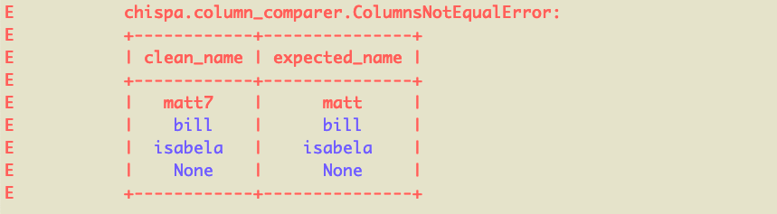
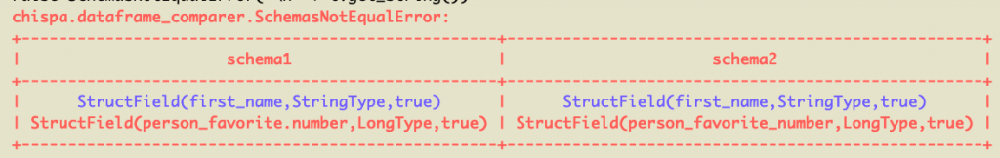
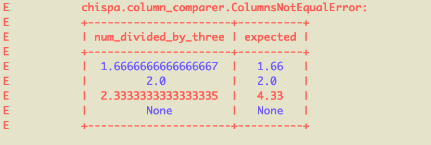
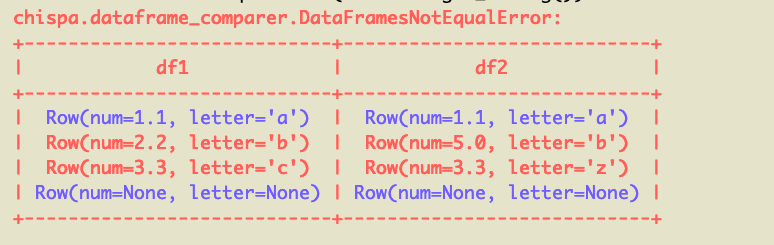
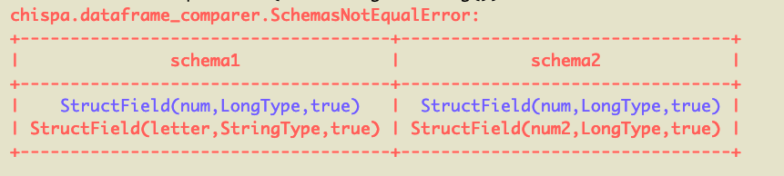

# Testing PySpark Code

This blog post explains how to test PySpark code with the [chispa](https://github.com/MrPowers/chispa) helper library.

Writing fast PySpark tests that provide your codebase with adequate coverage is surprisingly easy when you follow some simple design patters. chispa outputs readable error messages to facilitate your development workflow.

A robust test suite makes it easy for you to add new features and refactor your codebase. It also provides other developers with "living code documentation" - they can see the inputs and outputs of your functions.

## Example project

The [pysparktestingexample](https://github.com/MrPowers/pysparktestingexample) project was created with Poetry, [the best package manager for PySpark projects](https://mungingdata.com/pyspark/poetry-dependency-management-wheel/). All the code covered in this post is in the pysparktestingexample repo.

Here are the commands that were run to setup the project:

- `poetry new pysparktestingexample`: creates a new project and automatically includes pytest
- `poetry add pyspark`: adds PySpark to the project
- `poetry add chispa --dev`: adds chispa as a development dependency

chispa is only needed in the test suite and that's why it's added as a development dependency.

Your `pypoetry.toml` file will look like this after running the commands.

```
[tool.poetry]
name = "pysparktestingexample"
version = "0.1.0"
description = ""
authors = ["MrPowers <matthewkevinpowers@gmail.com>"]

[tool.poetry.dependencies]
python = "^3.7"
pyspark = "^2.4.6"

[tool.poetry.dev-dependencies]
pytest = "^5.2"
chispa = "^0.3.0"

[build-system]
requires = ["poetry>=0.12"]
build-backend = "poetry.masonry.api"
```

Poetry sets up a virtual environment with the PySpark, pytest, and chispa code that's needed for this example application.

## SparkSession

Let's start by setting up the SparkSession in a [pytest fixture](https://docs.pytest.org/en/stable/fixture.html), so it's easily accessible by all our tests.

You'll use the SparkSession frequently in your test suite to build DataFrames.

Create a `tests/conftest.py` file and add this code:

```
import pytest
from pyspark.sql import SparkSession

@pytest.fixture(scope='session')
def spark():
    return SparkSession.builder \
      .master("local") \
      .appName("chispa") \
      .getOrCreate()
```

Let's use this fixture to create a test that compares the equality of two columns.

## Column equality

Create a `functions.py` file and add a `remove_non_word_characters` function that'll remove all the non-word characters from a string.

```
import pyspark.sql.functions as F

def remove_non_word_characters(col):
    return F.regexp_replace(col, "[^\\w\\s]+", "")
```

Let's write a test that makes sure this function removes all the non-word characters in strings.

We'll put this code in a `tests/test_functions.py` file.

Create a DataFrame with a column that contains non-word characters, run the `remove_non_word_characters` function, and check that all the non-word characters are removed with the chispa `assert_column_equality` method.

```
import pytest

from pysparktestingexample.functions import remove_non_word_characters
from chispa import *
import pyspark.sql.functions as F

def test_remove_non_word_characters(spark):
    data = [
        ("jo&&se", "jose"),
        ("**li**", "li"),
        ("#::luisa", "luisa"),
        (None, None)
    ]
    df = spark.createDataFrame(data, ["name", "expected_name"])\
        .withColumn("clean_name", remove_non_word_characters(F.col("name")))
    assert_column_equality(df, "clean_name", "expected_name")
```

The DataFrame is initally created with the "input" and "expected" values. `withColumn` appends the "actual" value that's returned from running the function that's being tested.

Tests generally compare "actual" values with "expected" values. In this example, `clean_name` (actual value) is compared with `expected_name` (expected value).

Notice that one row has an input value equal to `None`. Always test the `None` case and make sure the code does not error out.

Notice that `def test_remove_non_word_characters(spark)` includes a reference to the "spark" fixture we created in the `conftest.py` file. Remember that this fixture is what provides you with access to the SparkSession in your tests so you can create DataFrames.

## Failing column equality test

Let's write another test that'll error out and inspect the test output to see how to debug the issue.

Here's the failing test.

```
def test_remove_non_word_characters_nice_error(spark):
    data = [
        ("matt7", "matt"),
        ("bill&", "bill"),
        ("isabela*", "isabela"),
        (None, None)
    ]
    df = spark.createDataFrame(data, ["name", "expected_name"])\
        .withColumn("clean_name", remove_non_word_characters(F.col("name")))
    assert_column_equality(df, "clean_name", "expected_name")
```

This'll return a nicely formatted error message:



We can see the `matt7` / `matt` row of data is what's causing the error because it's colored red. The other rows are colored blue because they're equal.

Descriptive error messages are an advantage of the chispa library. Other libraries don't output error messages that allow developers to easily identify mismatched rows.

## DataFrame equality

Create a `transformations.py` file and add a `sort_columns` method that sorts the columns of a DataFrame in ascending or descending alphabetical order.

```
def sort_columns(df, sort_order):
    sorted_col_names = None
    if sort_order == "asc":
        sorted_col_names = sorted(df.columns)
    elif sort_order == "desc":
        sorted_col_names = sorted(df.columns, reverse=True)
    else:
        raise ValueError("['asc', 'desc'] are the only valid sort orders and you entered a sort order of '{sort_order}'".format(
            sort_order=sort_order
        ))
    return df.select(*sorted_col_names)
```

Write a test that creates a DataFrame, reorders the columns with the `sort_columns` method, and confirms that the expected column order is the same as what's actually returned by the function. This test will compare the equality of two entire DataFrames. It'll be different than the previous test that compared the equality of two columns in a single DataFrame.

Here's the test that'll be added to the `tests/test_transformations.py` file.

```
from pysparktestingexample.transformations import sort_columns
from chispa.dataframe_comparer import assert_df_equality
import pyspark.sql.functions as F

def test_sort_columns_asc(spark):
    source_data = [
        ("jose", "oak", "switch"),
        ("li", "redwood", "xbox"),
        ("luisa", "maple", "ps4"),
    ]
    source_df = spark.createDataFrame(source_data, ["name", "tree", "gaming_system"])

    actual_df = sort_columns(source_df, "asc")

    expected_data = [
        ("switch", "jose", "oak"),
        ("xbox", "li", "redwood"),
        ("ps4", "luisa", "maple"),
    ]
    expected_df = spark.createDataFrame(expected_data, ["gaming_system", "name", "tree"])

    assert_df_equality(actual_df, expected_df)
```

This test is run with the `assert_df_equality` function defined in `chispa.dataframe_comparer`. The `assert_column_equality` method isn't appropriate for this test because we're comparing the order of multiple columns and the schema matters. Use the `assert_column_equality` method whenever possible and only revert to `assert_df_equality` when necessary.

Let's write another test to verify that the `sort_columns` method can also rearrange the columns in descending order.

```
def test_sort_columns_desc(spark):
    source_data = [
        ("jose", "oak", "switch"),
        ("li", "redwood", "xbox"),
        ("luisa", "maple", "ps4"),
    ]
    source_df = spark.createDataFrame(source_data, ["name", "tree", "gaming_system"])

    actual_df = sort_columns(source_df, "desc")

    expected_data = [
        ("oak", "jose", "switch"),
        ("redwood", "li", "xbox"),
        ("maple", "luisa", "ps4"),
    ]
    expected_df = spark.createDataFrame(expected_data, ["tree", "name", "gaming_system"])

    assert_df_equality(actual_df, expected_df)
```

In a real codebase, you'd also want to write a third test to verify that `sort_columns` throws an error when the second argument is an invalid value (`asc` and `desc` are the only valid values for the second argument). We'll skip that test for now, but it's important for your test suite to verify your code throws descriptive error messages.

## Failing DataFrame equality test

Let's write a DataFrame comparison test that'll return an error.

Create a `modify_column_names` function in the `transformations.py` file that'll update all the column names in a DataFrame.

```
def modify_column_names(df, fun):
    for col_name in df.columns:
        df = df.withColumnRenamed(col_name, fun(col_name))
    return df
```

Now create a `string_helpers.py` file with a `dots_to_underscores` method that converts the dots in a string to underscores.

```
def dots_to_underscores(s):
    return s.replace(".", "_", 1)
```

Write a test to verify that `modify_column_names` converts all the dots are converted to underscores.

```
import pysparktestingexample.transformations as T
import pysparktestingexample.string_helpers as SH

def test_modify_column_names_error(spark):
    source_data = [
        ("jose", 8),
        ("li", 23),
        ("luisa", 48),
    ]
    source_df = spark.createDataFrame(source_data, ["first.name", "person.favorite.number"])

    actual_df = T.modify_column_names(source_df, SH.dots_to_underscores)

    expected_data = [
        ("jose", 8),
        ("li", 23),
        ("luisa", 48),
    ]
    expected_df = spark.createDataFrame(expected_data, ["first_name", "person_favorite_number"])

    assert_df_equality(actual_df, expected_df)
```

This'll return a nicely formatted error message:



Our code has a bug. The `person.favorite.number` column is converted to `person_favorite.number` and we want it to be converted to `person_favorite_number`. Your test suite will help you avoid releasing buggy code like this in production ;)

## Approximate column equality

We can check if columns are approximately equal, which is especially useful for floating number comparisons.

Create a `divide_by_three` function in `functions.py` that divides a number by three.

```
def divide_by_three(col):
    return col / 3
```

Here's a test that uses the `assert_approx_column_equality` function to compare the equality of two floating point columns.

```
def test_divide_by_three(spark):
    data = [
        (1, 0.33),
        (2, 0.66),
        (3, 1.0),
        (None, None)
    ]
    df = spark.createDataFrame(data, ["num", "expected"])\
        .withColumn("num_divided_by_three", divide_by_three(F.col("num")))
    assert_approx_column_equality(df, "num_divided_by_three", "expected", 0.01)
```

The precision is set to 0.01 in this example. 0.33333333 and 0.33 are considered approximately equal because the absolute value of the difference between the two numbers is less than the specified precision.

Let's add another test that's failing and inspect the error message.

Here's a test that'll error out because of a row that's not approximately equal.

```
def test_divide_by_three_error(spark):
    data = [
        (5, 1.66),
        (6, 2.0),
        (7, 4.33),
        (None, None)
    ]
    df = spark.createDataFrame(data, ["num", "expected"])\
        .withColumn("num_divided_by_three", divide_by_three(F.col("num")))
    assert_approx_column_equality(df, "num_divided_by_three", "expected", 0.01)
```



The error message makes it clear that for one row of data, we're expecting `num_divided_by_three` to equal 4.33, but it's actually 2.3333333333333335. Those numbers aren't approximately equal when the precision factor is 0.01.

## Approximate DataFrame equality

Let's create two DataFrames and confirm they're approximately equal.

```
def test_approx_df_equality_same():
    data1 = [
        (1.1, "a"),
        (2.2, "b"),
        (3.3, "c"),
        (None, None)
    ]
    df1 = spark.createDataFrame(data1, ["num", "letter"])

    data2 = [
        (1.05, "a"),
        (2.13, "b"),
        (3.3, "c"),
        (None, None)
    ]
    df2 = spark.createDataFrame(data2, ["num", "letter"])

    assert_approx_df_equality(df1, df2, 0.1)
```

The `assert_approx_df_equality` method is smart and will only perform approximate equality operations for floating point numbers in DataFrames. It'll perform regular equality for strings and other types.

Let's perform an approximate equality comparison for two DataFrames that are not equal.

```
def test_approx_df_equality_different():
    data1 = [
        (1.1, "a"),
        (2.2, "b"),
        (3.3, "c"),
        (None, None)
    ]
    df1 = spark.createDataFrame(data1, ["num", "letter"])

    data2 = [
        (1.1, "a"),
        (5.0, "b"),
        (3.3, "z"),
        (None, None)
    ]
    df2 = spark.createDataFrame(data2, ["num", "letter"])

    assert_approx_df_equality(df1, df2, 0.1)
```

Here's the pretty error message that's outputted:



## Schema mismatch messages

DataFrame equality messages perform schema comparisons before analyzing the actual content of the DataFrames. DataFrames that don't have the same schemas should error out as fast as possible.

Let's compare a DataFrame that has a string column an integer column with a DataFrame that has two integer columns to observe the schema mismatch message.

```
def test_schema_mismatch_message():
    data1 = [
        (1, "a"),
        (2, "b"),
        (3, "c"),
        (None, None)
    ]
    df1 = spark.createDataFrame(data1, ["num", "letter"])

    data2 = [
        (1, 6),
        (2, 7),
        (3, 8),
        (None, None)
    ]
    df2 = spark.createDataFrame(data2, ["num", "num2"])

    assert_df_equality(df1, df2)
```

Here's the error message:



## Benefits of testing

A well written test suite makes your code easier to refactor. You be assured that newly added features don't break existing logic. Data tends to be messy and there are often lots of edge cases. Your test suite will make sure all the different types of dirty data are handled properly.

The test suite also documents code functionality. Suppose you're working with a column that has 5 different types of dirty data that's cleaned by a function. You may have a function that cleans this field. Your test suite will provide representative examples of the different types of dirty data and how they're standardized. Someone new to the project can read the tests and understand the different types of dirty data that needs to be accounted for without even querying the data in production.

Documenting dirty data attributes in a wiki or in comments is dangerous because the code can change and developers might forget to update the documentation. A test suite serves as "living code documentation". Developers should always keep the test suite passing. Whenever you push code to the master branch, you should have a continuous integration server that runs the test suite. If a test fails, fixing it should be a top priority. A test suite, living code documentaion, should never get outdated like traditional documentation.

Functions with side effects or that perform multiple operations are hard to test. It's easier to break up code into single purpose modular functions, so they're easier to test. Testing encourages developers to write higher quality code.

## Next steps

If you can, transition your project to Poetry, [as described in this blog post](https://mungingdata.com/pyspark/poetry-dependency-management-wheel/). It'll make it easier to add development dependencies like pytest and chispa to your project.

You'll want to leverage dependency injection and mocking to build a great test suite. You'll also want to wire up your project with continuous integration and continuous deployment.

You'll find your code a lot easier to reason with when it's nice and tested ;)
