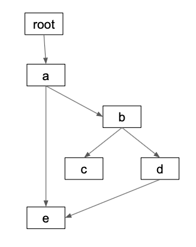
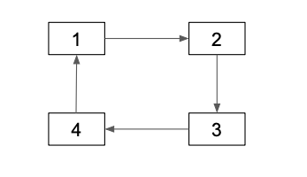
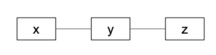
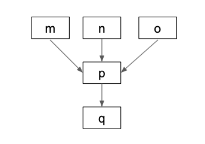
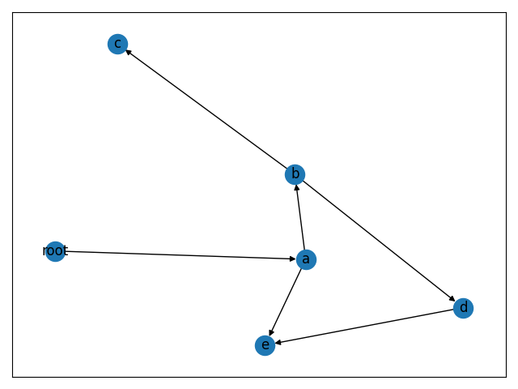
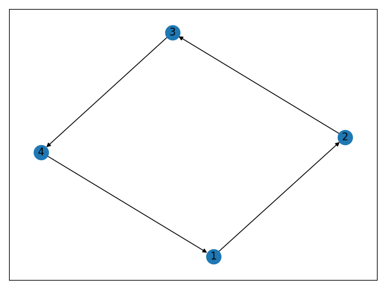

# Building DAGs / Directed Acyclic Graphs with Python

Directed Acyclic Graphs (DAGs) are a critical data structure for data science / data engineering workflows. DAGs are used extensively by popular projects like [Apache Airflow](https://github.com/apache/airflow) and [Apache Spark](https://github.com/apache/spark).

This blog post will teach you how to build a DAG in Python with the [networkx](https://networkx.github.io/) library and run important graph algorithms.

Once you're comfortable with DAGs and see how easy they are to work with, you'll find all sorts of analyses that are good candidates for DAGs. DAGs are just as important as data structures like dictionaries and lists for a lot of analyses.

## Simple example

Consider the following DAG:



root, a, b, c, d, and e are referred to as nodes. The arrows that connect the nodes are called edges. A graph is a collection of nodes that are connected by edges. A directed acyclic graph is a special type of graph with properties that'll be explained in this post.

Here's how we can construct our sample graph with the [networkx](https://networkx.github.io/) library.

```python
import networkx as nx

graph = nx.DiGraph()
graph.add_edges_from([("root", "a"), ("a", "b"), ("a", "e"), ("b", "c"), ("b", "d"), ("d", "e")])
```

`DiGraph` is short for "directed graph".

The directed graph is modeled as a list of tuples that connect the nodes. Remember that these connections are referred to as "edges" in graph nomenclature. Take another look at the graph image and observe how all the arguments to `add_edges_from` match up with the arrows in the graph.

networkx is smart enough to infer the nodes from a collection of edges.

```python
graph.nodes() # => NodeView(('root', 'a', 'b', 'e', 'c', 'd'))
```

Algorithms let you perform powerful analyses on graphs. This blog post focuses on how to use the built-in networkx algorithms.

## Shortest path

The shortest path between two nodes in a graph is the quickest way to travel from the start node to the end node.

Let's use the shortest path algorithm to calculate the quickest way to get from root to e.

```python
nx.shortest_path(graph, 'root', 'e') # => ['root', 'a', 'e']
```

You could also go from root => a => b => d => e to get from root to e, but that'd be longer.

## Longest path

The `dag_longest_path` method returns the longest path in a DAG.

```python
nx.dag_longest_path(graph) # => ['root', 'a', 'b', 'd', 'e']
```

## Topological sorting

Nodes in a DAG can be topologically sorted [such that for every directed edge uv from node u to node v, u comes before v in the ordering](https://en.wikipedia.org/wiki/Topological_sorting).

Our graph has nodes (a, b, c, etc.) and directed edges (ab, bc, bd, de, etc.). Here's a couple of requirements that our topological sort need to satisfy:

- for ab, a needs to come before b in the ordering
- for bc, b needs to come before c
- for bd, b needs to come before d
- for de, d needs to come before e

Let's run the algorithm and see if all our requirements are met:

```python
list(nx.topological_sort(graph)) # => ['root', 'a', 'b', 'd', 'e', 'c']
```

Observe that a comes before b, b comes before c, b comes before d, and d comes before e. The topological sort meets all the ordering requirements.

## Checking validity

We can check to make sure the graph is directed.

```python
nx.is_directed(graph) # => True
```

We can also make sure it's a directed acyclic graph.

```python
nx.is_directed_acyclic_graph(graph) # => True
```

## Directed graph that's not acyclic

Let's make a graph that's directed, but not acyclic. A "not acyclic graph" is more commonly referred to as a "cyclic graph".



```python
graph = nx.DiGraph()
graph.add_edges_from([(1, 2), (2, 3), (3, 4), (4, 1)])
nx.is_directed(graph) # => True
nx.is_directed_acyclic_graph(graph) # => False
```

An acyclic graph is when a node can't reach itself. This graph isn't acyclic because nodes can reach themselves (for example 3 can take this trip 3 => 4 => 1 => 2 => 3 and arrive back at itself.

Directed graphs that aren't acyclic can't be topologically sorted.

```python
list(nx.topological_sort(graph)) # throws this error - networkx.exception.NetworkXUnfeasible: Graph contains a cycle or graph changed during iteration
```

Let's revisit the topological sorting requirements and examine why cyclic directed graphs can't be topologically sorted. Our graph has nodes 1, 2, 3, 4 and directed edges 12, 23, 34, and 41. Here are the requirements for topological sorting:

- for 12, 1 needs to come before 2 in the ordering
- for 23, 2 needs to come before 3
- for 34, 3 needs to come before 4
- for 41, 4 needs to come before 1

The first three requirements are easy to meet and can be satisfied with a 1, 2, 3 sorting. But the final requirement is impossible to meet. 4 needs to be before 1, but 4, 1, 2, 3 isn't possible because 3 needs to come before 4.

Topologically sorting cyclic graphs is impossible.

## Graph that's neither directed nor acyclic

We've been using the `DiGraph` class to make graphs that are directed thus far. You can use the `Graph` class to make undirected graphs. All the edges in an undirected graph are bidirectional, so arrows aren't needed in visual representations of undirected graphs.



```python
graph = nx.Graph()
graph.add_edges_from([('x', 'y'), ('y', 'z')])
nx.is_directed(graph) # => False
nx.is_directed_acyclic_graph(graph) # => False
```

You need to use different algorithms when interacting with bidirectional graphs. Stick with DAGs while you're getting started ;)

## Multiple roots

A DAG can have multiple root nodes.



```python
graph = nx.DiGraph()
graph.add_edges_from([('m', 'p'), ('n', 'p'), ('o', 'p'), ('p', 'q')])
nx.is_directed(graph) # => True
nx.is_directed_acyclic_graph(graph) # => True
list(nx.topological_sort(graph)) # => ['o', 'n', 'm', 'p', 'q']
```

A directed graph can have multiple valid topological sorts. m, n, o, p, q is another way to topologically sort this graph.

## Graphing a DAG

It's easy to visualized networkx graphs with [matplotlib](https://github.com/matplotlib/matplotlib).

Here's how we can visualize the first DAG from this blog post:

```python
from matplotlib import pyplot as plt

g1 = nx.DiGraph()
g1.add_edges_from([("root", "a"), ("a", "b"), ("a", "e"), ("b", "c"), ("b", "d"), ("d", "e")])
plt.tight_layout()
nx.draw_networkx(g1, arrows=True)
plt.savefig("g1.png", format="PNG")
# tell matplotlib you're done with the plot: https://stackoverflow.com/questions/741877/how-do-i-tell-matplotlib-that-i-am-done-with-a-plot
plt.clf()
```



Here's how to visualize our directed, cyclic graph.

```python
g2 = nx.DiGraph()
g2.add_edges_from([(1, 2), (2, 3), (3, 4), (4, 1)])
plt.tight_layout()
nx.draw_networkx(g2, arrows=True)
plt.savefig("g2.png", format="PNG")
plt.clf()
```



## Next steps

Now that you're familiar with DAGs and can see how easy they are to create and manage with networkx, you can easily start incorporating this data structure in your projects.

I recently created a project called [unicron](https://github.com/MrPowers/unicron) that models PySpark transformations in a DAG, to give users an elegant interface for running order dependent functions. You'll be able to make nice abstractions like these when you're comfortable with the DAG data structure.

Check out [this blog post on setting up a PySpark project with Poetry](https://mungingdata.com/pyspark/poetry-dependency-management-wheel/) if you're interested in learning how to process massive datasets with PySpark and use networkx algorithms at scale.
