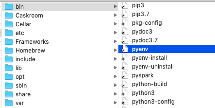

# Deep dive into how pyenv actually works by leveraging the shim design pattern

[pyenv](https://github.com/pyenv/pyenv) lets you manage multiple versions of Python on your computer.

This blog post focuses on how pyenv uses the shim design pattern to provide a wonderful user experience (it doesn't focus on installing and using the software like other posts).

Once pyenv is installed you can easily switch between one project that uses Python 3.6, another project that uses Python 3.7, and a system-wide default Python, without any additional thought.

Managing Python versions and packages can be a huge pain. It's important to understand how pyenv works to debug issues. Complexities are layered on top of different Python versions… good luck understanding virtual environments if you don't understand Python versioning.

pyenv is a fork of [rbenv](https://github.com/rbenv/rbenv), a project to manage Ruby versions. The "shim design philosophy" used by pyenv and rbenv has proven to be a winner for maintaining multiple versions of a programming language on a given machine. Learning the shim design philosophy will make you a better programmer and teach you a powerful design pattern you can use with your own programs.

## pyenv installation

You can install pyenv with Homebrew using the `brew install pyenv` command.

Homebrew runs [this formula](https://github.com/Homebrew/homebrew-core/blob/master/Formula/pyenv.rb). We'll cover how Homebrew works in another post.

Type `which pyenv` to see that there is a pyenv executable in the `/usr/local/bin` directory.

Enter `open /usr/local/bin` to view the `pyenv` executable in the directory.



The `pyenv` executable is run whenever we run commands like `pyenv versions` or `pyenv install --list`. Simply run `pyenv` without any arguments to see a listing of all the pyenv commands that can be run.

Let's dig into where pyenv installs Python code in the filesystem.

## Python installations

Run `pyenv versions` to see the Python versions you currently have installed on your machine.

```
$ pyenv versions
  system
* 3.7.5 (set by /Users/matthewpowers/.pyenv/version)
```

Run `pyenv install --list` to see the Python versions that can be installed.

One of the Python versions that can be installed is `3.6.10` - let's install it with `pyenv install 3.6.10`. Here's the console output:

```
~ $ pyenv install 3.6.10
python-build: use openssl@1.1 from homebrew
python-build: use readline from homebrew
Downloading Python-3.6.10.tar.xz...
-> https://www.python.org/ftp/python/3.6.10/Python-3.6.10.tar.xz
Installing Python-3.6.10...
python-build: use readline from homebrew
python-build: use zlib from xcode sdk
Installed Python-3.6.10 to /Users/matthewpowers/.pyenv/versions/3.6.10
```

Python 3.6.10 was downloaded to the `/Users/matthewpowers/.pyenv/versions/3.6.10` directory.

## Python versions

Type `pyenv versions` to see all the Python versions available on your machine.

```
~ $ pyenv versions
  system
  3.6.10
* 3.7.5 (set by /Users/matthewpowers/.pyenv/version)
```

My machine has the system Python version, 3.6.10, and 3.7.5.

Python 3.7.5 is the "current selected" version of Python that pyenv will use (as indicated by the \* next to 3.7.5 when `pyenv versions` is run).

If you run `python` when `3.7.5` is the selected Python version, then a Python 3.7.5 shell will be started. Understanding how pyenv knows to launch a 3.7.5 shell when the `python` command is run is the central focus of this post.

```
~ $ python
Python 3.7.5 (default, Apr  7 2020, 08:06:08)
[Clang 10.0.1 (clang-1001.0.46.4)] on darwin
Type "help", "copyright", "credits" or "license" for more information.
```

The `/Users/matthewpowers/.pyenv/version` file only contains a single line of data.

```
~ $ cat /Users/matthewpowers/.pyenv/version
3.7.5
```

## pyenv global

Let's view the current "global" python version with `pyenv global`:

```
~ $ pyenv global
3.7.5
```

The global Python version is set in the `/Users/matthewpowers/.pyenv/version` file.

Let's change the global version to `3.6.10` with `pyenv global 3.6.10`.

We can run `pyenv versions` and see that pyenv is using 3.6.10 by default now.

```
~ $ pyenv versions
  system
* 3.6.10 (set by /Users/matthewpowers/.pyenv/version)
  3.7.5
```

Let's inspect the contents of the `/Users/matthewpowers/.pyenv/version` file to decipher what the `pyenv global 3.6.10` command did under the hood.

```
~ $ cat /Users/matthewpowers/.pyenv/version
3.6.10
```

Looks like `pyenv global 3.6.10` just clobbered the `/Users/matthewpowers/.pyenv/version` file with a new Python version number.

Let's make a bad decision and clobber `/Users/matthewpowers/.pyenv/version` with `echo` and `>` to see if we can change the global Python version ourselves (don't do this - we're just hacking to learn how this all works).

```
~ $ echo 3.7.5 > /Users/matthewpowers/.pyenv/version
~ $ pyenv global
3.7.5
```

The pyenv global version is set in the `/Users/matthewpowers/.pyenv/version` file. This approach simple and intuitive. Let's see how we can modify Python versions for different projects.

## pyenv local

Let's create a `~/Documents/project1/` folder and cd into the directory.

```
~ $ mkdir ~/Documents/project1
~ $ cd ~/Documents/project1/
```

We can run `pyenv version` to see this project is using Python 3.7.5 (it's using the global Python version by default):

```
project1 $ pyenv version
3.7.5 (set by /Users/matthewpowers/.pyenv/version)
```

Let's change the Python version to 3.6.10 for this project.

```
project1 $ pyenv local 3.6.10
project1 $ pyenv version
3.6.10 (set by /Users/matthewpowers/Documents/project1/.python-version)
```

pyenv added a `.python-version` file to the project1 directory.

```
project1 $ ls -ahl
total 8
drwxr-xr-x  3 matthewpowers  staff    96B Apr 11 10:59 .
drwx------+ 8 matthewpowers  staff   256B Apr 11 13:49 ..
-rw-r--r-- 1 matthewpowers  staff     7B Apr 11 10:59 .python-version
```

Let's inspect the contents of `/Users/matthewpowers/Documents/project1/.python-version`:

```
project1 $ cat /Users/matthewpowers/Documents/project1/.python-version
3.6.10
```

The `/Users/matthewpowers/.pyenv/version` file that sets the global Python version is unchanged.

```
project1 $ cat /Users/matthewpowers/.pyenv/version
3.7.5
```

pyenv is somehow performing an analysis like "yes, I can see you have a global Python version set, but the `python version` command is being run from the `project1` directory, and that has a `.python-version` file that takes precedence over the global Python version".

Let's create a `~/Documents/project2/` folder and set the local Python version to "system".

```
project1 $ mkdir ~/Documents/project2
project1 $ cd ~/Documents/project2
project2 $ pyenv local system
```

Let's verify that project2 is using the system Python version.

```
project2 $ pyenv version
system (set by /Users/matthewpowers/Documents/project2/.python-version)
```

Let's run some commands to recap and demonstrate that the home directory is using a Python version of 3.7.5, project1 is using 3.6.10, and project2 is using the system Python.

```
$ cd ~
~ $ pyenv version
3.7.5 (set by /Users/matthewpowers/.pyenv/version)

~ $ cd ~/Documents/project1/
project1 $ pyenv version
3.6.10 (set by /Users/matthewpowers/Documents/project1/.python-version)

project1 $ cd ~/Documents/project2/
project2 $ pyenv version
system (set by /Users/matthewpowers/Documents/project2/.python-version)
```

Let's keep digging and see how pyenv is switching these Python versions magically.

## PATH basics

PATH is an environment variable that specifies an ordered list of folders where executables are saved.

Run `echo $PATH` on your machine to see the path on your machine.

```
~ $ echo $PATH
/usr/local/bin:/usr/bin:/bin:/usr/sbin:/sbin
```

The `PATH` is an ordered list of directories delimited by a colon. It's easier to visualize a bulleted list:

- `/usr/local/bin`
- `/usr/bin`
- `/bin`
- `/usr/sbin`
- `/sbin`

When you enter a command in Terminal, your computer will look for an executable in `/usr/local/bin` first, then `/usr/bin`, then `/bin`, then `/bin/usr/sbin` and finally `/sbin`.

When you run `echo hi`, your Terminal will start by looking for an executable named `echo` in the `/usr/local/bin` directory. There isn't a `echo` executable in `/usr/local/bin/` (run `open /usr/local/bin/` on your machine and visually inspect to verify). `echo` isn't in `/usr/bin` either. An `echo` executable is stored in `/bin`. The Terminal will use whatever executable it finds first.

You can also find where executables are located with the `whereis` command:

```
~ $ whereis echo
/bin/echo
```

## pyenv changes PATH

pyenv adds this code to the `~/.bash_profile` which changes the `PATH` on your machine:

```bash
if command -v pyenv 1>/dev/null 2>&1; then
  eval "$(pyenv init -)"
fi
```

Run `echo $PATH` to see the `PATH` is different now: `/Users/matthewpowers/.pyenv/shims:/usr/local/bin:/usr/bin:/bin:/usr/sbin:/sbin`.

The `/Users/matthewpowers/.pyenv/shims` directory has been added before all the other directories in the `PATH`.

All Terminal commands will go through `/Users/matthewpowers/.pyenv/shims` first now. This allows pyenv to "intercept" any relevant Python commands.

- The `$ python` command will go to `/Users/matthewpowers/.pyenv/shims/python`.
- The `$ pip` command will go to `/Users/matthewpowers/.pyenv/shims/pip`.

`/Users/matthewpowers/.pyenv/shims` doesn't contain an executable named `echo`, so the `echo hi there` command will still use the `echo` executable that's in `/bin`.

## Rehashing design pattern

Once you have pyenv installed and run a simple command like `pip install pandas`, what exactly happens? How does pyenv execute this code?

The pyenv README has [a great high level description on shims and the rehashing pattern](https://github.com/pyenv/pyenv#understanding-shims). From the README:

Shims are lightweight executables that simply pass your command along to pyenv. So with pyenv installed, when you run, say, `pip`, your operating system will do the following:

- Search your PATH for an executable file named pip
- Find the pyenv shim named pip at the beginning of your PATH
- Run the shim named pip, which in turn passes the command along to pyenv

Let's describe these steps in more detail:

- When you run `pip install pandas`, your Terminal will search your `PATH` for a `pip` executable. It'll find that executable in the `/Users/matthewpowers/.pyenv/shims` directory that is at the front of your path. pyenv is intercepting this command and handling it before it can be picked up by another executable lower in the `PATH` hierarchy. The `python` command will use the executable in `/usr/bin`, the dreaded system Python version, it it's not intercepted.
- `/Users/matthewpowers/.pyenv/shims/pip` is an executable file that's referred to as a "shim". A shim [intercepts a call and redirects the operation elsewhere](https://en.wikipedia.org/wiki/Shim_\(computing\)).
- The shim redirects the command to pyenv. Let's take a look at the code with `cat /Users/matthewpowers/.pyenv/shims/pip`:

```bash
#!/usr/bin/env bash
set -e
[ -n "$PYENV_DEBUG" ] && set -x

program="${0##*/}"
if [[ "$program" = "python"* ]]; then
  for arg; do
    case "$arg" in
    -c* | -- ) break ;;
    */* )
      if [ -f "$arg" ]; then
        export PYENV_FILE_ARG="$arg"
        break
      fi
      ;;
    esac
  done
fi

export PYENV_ROOT="/Users/matthewpowers/.pyenv"
exec "/usr/local/Cellar/pyenv/1.2.18/libexec/pyenv" exec "$program" "$@"
```

We can see that `exec "/usr/local/Cellar/pyenv/1.2.18/libexec/pyenv"` is "passing the command along to pyenv".

## Intercepting the python command

The `python` command will be intercepted by `/Users/matthewpowers/.pyenv/shims/python`, as you can see by running `which python`:

```
$ which python
/Users/matthewpowers/.pyenv/shims/python
```

The code in `/Users/matthewpowers/.pyenv/shims/python` is exactly the same as the code in `/Users/matthewpowers/.pyenv/shims/pip`.

This is what `cat /Users/matthewpowers/.pyenv/shims/python` returns:

```bash
#!/usr/bin/env bash
set -e
[ -n "$PYENV_DEBUG" ] && set -x

program="${0##*/}"
if [[ "$program" = "python"* ]]; then
  for arg; do
    case "$arg" in
    -c* | -- ) break ;;
    */* )
      if [ -f "$arg" ]; then
        export PYENV_FILE_ARG="$arg"
        break
      fi
      ;;
    esac
  done
fi

export PYENV_ROOT="/Users/matthewpowers/.pyenv"
exec "/usr/local/Cellar/pyenv/1.2.18/libexec/pyenv" exec "$program" "$@"
```

The shim passes the command to pyenv without doing any processing.

## pyenv executable

Let's look at the pyenv executable that's being passed commands from the shims.

Run `cat /usr/local/Cellar/pyenv/1.2.18/libexec/pyenv` to inspect the contents of the `pyenv` executable. Prepare yourself for 150 lines of Bash code.

```bash
#!/usr/bin/env bash
set -e

if [ "$1" = "--debug" ]; then
  export PYENV_DEBUG=1
  shift
fi

if [ -n "$PYENV_DEBUG" ]; then
  export PS4='+ [${BASH_SOURCE##*/}:${LINENO}] '
  set -x
fi

abort() {
  { if [ "$#" -eq 0 ]; then cat -
    else echo "pyenv: $*"
    fi
  } >&2
  exit 1
}

if enable -f "${BASH_SOURCE%/*}"/../libexec/pyenv-realpath.dylib realpath 2>/dev/null; then
  abs_dirname() {
    local path
    path="$(realpath "$1")"
    echo "${path%/*}"
  }
else
  [ -z "$PYENV_NATIVE_EXT" ] || abort "failed to load \`realpath' builtin"

  READLINK=$(type -p greadlink readlink | head -1)
  [ -n "$READLINK" ] || abort "cannot find readlink - are you missing GNU coreutils?"

  resolve_link() {
    $READLINK "$1"
  }

  abs_dirname() {
    local path="$1"

    # Use a subshell to avoid changing the current path
    (
    while [ -n "$path" ]; do
      cd_path="${path%/*}"
      if [[ "$cd_path" != "$path" ]]; then
        cd "$cd_path"
      fi
      name="${path##*/}"
      path="$(resolve_link "$name" || true)"
    done

    echo "$PWD"
    )
  }
fi

if [ -z "${PYENV_ROOT}" ]; then
  PYENV_ROOT="${HOME}/.pyenv"
else
  PYENV_ROOT="${PYENV_ROOT%/}"
fi
export PYENV_ROOT

# Transfer PYENV_FILE_ARG (from shims) into PYENV_DIR.
if [ -z "${PYENV_DIR}" ]; then
  if [ -n "${PYENV_FILE_ARG}" ]; then
    if [ -L "${PYENV_FILE_ARG}" ]; then
      PYENV_DIR="$(abs_dirname "${PYENV_FILE_ARG}")"
    else
      PYENV_DIR="${PYENV_FILE_ARG%/*}"
    fi
    export PYENV_DIR
    unset PYENV_FILE_ARG
  fi
else
  [[ $PYENV_DIR == /* ]] || PYENV_DIR="$PWD/$PYENV_DIR"
  cd "$PYENV_DIR" 2>/dev/null || abort "cannot change working directory to \`$PYENV_DIR'"
  PYENV_DIR="$PWD"
  cd "$OLDPWD"
fi

if [ -z "${PYENV_DIR}" ]; then
  PYENV_DIR="$PWD"
fi

if [ ! -d "$PYENV_DIR" ] || [ ! -e "$PYENV_DIR" ]; then
  abort "cannot change working directory to \`$PYENV_DIR'"
fi

PYENV_DIR=$(cd "$PYENV_DIR" && echo "$PWD")
export PYENV_DIR


shopt -s nullglob

bin_path="$(abs_dirname "$0")"
for plugin_bin in "${PYENV_ROOT}/plugins/"*/bin; do
  PATH="${plugin_bin}:${PATH}"
done
export PATH="${bin_path}:${PATH}"

PYENV_HOOK_PATH="${PYENV_HOOK_PATH}:${PYENV_ROOT}/pyenv.d"
if [ "${bin_path%/*}" != "$PYENV_ROOT" ]; then
  # Add pyenv's own `pyenv.d` unless pyenv was cloned to PYENV_ROOT
  PYENV_HOOK_PATH="${PYENV_HOOK_PATH}:${bin_path%/*}/pyenv.d"
fi
PYENV_HOOK_PATH="${PYENV_HOOK_PATH}:/usr/local/etc/pyenv.d:/etc/pyenv.d:/usr/lib/pyenv/hooks"
for plugin_hook in "${PYENV_ROOT}/plugins/"*/etc/pyenv.d; do
  PYENV_HOOK_PATH="${PYENV_HOOK_PATH}:${plugin_hook}"
done
PYENV_HOOK_PATH="${PYENV_HOOK_PATH#:}"
export PYENV_HOOK_PATH

shopt -u nullglob


command="$1"
case "$command" in
"" )
  { pyenv---version
    pyenv-help
  } | abort
  ;;
-v | --version )
  exec pyenv---version
  ;;
-h | --help )
  exec pyenv-help
  ;;
* )
  command_path="$(command -v "pyenv-$command" || true)"
  if [ -z "$command_path" ]; then
    if [ "$command" == "shell" ]; then
      abort "shell integration not enabled. Run \`pyenv init' for instructions."
    else
      abort "no such command \`$command'"
    fi
  fi

  shift 1
  if [ "$1" = --help ]; then
    if [[ "$command" == "sh-"* ]]; then
      echo "pyenv help \"$command\""
    else
      exec pyenv-help "$command"
    fi
  else
    exec "$command_path" "$@"
  fi
  ;;
```

[Here is where this script is defined in the pyenv repo](https://github.com/pyenv/pyenv/blob/3faeda67bb33e07750d1a104271369a7384ca45c/libexec/pyenv).

## pip install for different Python versions

Suppose you're using Python 3.7.5 and run `pip install pandas`.

The Pandas code will be stored in `.pyenv/versions/3.7.5/lib/python3.7/site-packages`.

If you switch to Python 3.6.10 with `pyenv shell 3.6.10`, you'll need to reinstall pandas with another `pip install pandas`. The Python 3.6.10 pandas will be stored in `/Users/matthewpowers/.pyenv/versions/3.6.10/lib/python3.6/site-packages`.

pyenv doesn't share library versions across different Python versions.

See [pyenv-virtualenv](https://github.com/pyenv/pyenv-virtualenv) for more details about managing virtual environments with pyenv.

## pyenv is not bootstrapped by Python

You might wonder why the pyenv codebase is almost entirely Shell and Roff code.


pyenv intentionally avoids Python. If pyenv was written in Python, then the system would need Python installed to run pyenv commands. pyenv can install Python on machines that don't have any version of Python installed (most machines come with an old Python version pre-installed).

You don't want a program that installs Python to depend on Python.

The system version of Python that comes pre-installed in machines causes a huge headache for programmers that don't understand the PATH, executable, etc. The shell scripting patterns you've learned in this post will save you from a lot of Python development hell.

## Conclusion

We learned a lot about pyenv and have a good understanding of how it works.

The shims are injected at the beginning of your PATH so pyenv can route commands to the right Python version. pyenv is using versions specified in text files to see what version of Python should be used to run the commands.

pyenv offers an elegant user interface for managing different Python versions for end users. The codebase is amazingly clean.

Programs like these make you sit back with awe - you're starstruck that other programmers can architect such beauty.

Study their design patterns and try to copy them! [Copy what you like](http://www.paulgraham.com/copy.html).
