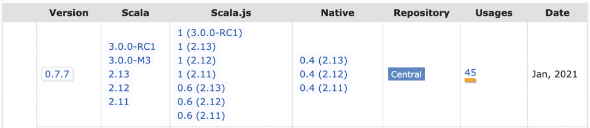
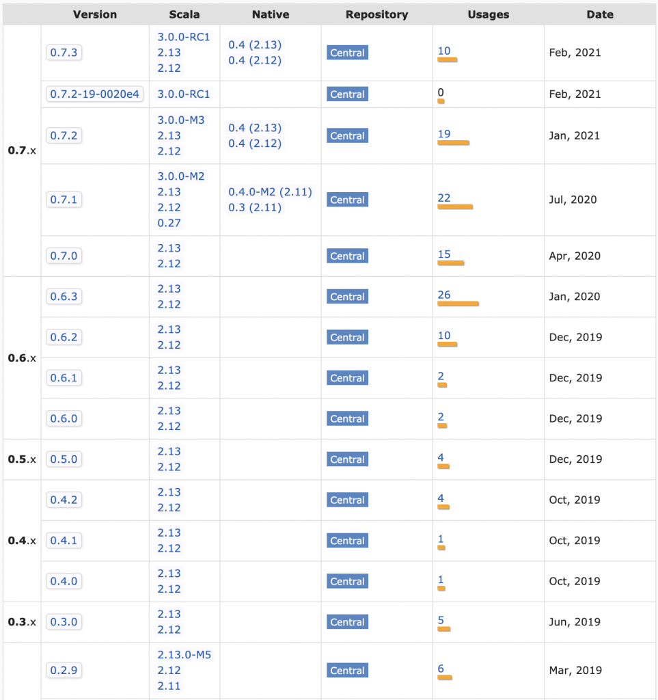
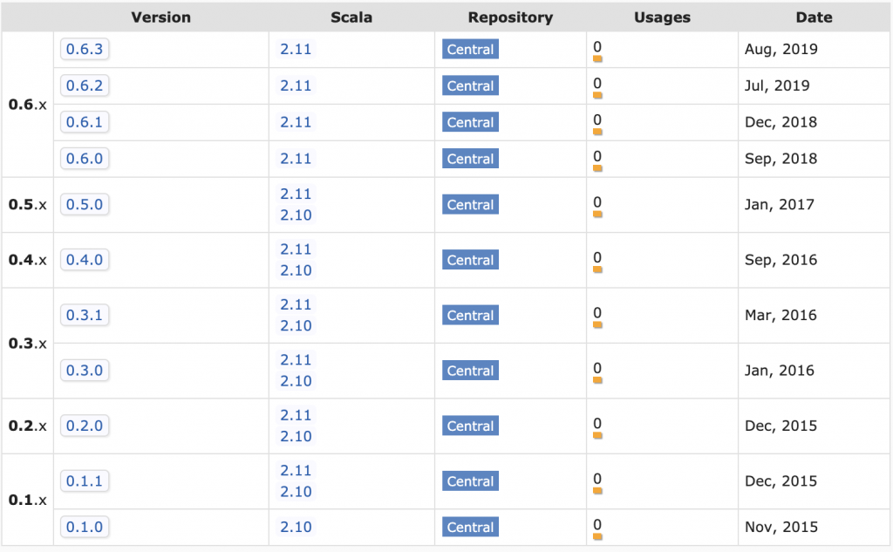
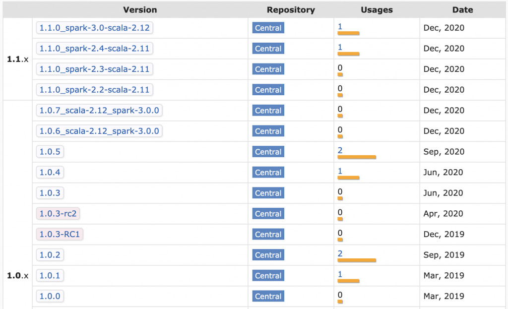
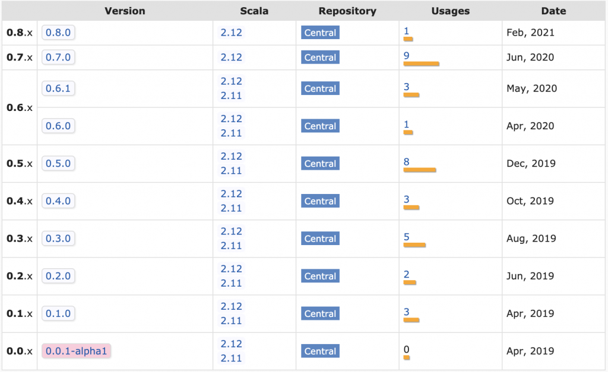

This post explains why Scala projects are difficult to maintain.

Scala is a powerful programming language that can make certain small teams hyper-productive.

Scala can also slow productivity by drowning teams in in code complexity or burning them in dependency hell.

Scala is famous for crazy, complex code - everyone knows about that risk factor already.

The rest of this post focuses on the maintenance burden, a less discussed Scala productivity drain.

This post generated lots of comment on [Hackernews](https://news.ycombinator.com/item?id=26539508) and [Reddit](https://www.reddit.com/r/programming/comments/matoum/scala_is_a_maintenance_nightmare/). The [Scala subreddit made some fair criticisms](https://www.reddit.com/r/scala/comments/maw2wf/scala_is_a_maintenance_nightmare_mungingdata/) of the article, but the main points stand.

Li [tweeted the post](https://twitter.com/li_haoyi/status/1374032578215247872?s=20) and empathizes with the difficulties of working in the Scala ecosystem.

## Cross compiling Scala libs

Scala libraries need to be cross compiled with different Scala versions. [utest](https://github.com/com-lihaoyi/utest) v0.7.7 publishes separate JAR files for Scala 2.11, Scala 2.12, and Scala 2.13 for example.

Scala 2.12 projects that depend on utest v0.7.7 need to grab the JAR file that's compiled with Scala 2.12. Scala 2.10 users can't use utest v0.7.7 because there isn't a JAR file.

Minor versions are compatible in most languages. Python projects that are built with Python 3.6 are usable in Python 3.7 projects for example.

## Scala itself is unstable

Scala doesn't use `major.minor.patch` versioning as described in [semver](https://semver.org/). It uses the pvp `epoch.major.minor` versioning.

So Scala 2.11 => Scala 2.12 is a major release. It's not a minor release!

Scala major releases are not backwards compatible. Java goes to extreme lengths to maintain backwards compatibility, so Java code that was built with Java 8 can be run with Java 14.

That's not the case with Scala. Scala code that was built with Scala 2.11 cannot be run with Scala 2.12.

Most of the difficulty of maintaining Scala apps stems from the frequency of major releases.

Scala 2.0 was released in March 2006 and Scala 2.13 was released in June 2019. That's 13 major releases in 13 years!

Migrating [to Scala 2.12](https://contributors.scala-lang.org/t/spark-as-a-scala-gateway-drug-and-the-2-12-failure/1747) or [Scala 2.13](https://issues.apache.org/jira/browse/SPARK-25075) can be hard. These major version bumps can be trivial for some projects and really difficult for others.

## Some libs drop Scala versions too early

Some dependencies force you to use old Scala versions that other libraries might stop supporting.

The Databricks platform didn't start supporting Scala 2.12 till Databricks Runtime 7 was [released in June 2020](https://docs.databricks.com/release-notes/runtime/releases.html). Compare this with the Scala release dates:

- Scala 2.11: April 2014
- Scala 2.12: November 2016
- Scala 2.13: June 2019

There was a full year where much of the Scala community had switched to Scala 2.13 and the Spark community was still stuck on Scala 2.11. That's a big gap, especially when you think of Scala minor versions as being akin to major version differences in other languages.

Many Scala projects dropped support for Scala 2.11 long before Spark users were able to upgrade to Scala 2.12.

Spark devs frequently needed to search [the Maven page for a project](https://mvnrepository.com/artifact/com.lihaoyi/os-lib) and look for the latest project for the Scala version they are using.

## Abandoned libs

Open source libraries are often abandoned, especially in Scala.

Open source maintainers get tired or shift to different technology stacks. Lots of folks rage quit Scala too (another unique factor of the Scala community).

Generic libraries are usable long after they're abandoned in many languages.

Scala open source libs aren't usable for long after they're abandoned. Take [spark-google-spreadsheets](https://github.com/potix2/spark-google-spreadsheets) for example.

The project isn't maintained anymore and all [the JAR files are for Scala 2.10 / Scala 2.11](https://mvnrepository.com/artifact/com.github.potix2/spark-google-spreadsheets).

Suppose you have a Spark 2 / Scala 2.11 project that depends on spark-google-spreadsheets and would like to upgrade to Spark 3 / Scala 2.12. The spark-google-spreadsheet dependency will prevent you from doing the upgrade. You'll need to either fork the repo, upgrade it, and publish it yourself or vendor the code in your repo.

## Difficult to publish to Maven

Publishing open source project to Maven is way more difficult than most language ecosystems.

The [sbt-ci-release](https://github.com/olafurpg/sbt-ci-release) project provides the best overview of the steps to publish a project to Maven.

You need to open a JIRA ticket to get a namespace, create GPG keys, register keys in a keyserver, and add SBT plugins just to get a manual publishing process working. It's a lot more work than publishing to [PyPI](https://pypi.org/) or [RubyGems](https://rubygems.org/).

Adopting an unmaintained project and getting it published to Maven yourself is challenging. To be fair, this is equally challenging for any JVM language.

## Properly publishing libs

Knowing how to properly publish libraries is difficult as well. [Deequ](https://github.com/awslabs/deequ) is a popular Spark library for unit testing data that's fallen into the trap of trying to publish a variety of JAR files for different combinations of Scala / Spark versions per release.

Build matrices are difficult to maintain, especially if you want different combinations of code for different cells in the build matrix.

The Deequ matrix somehow slipped up and has Scala 2.11 dependencies associated with the Spark 3 JAR. Not trying to single out Deequ, just showing how well funded, popular projects can even get tripped up when dealing with Scala publishing complexity.

The [Delta Lake](https://github.com/delta-io/delta) project use a maintainable release process that avoids the build matrix. The README includes this disclaimer: "Starting from 0.7.0, Delta Lake is only available with Scala version 2.12".

Take a look at the Delta Lake JAR files in Maven:

This shifts the burden of selecting the right project version to the library user.

## SBT

Most Scala projects are built with SBT.

Li detailed [the problems with SBT](https://www.lihaoyi.com/post/SowhatswrongwithSBT.html) and [created a new solution](https://github.com/com-lihaoyi/mill), but new projects are still being built with SBT.

SBT is [a highly active project](https://github.com/sbt/sbt) with more than total 10,000 commits and new features are added frequently.

Scala project maintainers need to track the [SBT releases](https://github.com/sbt/sbt/releases) and frequently upgrade the SBT version in their projects. Most SBT releases are backwards compatible thankfully.

The Scala community should be grateful for @eed3si9n's tireless effort on this project.

## SBT plugins

The SBT plugin ecosystem isn't as well maintained. SBT plugins are versioned and added, separate from regular library dependencies, so SBT projects have two levels of dependency hell (regular dependencies and SBT plugins).

SBT plugins can't be avoided entirely. You need to add them to perform basic operations like building fat JAR files ([sbt-assembly](https://github.com/sbt/sbt-assembly)) or publishing JAR files to Maven (\[sbt-sonatype\]https://github.com/xerial/sbt-sonatype() and [sbt-pgp](https://github.com/sbt/sbt-pgp)).

[tut](https://github.com/tpolecat/tut) is an example of a plugin that was deprecated and required maintenance action. At least they provided [a migration guide](https://scalameta.org/mdoc/docs/tut.html).

It's best to avoid SBT plugins like the plague (unless you like doing maintenance).

## Breaking changes (Scalatest)

Scalatest, the most popular Scala testing framework, broke existing import statements in the 3.2 release (previous version of this article incorrectly stated that the breakage started in the 3.1 release). Users accustomed to libraries that follow semantic versioning were surprised to see their code break when performing a minor version bump.

The creator of Scalatest commented on this blog (highly recommend reading his comment) and said "My understanding of the semantic versioning spec has been that it does allow deprecation removals in a minor release".

[Semver](https://semver.org/) states that "Major version MUST be incremented if any backwards incompatible changes are introduced to the public API". Deleting public facing APIs is a backwards incompatible change.

Semver specifically warns against backwards incompatible changes like these:

> Incompatible changes should not be introduced lightly to software that has a lot of dependent code. The cost that must be incurred to upgrade can be significant. Having to bump major versions to release incompatible changes means you’ll think through the impact of your changes, and evaluate the cost/benefit ratio involved.

Scalatest should have made a major version bump if they felt strongly about this change (unless they don't follow semver).

There is [an autofix](https://github.com/scalatest/autofix/tree/master/3.1.x) for this that's available via SBT, Mill, and Maven. I personally don't want to install a plugin to fix import statements in my code. In any case, this supports the argument that maintaining Scala is work.

Spark and popular testing libraries like [spark-testing-base](https://github.com/holdenk/spark-testing-base) depend on Scalatest core classes. spark-testing-base users won't be able to use the latest version of Scalatest.

What should spark-testing-base do? They already have a two dimensional build matrix for different versions of Scala & Spark. Should they make a three dimensional build matrix for all possible combinations of Scala / Spark / Scalatest? spark-testing-base already has 592 artifacts in Maven.

There are no good solutions here. Stability and backwards compatibility is impossible when multiple levels of core language components are all making breaking changes.

## When is Scala a suitable language

This maintenance discussion might have you thinking "why would anyone ever use Scala?"

Scala is really only appropriate for difficult problems, like building compilers, that benefit from powerful Scala programming features.

[As Reynolds mentioned](https://www.quora.com/Is-it-possible-to-build-a-framework-like-Apache-Spark-in-Kotlin), Scala is a good language for Spark because Catalyst and Tungsten rely heavily on pattern matching.

Scala should be avoided for easier problems that don't require advance programming language features.

## Building relatively maintainable Scala apps

Even the most basic of Scala apps require maintenance. Upgrading minor Scala versions can cause breaking changes and SBT versions need to be bumped regularly.

Scala projects with library dependencies are harder to maintain. Make sure you depend on libraries that are actively maintained and show a pattern of providing long term support for multiple Scala versions.

Prioritize dependency free libraries over libs that'll pull transitive dependencies into your projects. Dependency hell is painful in Scala.

Go to great lengths to avoid adding library dependencies to your projects. Take a look at the `build.sbt` file of [one of my popular Scala libraries](https://github.com/MrPowers/spark-daria/blob/main/build.sbt) and see that all the dependencies are test or provided. I would rather write hundreds of lines of code than add a dependency, expecially to a library.

Don't use advanced SBT features. Use the minimal set of features and try to avoid multi-project builds.

Use the minimal set of SBT plugins. It's generally better to skip project features than to add a SBT plugin. I'd rather not have a microsite associated with an open source project than add a SBT plugin. I'd definitely rather not add a SBT plugin to rename Scalatest classes for major breaking changes that happened in a minor release.

The Scalatest Semantic Versioning infraction motivated me to shift project to [utest](https://github.com/com-lihaoyi/utest) and [munit](https://github.com/scalameta/munit). Grateful for Scalatest's contributions to the Scala community, but want to avoid the pain of [multiple redundant ways of doing the same thing](https://github.com/com-lihaoyi/utest#why-utest).

Shifting off SBT and using Mill isn't as easy. Li's libs seem to be the only popular ones to actually be using Mill. The rest of the community is still on SBT.

Most devs don't want to learn another build tool, so it'll be hard for Mill to get market share. I would build Mill projects, but think it'd hinder open source contributions cause other folks don't want to learn another build tool.

## Conclusion

Scala is a powerful programming language that can make small teams highly productive, despite the maintenance overhead. All the drawbacks I've mentioned in this post can be overcome. Scala is an incredibly powerful tool.

Scala can also bring out the weirdness in programmers and create codebases that are incredibly difficult to follow, independent of the maintenance cost. Some programmers are more interested in functional programming paradigms and category theory than the drudgery of generating business value for paying customers.

The full Scala nightmare is the double whammy of difficult code that's hard to modify and a high maintenance cost. This double whammy is why Scala has a terrible reputation in many circles.

Scala can be a super power or an incredible liability that sinks an organization. At one end of the spectrum, we have Databricks, a [28 billion](https://techcrunch.com/2021/02/01/databricks-raises-1b-at-28b-valuation-as-it-reaches-425m-arr/) company that was build on Scala. At the other end of the spectrum, we have an ever growing graveyard of abandoned Scala libraries.

Only roll the dice and use Scala if your team is really good enough to outweigh the Scala maintenance burden costs.
