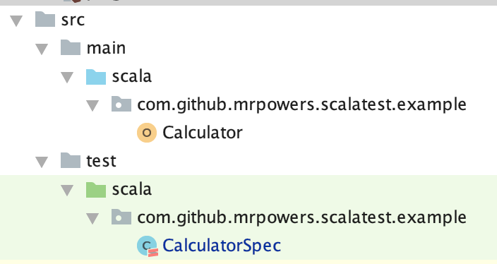
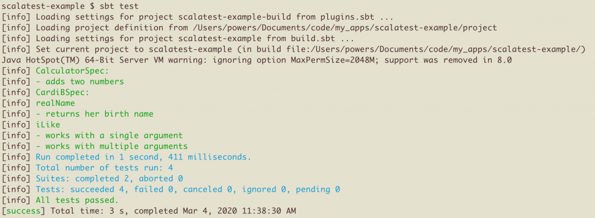
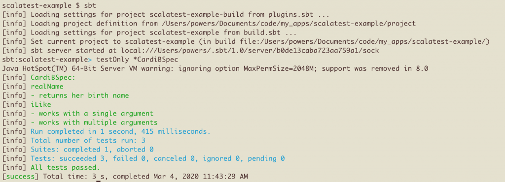
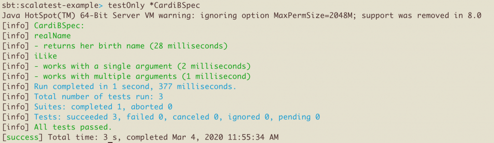

Scalatest makes it easy to test your Scala code.

This blog post shows how to add Scalatest to a sbt project and write some basic tests.

## Writing a simple test

Make a `Calculator` object with an `addNumbers` method that adds two integers:

```
package com.github.mrpowers.scalatest.example

object Calculator {

  def addNumbers(n1: Int, n2: Int): Int = {
    n1 + n2
  }

}
```

Let's verify that `addNumbers` returns 7 when the inputs are 3 and 4. Let's take a look at the test code.

```
package com.github.mrpowers.scalatest.example

import org.scalatest.FunSpec

class CalculatorSpec extends FunSpec {

  it("adds two numbers") {

    assert(Calculator.addNumbers(3, 4) === 7)

  }


}
```

You can find all the code in [this GitHub repo](https://github.com/MrPowers/scalatest-example).

You can run the tests with the `sbt test` command in your Terminal or by right clicking the method and pressing "Run CalculatorSpec.adds" in your IntelliJ text editor.

Let's examine the important components of the test file:

- `import org.scalatest.FunSpec` imports FunSpec from [Scalatest](https://github.com/scalatest/scalatest). `FunSpec` is a trait that you can mix into your test files.
- `FunSpec` defines an `it()` method to group tests into blocks and a `===` operator to provide readable test output

Let's look at how to add Scalatest as a project dependency before diving into more advanced features.

## Directory organization

Scalatest works best when you follow SBT directory conventions. A project named `scalatest-example` in the `com.github.mrpowers` package should be organized as follows:

```
src/
  main/
    scala/
      com/
        github/
          mrpowers/
            scalatest/
              example/
                Calculator
  test/
    scala/
      com/
        github/
          mrpowers/
            scalatest/
              example/
                CalculatorSpec
```

IntelliJ does a great job formatting the nested directories so they're readable.



Both the application and test code live in the `com.github.mrpowers.scalatest.example` namespace. This allows our tests to easily access the application code without any special imports.

## build.sbt

Scalatest should be specified as a test dependency in your `build.sbt` file:

```
libraryDependencies += "org.scalatest" %% "scalatest" % "3.0.1" % "test"
```

You should mark Scalatest as a test dependency, so it's not included in your JAR files.

## More tests

Let's create a `CardiB` object with a couple of methods.

```
object CardiB {

  def realName(): String = {
    "Belcalis Almanzar"
  }

  def iLike(args: String*): String = {
    "I like " + args.mkString(", ")
  }

}
```

Let's use the `describe()` and `it()` method provided by `FunSpec` to neatly organize our `CardiB` tests:

```
class CardiBSpec extends FunSpec {

  describe("realName") {

    it("returns her birth name") {
      assert(CardiB.realName() === "Belcalis Almanzar")
    }

  }

  describe("iLike") {

    it("works with a single argument") {
      assert(CardiB.iLike("dollars") === "I like dollars")
    }

    it("works with multiple arguments") {
      assert(CardiB.iLike("dollars", "diamonds") === "I like dollars, diamonds")
    }

  }

}
```

You can use `sbt test` to run the entire test suite.

Let's look at how to run individual test files and configure the test output.

## Running tests and configuring output

Here's what the test output will look like when running the entire test suite from the Terminal:



We can run the `sbt` command to open the SBT console and run the tests from the console. The `testOnly` command can be used to run a single test file.



Let's update the `build.sbt` file with [configuration options](https://stackoverflow.com/a/46535105/1125159) that will show the runtime for each individual test.

```
testOptions in Test += Tests.Argument(TestFrameworks.ScalaTest, "-oD")
```

Restart the console, rerun the test suite, and observe how the test output contains the runtime for each individual test.



There are a variety of test output settings that can be configured for your project needs.

## assertThrows

Let's update the `iLike()` method to throw an error if the argument list is empty:

```
def iLike(args: String*): String = {
  if (args.isEmpty) {
    throw new java.lang.IllegalArgumentException
  }
  "I like " + args.mkString(", ")
}
```

We can use `assertThrows` to verify that the exception is thrown when `iLike()` is run without any arguments:

```
it("throws an error if an integer argument is supplied") {
  assertThrows[java.lang.IllegalArgumentException]{
    CardiB.iLike()
  }
}
```

We can also write tests to verify if code compiles.

## assertDoesNotCompile

The `iLike()` method will error out with "(Test / compileIncremental) Compilation failed" when run with integer arguments. `CardiB.iLike(1, 2, 3)` will return an error like this:

```
sbt:scalatest-example> testOnly *CardiBSpec
Compiling 1 Scala source to /Users/powers/Documents/code/my_apps/scalatest-example/target/scala-2.12/test-classes ...
.../CardiBSpec.scala:32:20: type mismatch;
found   : Int(1)
required: String
    CardiB.iLike(1, 2, 3)
                 ^
```

Here's a test to verify that this code does not compile.

```
it("does not compile with integer arguments") {
  assertDoesNotCompile("""CardiB.iLike(1, 2, 3)""")
}
```

A test like this isn't necessary in a real codebase. We can rely on the Scala compiler to make sure methods are passed the right argument type, so we don't need to write compile cases like these in general. You'll find these test cases useful when you're checking to make sure your code doesn't compile for "user errors".

## Other assertions

Read the Scalatest guide on [using assertions](http://www.scalatest.org/user_guide/using_assertions) for a full review of all the different types of tests you can write.

## Other test formats

Scalatest supports a [variety of testing styles](http://www.scalatest.org/user_guide/selecting_a_style).

The examples have been using FunSpec so far.

Let's create another example with FreeSpec, another test style that's also defined in Scalatest.

Start by defining a `Person` class with a `fullName()` method that concatenates the `firstName` and `lastName`.

```
class Person(firstName: String, lastName: String) {

  def fullName(): String = {
    firstName + " " + lastName
  }

}
```

Here's a `PersonSpec` test that leverages the `FreeSpec` test style.

```
import org.scalatest.FreeSpec

class PersonSpec extends FreeSpec {

  "fullName" - {

    "returns the first name and last name concatenated" in {

      val lilXan = new Person("Lil", "Xan")
      assert(lilXan.fullName() === "Lil Xan")

    }

  }

}
```

It's cool that Scalatest allows different test files in a given project to use different styles, but the flexibility can also be a burden.

Who wants to work on a project that uses multiple test styles? Yuck!

Other test frameworks have reacted to Scalatest's extreme flexibility with the express goal of providing only one way to write a test.

Providing only one test style is the only way to guarantee consistency in the codebase.

## Test library alternatives

### uTest

uTest was created with a [uniform syntax for defining tests](https://github.com/lihaoyi/utest#why-utest) and a single way of making assertions. Scalatest provides developers with lot of flexibility and options. uTest doesn't provide any options, so it's easier to [focus on your tests and your code](http://www.lihaoyi.com/post/uTesttheEssentialTestFrameworkforScala.html).

The uTest syntax is based on the Scalatest `FreeSpec` style.

We'll talk about uTest in more detail in a separate blog post.

### MUnit

MUnit is a Scala testing library with [actionable errors and extensible APIs](https://scalameta.org/munit/blog/2020/02/01/hello-world.html). It offers a set of features that are not available in any other Scala testing libraries.

MUnit is "heavily inspired by existing testing libraries including ScalaTest, utest, JUnit and ava" and combines a bunch of features in a unique way for a Scala testing library.

We'll create a separate blog post to cover the MUnit testing library soon.

## Testing Spark applications

[This blog post](https://medium.com/@mrpowers/testing-spark-applications-8c590d3215fa) explains how to test Spark applications with Scalatest.

The [spark-fast-tests](https://github.com/MrPowers/spark-fast-tests/) library shows how to build a Spark testing library that's compatible with Scalatest. Sometimes the built-in equality operators aren't sufficient and you need an external library to provide some extra functionality.

## Next steps

You can find all the code in [this GitHub repo](https://github.com/MrPowers/scalatest-example).

Cloning the example code repo and running the tests on your local machine is a great way to learn about Scalatest.

Make sure to setup your test suite to run on a continuous integration server whenever you push to master. Use [scoverage](https://github.com/scoverage) to make sure that your entire codebase is executed when running the test suite.

You can also look into mocking in Scala with [mockito-scala](https://github.com/mockito/mockito-scala) to write some more advanced test cases.

Getting good at writing tests is one of the best ways to become a better Scala programmer.
