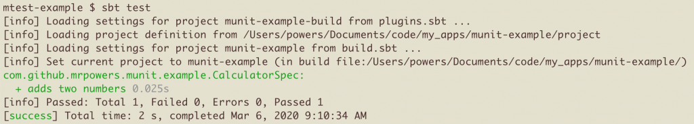
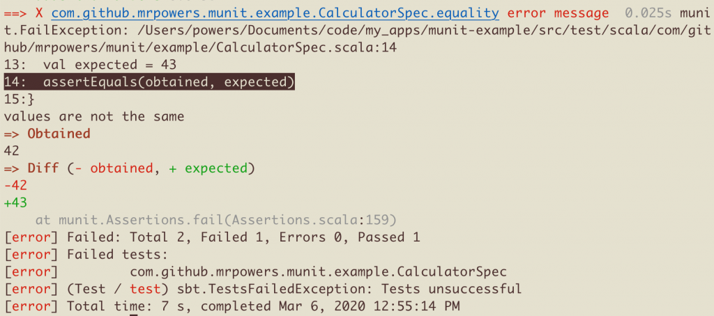
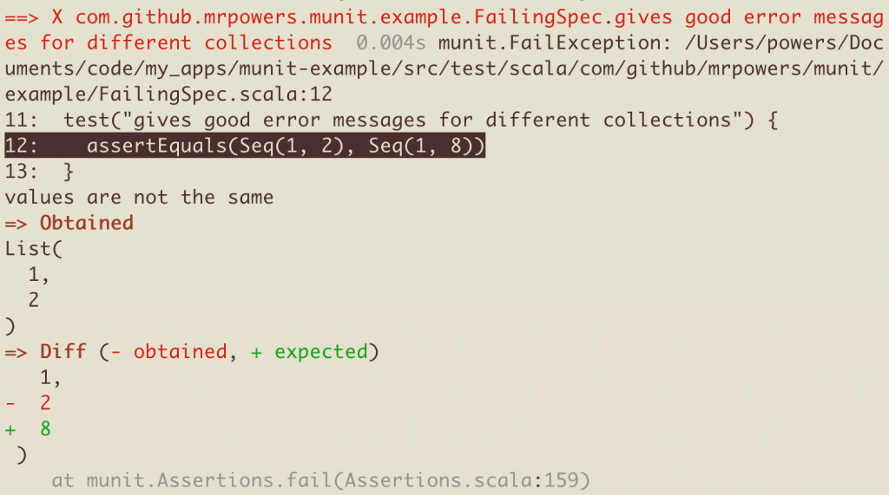
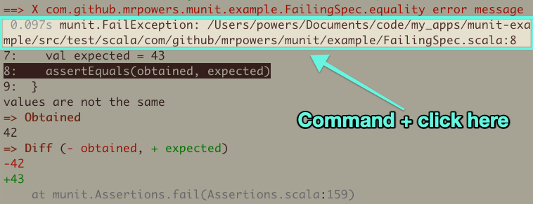
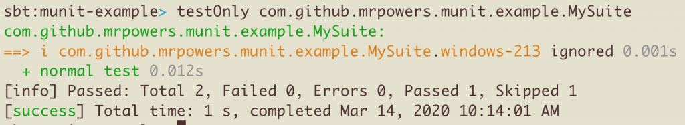

# Testing Scala with MUnit

MUnit is a test library with a collection of features that are not available in other Scala testing libraries.

MUnit draws inspiration from Scalatest, utest, and ava (JavaScript testing library).

This blog post explains how to setup MUnit and use its basic features.

## Simple test

Let's create a `Calculator` object with an `addNumbers` method that adds two integers:

```scala
package com.github.mrpowers.munit.example

object Calculator {

  def addNumbers(n1: Int, n2: Int): Int = {
    n1 + n2
  }

}
```

Let's add a MUnit test to verify that `addNumbers` returns 7 when 3 and 4 are supplied as inputs.

```scala
package com.github.mrpowers.munit.example

class CalculatorSpec extends munit.FunSuite {

  test("adds two numbers") {

    assertEquals(Calculator.addNumbers(3, 4), 7)

  }

}
```

We can run the test suite with `sbt test`.

MUnit outputs the test with a well-formatted passing message.



All the code snippets in this blog are from [this GitHub repo](https://github.com/MrPowers/munit-example).

Let's take a look at how MUnit outputs test failure messages.

## Pretty printing assertEquals failures

Here's an example of a failing test:

```scala
test("equality error message") {
  val obtained = 42
  val expected = 43
  assertEquals(obtained, expected)
}
```

The failing message includes the obtained value, expected value, and line number of the failure.



## Comparing collections

MUnit's `assertEquals` method can be used to compare collections that have the same elements:

```scala
test("considers collections with the same elements equal") {
  assertEquals(Seq(1, 2), Seq(1, 2))
}
```

This functionality is similar to [Scalatest should matchers](https://stackoverflow.com/questions/7434762/comparing-collection-contents-with-scalatest) and [utest arrow asserts](https://github.com/lihaoyi/utest#arrow-asserts).

MUnit gives nicely formatted error messages for collection comparisons that are not equal.

Here's a test that compares two collections that aren't equal.

```scala
test("gives good error messages for different collections") {
  assertEquals(Seq(1, 2), Seq(1, 8))
}
```

Here's the error message MUnit outputs.



## intercept

MUnit can also check that errors are thrown.

Let's create a `crankyMethod` that throws a `java.lang.IllegalArgumentException`.

```scala
def crankyMethod(): String = {
  throw new java.lang.IllegalArgumentException()
}
```

Let's write a test using `intercept` to verify that this method throws a `IllegalArgumentException`:

```scala
test("can intercept exceptions") {
  intercept[java.lang.IllegalArgumentException]{
    Calculator.crankyMethod()
  }
}
```

`intercept` is especially useful when making sure your code is throwing custom errors for certain logic paths.

## interceptMessage

Write a `crankyKong` method that'll throw a `java.lang.Exception` with the message "DK is my grandchild".

```scala
def crankyKong(): String = {
  throw new java.lang.Exception("DK is my grandchild")
}
```

Write a test that makes sure the `crankyKong` method throws a `java.lang.Exception` with the expected message.

```scala
test("can intercept exceptions with messages") {
  interceptMessage[java.lang.Exception]("DK is my grandchild"){
    Calculator.crankyKong()
  }
}
```

Use `interceptMessage` instead of `intercept` whenever possible. You should always write code with error messages that are descriptive and help users debug the underlying issue. Your test suite should verify that your error messages are awesome and descriptive.

## compileErrors

Our `Calculator.addNumbers()` method takes two integer arguments. The code won't compile if `addNumbers` is invoked with two String arguments.

Let's write a test to make sure `addNumbers()` errors out with a particular message when it's invoked with String arguments.

```scala
test("checks the error message of code that doesn't compile") {
  assertNoDiff(
    compileErrors("""Calculator.addNumbers("hi", "there")"""),
    """|error:
       |type mismatch;
       | found   : String("hi")
       | required: Int
       |Calculator.addNumbers("hi", "there")
       |                      ^
       |""".stripMargin
  )
}
```

Yep, MUnit is awesome!

## Jumping to failing section of code

MUnit shows the source location for errors in failing tests:

> Test failures point to the source code location where the failure happened. Cmd+click on the filename to open the relevant line number in your editor (does not work in all terminals).

For example, if you're using iTerm & MacOS, you can hold Command and click the path (e.g. /Users/powers/.../FailingSpec.scala) and you'll be redirected to the failing line in your text editor of choice.



## Enabling tests based on conditions

MUnit supports [rich test filtering capabilities](https://scalameta.org/munit/blog/2020/02/01/hello-world.html#rich-filtering-capabilities).

These let you customize what tests are run on different operating systems and with different Scala versions.

Let's create a test file with one test that runs for a Scala versions / operating systems and other test that only runs on Windows with Scala 2.13.

```scala
package com.github.mrpowers.munit.example

import scala.util.Properties
import munit._

object Windows213 extends Tag("Windows213")

class MySuite extends FunSuite {

  override def munitTestTransforms = super.munitTestTransforms ++ List(
    new TestTransform("Windows213", { test =>
      val isIgnored =
        test.tags(Windows213) && !(
          Properties.isWin &&
            Properties.versionNumberString.startsWith("2.13")
          )
      if (isIgnored) test.tag(Ignore)
      else test
    })
  )

  test("windows-213".tag(Windows213)) {
    assertEquals(2, 3)
  }

  test("normal test") {
    assertEquals(2, 2)
  }

}
```

Here's the output when you run this test file on macOS with Scala 2.12.



The windows-213 test is ignored and the "normal test" is run.

## Next steps

MUnit is a production-ready testing library that supports a bunch of awesome testing features. Clone [this repo](https://github.com/MrPowers/munit-example), run the test suite, and see for yourself ;)

Projects in the [scalameta family](https://github.com/scalameta/) are well supported. MUnit will likely get better and grow in popularity.

MUnit is used in production projects like [scalameta](https://github.com/scalameta/scalameta), [metals](https://github.com/scalameta/metals), and [mdoc](https://github.com/scalameta/mdoc). MUnit is a new library, but it's ready for your production app.

Big thanks to scalameta for continuing to release awesome projects and for relentlessly pushing Scala tooling forward.
