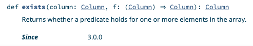
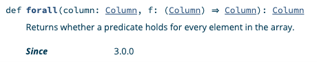
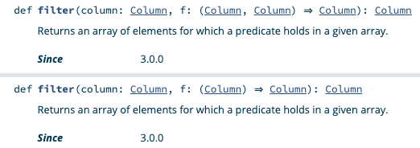
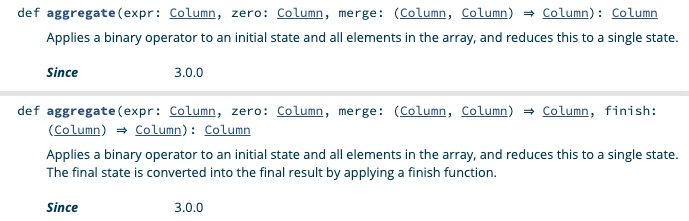

Spark 3 has new array functions that make working with ArrayType columns much easier.

Spark developers previously needed to use UDFs to perform complicated array functions. The new Spark functions make it easy to process array columns with native Spark.

Some of these higher order functions [were accessible in SQL as of Spark 2.4](https://docs.databricks.com/_static/notebooks/apache-spark-2.4-functions.html), but they didn't become part of the `org.apache.spark.sql.functions` object until Spark 3.0.

The `transform` and `aggregate` array functions are especially powerful general purpose functions. They provide functionality that's equivalent to `map` and `fold` in Scala and make it a lot easier to work with ArrayType columns.

You no longer need to revert to ugly UDFs to perform complex array manipulation. You can use native Spark!

## exists

`exists` returns true if the predicate function returns true for any value in an array.

Suppose you have the following data and would like identify all arrays that contain at least one even number.

```
+---------+------------+
|person_id|best_numbers|
+---------+------------+
|        a|   [3, 4, 5]|
|        b|     [8, 12]|
|        c|     [7, 13]|
|        d|        null|
+---------+------------+
```

People "a" and "b" have at least one favorite number that's even, person "c" only has favorite odd numbers, and person "d" doesn't have any data.

Start by creating an `isEven` column function that returns `true` is a number is even:

```
def isEven(col: Column): Column = {
  col % 2 === lit(0)
}
```

Let's create a DataFrame and then run the `org.apache.spark.sql.functions.exists` function to append a `even_best_number_exists` column.

```
val df = spark.createDF(
  List(
    ("a", Array(3, 4, 5)),
    ("b", Array(8, 12)),
    ("c", Array(7, 13)),
    ("d", null),
  ), List(
    ("person_id", StringType, true),
    ("best_numbers", ArrayType(IntegerType, true), true)
  )
)

val resDF = df.withColumn(
  "even_best_number_exists",
  exists(col("best_numbers"), isEven)
)
```

Print the contents of the DataFrame and verify that `even_best_number_exists` contains the expected values.

```
resDF.show()

+---------+------------+-----------------------+
|person_id|best_numbers|even_best_number_exists|
+---------+------------+-----------------------+
|        a|   [3, 4, 5]|                   true|
|        b|     [8, 12]|                   true|
|        c|     [7, 13]|                  false|
|        d|        null|                   null|
+---------+------------+-----------------------+
```

You don't have to defined `isEven` as a named function. You can also use an anonymous function and get the same result.

```
df.withColumn(
  "even_best_number_exists",
  exists(
    col("best_numbers"),
    (col: Column) => col % 2 === lit(0)
  )
)
```

Here's the [exists method signature in the Spark 3 docs](https://spark.apache.org/docs/3.0.0-preview2/api/scala/org/apache/spark/sql/functions$.html#exists\(column:org.apache.spark.sql.Column,f:org.apache.spark.sql.Column=%3Eorg.apache.spark.sql.Column\):org.apache.spark.sql.Column).



## forall

Let's take a look at some arrays that contain words:

```
+--------------------------+
|words                     |
+--------------------------+
|[ants, are, animals]      |
|[italy, is, interesting]  |
|[brazilians, love, soccer]|
|null                      |
+--------------------------+
```

Let's use `forall` to identify the arrays with words that all begin with the letter "a":

```
val df = spark.createDF(
  List(
    (Array("ants", "are", "animals")),
    (Array("italy", "is", "interesting")),
    (Array("brazilians", "love", "soccer")),
    (null),
  ), List(
    ("words", ArrayType(StringType, true), true)
  )
)

val resDF = df.withColumn(
  "uses_alliteration_with_a",
  forall(
    col("words"),
    (col: Column) => col.startsWith("a")
  )
)
```

Let's check out the contents of `resDF` and confirm it returns true for "ants are animals":

```
resDF.show(false)

+--------------------------+------------------------+
|words                     |uses_alliteration_with_a|
+--------------------------+------------------------+
|[ants, are, animals]      |true                    |
|[italy, is, interesting]  |false                   |
|[brazilians, love, soccer]|false                   |
|null                      |null                    |
+--------------------------+------------------------+
```

A more interesting function would be one that returns true for any array that uses alliteration. We'll solve that problem with the more advanced array functions.

Here's the `forall` method signature in the docs.



## filter

Suppose you have the following data:

```
+-----------------------+
|words                  |
+-----------------------+
|[bad, bunny, is, funny]|
|[food, is, bad, tasty] |
|null                   |
+-----------------------+
```

Let's filter out all the array values equal to "bad":

```
val df = spark.createDF(
  List(
    (Array("bad", "bunny", "is", "funny")),
    (Array("food", "is", "bad", "tasty")),
    (null),
  ), List(
    ("words", ArrayType(StringType, true), true)
  )
)

val resDF = df.withColumn(
  "filtered_words",
  filter(
    col("words"),
    (col: Column) => col =!= lit("bad")
  )
)
```

Print the contents of `resDF` and make sure the `filtered_words` column does not contain the word "bad".

```
resDF.show(false)

+-----------------------+------------------+
|words                  |filtered_words    |
+-----------------------+------------------+
|[bad, bunny, is, funny]|[bunny, is, funny]|
|[food, is, bad, tasty] |[food, is, tasty] |
|null                   |null              |
+-----------------------+------------------+
```

The `filter` method is overloaded to take a function that accepts either two or one column argument.



Send me an example of a `filter` invocation with a column function that takes two arguments if you can figure it out.

## transform

Suppose we have a dataset with arrays that contain fun cities.

```
+----------------------+
|places                |
+----------------------+
|[New York, Seattle]   |
|[Barcelona, Bangalore]|
|null                  |
+----------------------+
```

Let's add a `fun_places` column that makes it clear how fun all of these cities really are!

```
val df = spark.createDF(
  List(
    (Array("New York", "Seattle")),
    (Array("Barcelona", "Bangalore")),
    (null),
  ), List(
    ("places", ArrayType(StringType, true), true)
  )
)


val resDF = df.withColumn(
  "fun_places",
  transform(
    col("places"),
    (col: Column) => concat(col, lit(" is fun!"))
  )
)
```

Print out `resDF` and confirm that `is fun!` has been appended all the elements in each array.

```
resDF.show(false)

+----------------------+--------------------------------------+
|places                |fun_places                            |
+----------------------+--------------------------------------+
|[New York, Seattle]   |[New York is fun!, Seattle is fun!]   |
|[Barcelona, Bangalore]|[Barcelona is fun!, Bangalore is fun!]|
|null                  |null                                  |
+----------------------+--------------------------------------+
```

`transform` works similar to the `map` function in Scala. I'm not sure why they chose to name this function `transform`… I think `array_map` would have been a better name, especially because the `Dataset#transform` function is commonly used to [chain DataFrame transformations](https://mungingdata.com/apache-spark/chaining-custom-dataframe-transformations/).

Using a method name that already exists confuses folks that don't understand OOP. It also makes stuff hard to Google.

Let's not focus on the negative. `org.apache.spark.functions.transform` now exists and is an absolute joy to work with. This is a great addition to the API.

## aggregate

Suppose you have a DataFrame with an array of numbers:

```
+------------+
|     numbers|
+------------+
|[1, 2, 3, 4]|
|   [5, 6, 7]|
|        null|
+------------+
```

You can calculate the sum of the numbers in the array with the `aggregate` function.

```
val df = spark.createDF(
  List(
    (Array(1, 2, 3, 4)),
    (Array(5, 6, 7)),
    (null),
  ), List(
    ("numbers", ArrayType(IntegerType, true), true)
  )
)

val resDF = df.withColumn(
  "numbers_sum",
  aggregate(
    col("numbers"),
    lit(0),
    (col1: Column, col2: Column) => col1 + col2
  )
)
```

Let's check out the result:

```
resDF.show()

+------------+-----------+
|     numbers|numbers_sum|
+------------+-----------+
|[1, 2, 3, 4]|         10|
|   [5, 6, 7]|         18|
|        null|       null|
+------------+-----------+
```

`aggregate` isn't the best name. This concept is referred to as `reduce` in Python, `inject` in Ruby, and `fold` in Scala. The function name `aggregate` makes you think about database aggregations, not reducing an array.

The `aggregate` function is amazingly awesome, despite the name. It opens the door for all types of interesting array reductions.

The `aggregate` docs are hard to follow because there are so many column arguments:



Let me know if you have a good example of an `aggregate` function that uses the `finish` function.

## zip\_with

Suppose we have a DataFrame with `letters1` and `letters2` columns that contain arrays of letters.

```
+--------+--------+
|letters1|letters2|
+--------+--------+
|  [a, b]|  [c, d]|
|  [x, y]|  [p, o]|
|    null|  [e, r]|
+--------+--------+
```

Let's zip the `letters1` and `letters2` arrays and join them with a `***` delimiter. We want to convert `[a, b]` and `[c, d]` into a single array: `[a***c, b***d]`.

```
val df = spark.createDF(
  List(
    (Array("a", "b"), Array("c", "d")),
    (Array("x", "y"), Array("p", "o")),
    (null, Array("e", "r"))
  ), List(
    ("letters1", ArrayType(StringType, true), true),
    ("letters2", ArrayType(StringType, true), true)
  )
)

val resDF = df.withColumn(
  "zipped_letters",
  zip_with(
    col("letters1"),
    col("letters2"),
    (left: Column, right: Column) => concat_ws("***", left, right)
  )
)
```

Let's take a look at the results.

```
resDF.show()

+--------+--------+--------------+
|letters1|letters2|zipped_letters|
+--------+--------+--------------+
|  [a, b]|  [c, d]|[a***c, b***d]|
|  [x, y]|  [p, o]|[x***p, y***o]|
|    null|  [e, r]|          null|
+--------+--------+--------------+
```

## Ugly UDFs from the past

[spark-daria](https://github.com/MrPowers/spark-daria/) implemented `exists` as a UDF and the code is pretty gross:

```
def exists[T: TypeTag](f: (T => Boolean)) = udf[Boolean, Seq[T]] { (arr: Seq[T]) =>
  arr.exists(f(_))
}
```

The spark-daria `forall` UDF implementation was equally unappealing:

```
def forall[T: TypeTag](f: T => Boolean) = udf[Boolean, Seq[T]] { arr: Seq[T] =>
  arr.forall(f(_))
}
```

It'll be cool to get rid of this cruft in spark-daria.

The more spark-daria functions that are supported natively in Spark, the better.

Let's hope we can get the spark-daria `createDF` function merged in with the Spark codebase some day…

## Conclusion

Spark 3 has added some new high level array functions that'll make working with ArrayType columns a lot easier.

The `transform` and `aggregate` functions don't seem quite as flexible as `map` and `fold` in Scala, but they're a lot better than the Spark 2 alternatives.

The Spark core developers really "get it". They're doing a great job continuing to make Spark better.
