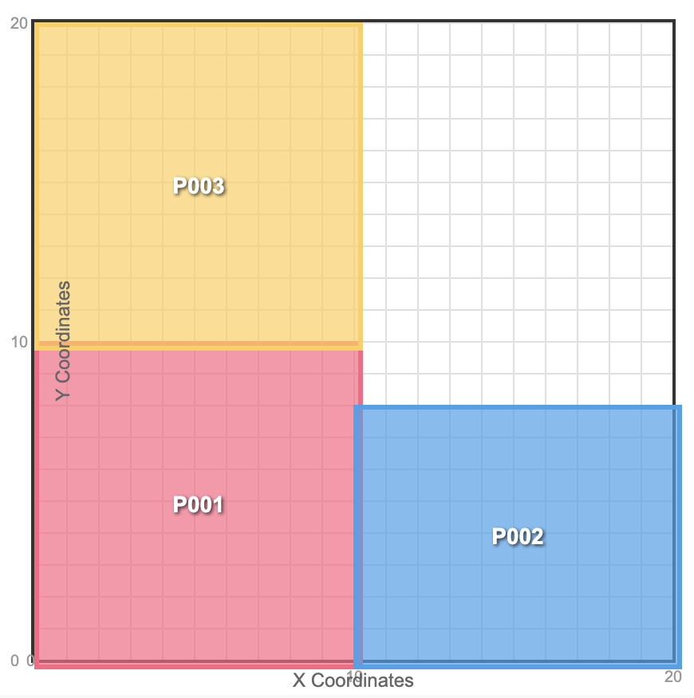

# How to Use ST_Touches: Finding Geometries That Share Boundaries

`ST_Touches` identifies geometries that share a boundary but don't overlap. You can use `ST_Touches` to identify adjacent countries, neighboring parcels, or polygons that share edges. It works consistently across spatial query engines like PostGIS, DuckDB, and Apache Sedona.

`ST_Touches` differs from other spatial predicates:

* `ST_Intersects` includes overlaps
* `ST_Contains` checks for one shape within another

`ST_Touches` specifically finds shapes that share boundaries.

Adjacent states or countries that share borders are examples of geometries that touch.  Let’s dive into a conceptual overview and then see how to use `ST_Touches` with PostGIS, DuckDB, and Apache Sedona.

## How ST_Touches functions

`ST_Touches` returns true when two geometries share at least one boundary point, but their interiors don't overlap.

**Classic examples of touching geometries:**

* Two squares that share an edge
* A line that ends exactly at a polygon boundary
* Countries that share a border (like the USA and Canada)

**What doesn't count as touching:**

* Shapes that overlap, which is an intersection
* Completely separate shapes
* When one shape is completely inside another, which is a “contains” relationship

Touching means sharing boundaries, not sharing interiors.

Here’s the basic SQL syntax for `ST_Touches`:

```sql
SELECT ST_Touches(geometry1, geometry2) AS touches;
```

Let’s look at three parcels, P001, P002, and P003, for a concrete example:



Here’s a summary of the touches:

* P001 and P002 share an edge
* P001 and P003 share an edge
* P002 and P003 don't touch each other

Let’s examine how to summarize the touching relationships with Apache Sedona.

## Apache Sedona ST_Touches Examples

Apache Sedona supports `ST_Touches` with Apache Spark, Apache Flink, and Snowflake via SnowSedona.  The following example uses PySpark and Apache Sedona.

Let’s create some sample parcels using adjacent polygons that touch:

```python
sample_parcels_data = [
    ("P001", "POLYGON((0 0, 0 10, 10 10, 10 0, 0 0))"),
    ("P002", "POLYGON((10 0, 10 5, 20 5, 20 0, 10 0))"),
    ("P003", "POLYGON((0 10, 0 20, 10 20, 10 10, 0 10))")
]
parcels_df = spark.createDataFrame(sample_parcels_data, ["parcel_id", "geometry"])

parcels_df = parcels_df.selectExpr(
    "parcel_id",
    "ST_GeomFromWKT(geometry) as geometry"
)

parcels_df.createOrReplaceTempView("parcels")
```

Here’s the content of `parcels_df`:

```
+----------+--------------------------------------------+
|parcel_id |geometry                                    |
+----------+--------------------------------------------+
|P001      |POLYGON((0 0, 0 10, 10 10, 10 0, 0 0))      |
|P002      |POLYGON((10 0, 10 5, 20 5, 20 0, 10 0))     |
|P003      |POLYGON((0 10, 0 20, 10 20, 10 10, 0 10))   |
+----------+--------------------------------------------+
```

Now let’s find all the touching relationships:

```python
result = spark.sql("""
SELECT 
    p1.parcel_id,
    p2.parcel_id
FROM parcels p1, parcels p2
WHERE ST_Touches(p1.geometry, p2.geometry)
""")
```

Here’s the result of the query:

```
+----------+--------------+
|parcel_id |parcel_id     |
+----------+--------------+
|P001      |P002          |
|P002      |P001          |
|P001      |P003          |
|P003      |P001          |
+----------+--------------+
```

The query returns both directions of each touching relationship, so there is one row for P001 touching P002 and another row for P002 touching P001.

Here’s how you can modify the query to return only one direction of the touching relationship:

```sql
SELECT 
    p1.parcel_id,
    p2.parcel_id
FROM parcels p1, parcels p2
WHERE ST_Touches(p1.geometry, p2.geometry)
AND p1.parcel_id < p2.parcel_id
```

Here are the results of the query:

```
+----------+----------+
|parcel_id |parcel_id |
+----------+----------+
|P001      |P002      |
|P001      |P003      |
+----------+----------+
```

## DuckDB ST_Touches Examples

DuckDB also supports `ST_Touches` via the `spatial` extension.

Start by installing the `spatial` extension:

```sql
INSTALL spatial;
LOAD spatial;
```

Now, create the `parcels` table:

```sql
CREATE TABLE parcels AS
SELECT 
    parcel_id,
    ST_GeomFromText(geometry) AS geometry
FROM (
    SELECT * FROM VALUES
        ('P001', 'POLYGON((0 0, 0 10, 10 10, 10 0, 0 0))'),
        ('P002', 'POLYGON((10 0, 10 5, 20 5, 20 0, 10 0))'),
        ('P003', 'POLYGON((0 10, 0 20, 10 20, 10 10, 0 10))')
    AS t(parcel_id, geometry)
);
```

Join the parcels table to see the geometries that are touching:

```sql
SELECT
    p1.parcel_id,
    p2.parcel_id
FROM
    parcels p1
JOIN
    parcels p2
ON
    ST_Touches(p1.geometry, p2.geometry)
WHERE
    p1.parcel_id < p2.parcel_id;
```

Here’s the result:

```
┌───────────┬───────────┐
│ parcel_id │ parcel_id │
│  varchar  │  varchar  │
├───────────┼───────────┤
│ P001      │ P002      │
│ P001      │ P003      │
└───────────┴───────────┘
```

## PostGIS ST_Touches Examples

This section shows how to use `ST_Touches` with PostGIS.

Here’s how to create the parcels table with PostGIS:

```sql
CREATE TABLE parcels AS
SELECT 
    parcel_id,
    ST_GeomFromText(geometry) AS geometry
FROM (
    SELECT * FROM (VALUES
        ('P001', 'POLYGON((0 0, 0 10, 10 10, 10 0, 0 0))'),
        ('P002', 'POLYGON((10 0, 10 5, 20 5, 20 0, 10 0))'),
        ('P003', 'POLYGON((0 10, 0 20, 10 20, 10 10, 0 10))')
    ) AS t(parcel_id, geometry)
);
```

Now see the geometries that are touching with PostGIS:

```sql
SELECT
    p1.parcel_id,
    p2.parcel_id
FROM
    parcels p1
JOIN
    parcels p2
ON
    ST_Touches(p1.geometry, p2.geometry)
WHERE
    p1.parcel_id < p2.parcel_id;
```

Here’s the result of the query:

```
parcel_id | parcel_id 
-----------+-----------
 P001      | P002
 P001      | P003
```

## Common Gotchas with ST_Touches

### Point-to-Point Touching

Points can't touch other points in most implementations. They can be equal, but points with identical coordinates aren’t considered touching.  This query returns false for all of them on this page.

```
SELECT ST_Touches(ST_Point(1, 1), ST_Point(1, 1));
```

Here’s the result in Sedona:

```
spark.sql("SELECT ST_Touches(ST_Point(1, 1), ST_Point(1, 1));").show()

+------------------------------------------+
|st_touches(st_point(1, 1), st_point(1, 1))|
+------------------------------------------+
|                                     false|
+------------------------------------------+
```

Here’s the result in DuckDB:

```
SELECT ST_Touches(ST_Point(1, 1), ST_Point(1, 1));

┌────────────────────────────────────────────┐
│ st_touches(st_point(1, 1), st_point(1, 1)) │
│                  boolean                   │
├────────────────────────────────────────────┤
│ false                                      │
└────────────────────────────────────────────┘
```

Here’s the result in PostGIS:

```
matthewpowers=# SELECT ST_Touches(ST_Point(1, 1), ST_Point(1, 1));

 st_touches 
------------
 f
```

### Self-Touches

A geometry can't touch itself, so the following code always returns false:

```sql
SELECT ST_Touches(geom, geom);
```

## ST_Touches Conclusion

`ST_Touches` is commonly used for boundary analysis with geospatial engines. It consistently identifies adjacent geometries that don’t overlap.

`ST_Touches` adheres to the DE-9IM (Dimensionally Extended 9-Intersection Model) specification, ensuring consistent behavior across various spatial engines and databases.
