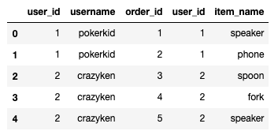

# Creating a sqlite database from CSVs with Python

This blog post demonstrates how to build a sqlite database from CSV files.

Python is perfect language for this task because it has great libraries for sqlite and CSV DataFrames.

## Creating a sqlite database

sqlite is a lightweight database that can be started as an empty text file. You can create the file with `touch my_data.db` or with this equivalent Python code:

```
from pathlib import Path
Path('my_data.db').touch()
```

A zero byte text file is a great starting point for a lightweight database!

## Creating sqlite table

Create a database connection and cursor to execute queries.

```
import sqlite3

conn = sqlite3.connect('my_data.db')
c = conn.cursor()
```

Execute a query that'll create a `users` table with `user_id` and `username` columns.

```
c.execute('''CREATE TABLE users (user_id int, username text)''')
```

## Load CSV file into sqlite table

Suppose you have the following `users.csv` file:

```
user_id,username
1,pokerkid
2,crazyken
```

Pandas makes it easy to load this CSV data into a sqlite table:

```
import pandas as pd

# load the data into a Pandas DataFrame
users = pd.read_csv('users.csv')
# write the data to a sqlite table
users.to_sql('users', conn, if_exists='append', index = False)
```

The `to_sql` method makes it easy to write DataFrames to databases.

## Fetch values from sqlite table

Fetch all the rows from the `users` table:

```
c.execute('''SELECT * FROM users''').fetchall() # [(1, 'pokerkid'), (2, 'crazyken')]
```

The `fetchall()` method returns an array of tuples.

`c.execute()` returns a `sqlite3.Cursor` object. Cursors can be thought of as iterators in the database world.

## Load another CSV into the databases

Suppose you have the following `orders.csv` file:

```
order_id,user_id,item_name
1,1,speaker
2,1,phone
3,2,spoon
4,2,fork
5,2,speaker
```

Create a table and then load the orders data into the database.

```
c.execute('''CREATE TABLE orders (order_id int, user_id int, item_name text)''')
orders = pd.read_csv('orders.csv') # load to DataFrame
orders.to_sql('orders', conn, if_exists='append', index = False) # write to sqlite table
```

## Fetch results of database join

Join the `users` and `orders` tables on the `user_id` value and print the results:

```
c.execute('''SELECT * FROM users u LEFT JOIN orders o ON u.user_id = o.user_id''')
c.fetchall()
```

Here's the array that's returned:

```
[(1, 'pokerkid', 1, 1, 'speaker'),
 (1, 'pokerkid', 2, 1, 'phone'),
 (2, 'crazyken', 3, 2, 'spoon'),
 (2, 'crazyken', 4, 2, 'fork'),
 (2, 'crazyken', 5, 2, 'speaker')]
```

You can also read the SQL query directly into a Pandas DataFrame.

```
pd.read_sql('''SELECT * FROM users u LEFT JOIN orders o ON u.user_id = o.user_id''', conn)
```



## Next steps

Python's build in sqlite library coupled with Pandas DataFrames makes it easy to load CSV data into sqlite databases.

sqlite databases are great for local experimentation and are used extensively on mobile phones. It's a great database when you'd like relational database query functionality without the overhead of Postgres.

Python's great support for sqlite will make you love it in no time.
