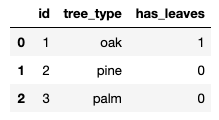
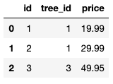

# Write sqlite tables to CSV / Parquet files

This blog post explains how to write sqlite tables to CSV and Parquet files. It'll also show how to output SQL queries to CSV files.

It'll even show how to output all the tables in a sqlite database to files with a single command.

## Create sqlite database

We'll start by creating a sqlite database. The database will contain the following `trees` and `orders` tables:





We'll use Pandas to create DataFrames that can be loaded into the sqlite database.

```python
import pandas as pd
import sqlite3

# establish database connection
conn = sqlite3.connect('nature.db')
c = conn.cursor()

# create sqlite database tables
c.execute('''CREATE TABLE trees (id int, tree_type text, has_leaves int)''')
c.execute('''CREATE TABLE orders (id int, tree_id int, price real)''')

# create DataFrames
tree_data = [(1, 'oak', 1),
    (2, 'pine', 0),
    (3, 'palm', 0)]

tree_df = pd.DataFrame.from_records(tree_data, columns=['id', 'tree_type', 'has_leaves'])

orders_data = [(1, 1, 19.99),
    (2, 1, 29.99),
    (3, 3, 49.95)]

orders_df = pd.DataFrame.from_records(orders_data, columns=['id', 'tree_id', 'price'])

# load DataFrames into sqlite database
tree_df.to_sql('trees', conn, if_exists='append', index = False)
orders_df.to_sql('orders', conn, if_exists='append', index = False)
```

We're ready to start exporting tables to files now that we have data loaded into a database.

## Export entire table to file

Here's how to export the `orders` table to a CSV file.

```python
# save sqlite table in a DataFrame
df = pd.read_sql('SELECT * from orders', conn)

# write DataFrame to CSV file
df.to_csv('orders.csv', index = False)
```

Here are the contents of the `orders.csv` file:

```
id,tree_id,price
1,1,19.99
2,1,29.99
3,3,49.95
```

Notice that the CSV file includes the data header row.

## Export part of table to file

Here's how to export all the `orders` that cost more than $25 to a CSV file.

```python
df = pd.read_sql_query('SELECT * from orders where price > 25', conn)
df.to_csv('orders_over_25.csv', index = False)
```

Here's what the `orders_over_25.csv` file contains:

```
id,tree_id,price
2,1,29.99
3,3,49.95
```

The SQL query is executed in the database before the data is passed to the DataFrame. This is known as predicate pushdown filtering and can result in a significant performance boost.

## Export all tables to files

Here's how to export all the sqlite tables to CSV files with a single command:

```python
for table in c.execute("SELECT name FROM sqlite_master WHERE type='table';").fetchall():
    t = table[0]
    df = pd.read_sql('SELECT * from ' + t, conn)
    df.to_csv(t + '_one_command.csv', index = False)
```

Notice that the `sqlite_master` table is queried to get all the tables in the database.

Here's what the `orders_one_command.csv` file contains:

```
id,tree_id,price
1,1,19.99
2,1,29.99
3,3,49.95
```

Here's what the `trees_one_command.csv` file contains:

```
id,tree_type,has_leaves
1,oak,1
2,pine,0
3,palm,0
```

## Export Parquet files

Here's code that'll export the `trees` table to a Parquet file:

```python
df = pd.read_sql('SELECT * from trees', conn)
df.to_parquet('trees.parquet', index = False)
```

Parquet files are not human readable, but they're a way better storage format compared to CSV in almost all cases, as explained here.

You need to make sure PyArrow is installed before you can call the `to_parquet` command.

## Next steps

See [here](https://github.com/MrPowers/sqlite-example/blob/master/notebooks/sqlite_to_files_blog.ipynb) for a Jupyter notebook that contains all the commands covered in this blog post.

It's easy to export sqlite tables or query results to CSV / Parquet files with Python. Pandas does all the heavy lifting.

See [here to learn how to load CSV files into sqlite tables](https://mungingdata.com/sqlite/create-database-load-csv-python/).
