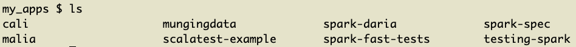
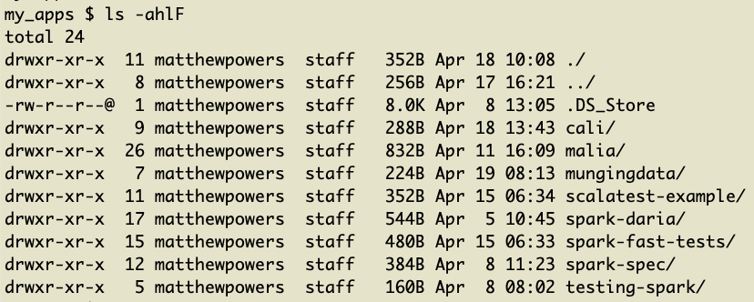
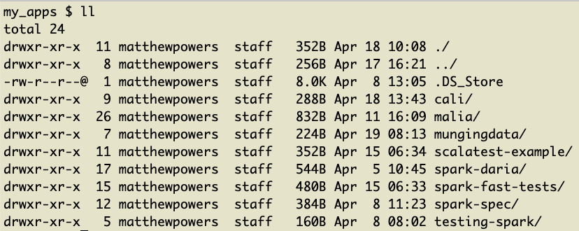
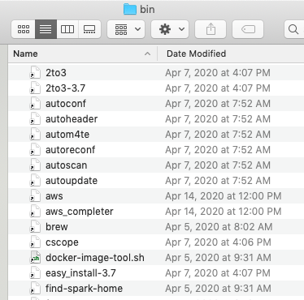
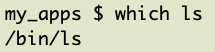
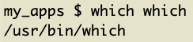
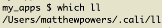

# Adding executables to your PATH for fun

Adding executables to your PATH is fun, easy, and a great way to learn about how your machine works.

This pattern is especially useful for long commands that you need to run frequently.

Learning how to add executables to your PATH will help you understand how libraries like [pyenv](https://github.com/pyenv/pyenv) use [the shim design pattern to seamlessly switch between Python versions](https://mungingdata.com/python/how-pyenv-works-shims/).

While we're learning about this design pattern, we'll also review how your machine uses the PATH and where executables are stored on our system.

## Building a more useful file listing command

The `ls` command outputs the files and folders in the current directory.



The `ls` output is more useful when it is run with flags so the output shows hidden directories and file sizes.



It's common to create a `ll` command that runs `ls -ahlF`. You don't want to always type `ls -ahlF` every time you do a file listing.

It's best to use a `~/.bash_profile` alias for something simple like this, [as described in this answer](https://unix.stackexchange.com/questions/28425/how-can-i-install-the-ll-command-on-mac-os-x). We'll create an executable and add it to our path for learning purposes. This will set us up nicely for a more complicated example.

Let's start by creating a `~/.cali/ll` file. We'll put our executables in the `~/.cali` directory, [following this design pattern](https://github.com/MrPowers/cali).

```
mkdir ~/.cali
touch ~/.cali/ll
```

Open the `ll` file with a text editor and add `ls -ahlF`.

We can run the `ll` script with `bash ~/.cali/ll`, but we can't run `~/.cali/ll` yet because the file isn't an executable.

Let's make the `ll` file an executable: `chmod +x ~/.cali/ll`.

We want to be able to run `ll` from the command line, just like any other Terminal command. We can run `~/.cali/ll`, but we want to be able to simply run `ll` from any directory, similar to `ls`.

Let's append `~/.cali` to our PATH environment variable.

Add this code to the `~/.bash_profile` file:

```
export PATH=$PATH:~/.cali
```

We can reload the bash profile with `source ~/.bash_profile` and then run `ll` from the command line.



## Understanding PATH

The PATH environment variable is an ordered list of directories that contain executables.

You can view the contents of your PATH by running `echo $PATH`. It'll return something like this: `/usr/local/bin:/usr/bin:/bin:/usr/sbin:/sbin:/Users/matthewpowers/.cali`.

Each directory is separated by a colon. It's easier to view them as a list:

- /usr/local/bin
- /usr/bin
- /bin
- /usr/sbin
- /sbin
- /Users/matthewpowers/.cali

Here are some of the files contained in `/usr/local/bin` on my machine.



We can type `which autoheader` to find where this executable file is stored on my system.


We can type `which ls` to see that the `ls` executable is stored in the `/bin` directory.



When `ls ~/Documents` is run, your computer will start by looking for an `ls` executable in the `/usr/local/bin` directory. It won't find one, so it'll look in `/usr/bin`. It wont find one there either, so it'll look in `/bin`. It'll find the executable in `/bin`, so it'll stop looking and use the `/bin/ls` executable.

We can even type `which which` to see that the `which` executable is stored in `/usr/bin`:



This is too much fun!!!

Let's type `which ll` and see where the `ll` executable is stored:



Of course, `ll` is in the `~/.cali` directory - that's where we put it!

## Adding s3\_ll

The AWS CLI offers this command to see the size of a S3 bucket: `aws s3 ls --summarize --human-readable --recursive s3://bucket-name/directory`.

This command is too long to remember. Let's create an executable that takes a single argument. We want `s3_ll my_bucket/some_folder` to run `aws s3 ls --summarize --human-readable --recursive s3://my_bucket/some_folder`.

Let's create the `~/.cali/s3_ll` file.

```
touch `~/.cali/s3_ll`
```

Open the file and add this code: `aws s3 ls --summarize --human-readable --recursive s3://$1`

The `$1` is how we pass the argument from the Terminal command to the shell script. In the `s3_ll s3_ll my_bucket/some_folder`, `s3_ll` is the command and `my_bucket/some_folder` is the argument. `$1` is how we access the argument in the shell script.

## Shim design pattern

We appended the `.cali` directory to our path - we put the directory at the end of the PATH environment variable.

The shim design pattern depends on prepending a directory to our path to intercept commands.

[pyenv](https://github.com/pyenv/pyenv) and [rbenv](https://github.com/rbenv/rbenv) use the shim design pattern to allow users to seamlessly switch between Python and Ruby versions.

Read [this post](https://mungingdata.com/python/how-pyenv-works-shims/) to learn more about the shim design pattern.

## Next steps

Adding executables to your path is fun and useful.

It teaches you about how your system executes commands.

Customizing your environment is great, as long as the customizations are documented and stored in a version controlled repo. You should be able to easily replicate your custom setup on a different machine. Take a look at [cali](https://github.com/MrPowers/cali) for an example of customizations that can be easily transitioned to a new machine.
